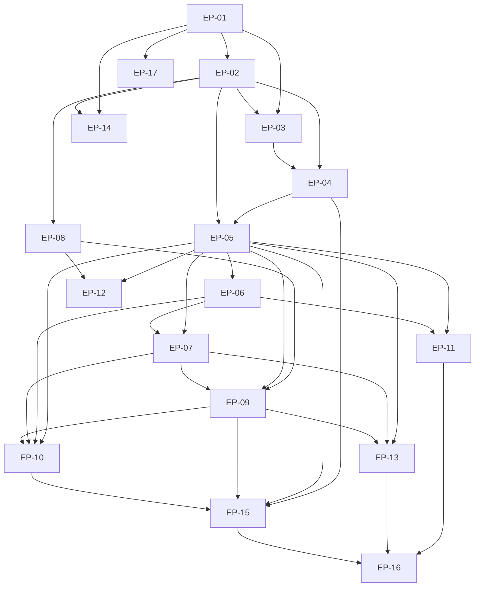

# Feature Ticket List: Epics, Stories, Tasks, Acceptance Criteria and Build Order

**Project:** Cyber Risk Quantification Platform (CRQP)  
**Problem statement:** AI-Powered Continuous Cyber Risk Quantification and Investment Optimization Platform  
**Document status:** Draft for review  
**Date:** 2026-09-30  
**Source of truth for requirements:** the specification documents listed in §1.3

---


## 1. How to use this backlog


This backlog was built by reading the existing repository and its four specification documents. It is not a guess. Every ticket that is marked **Done** points at code, a test or a command output that was actually run while writing this document.


### 1.1 Reading order


1. **Section 2 (project facts)** — what is known and what is still TBD. Read this first, because several estimates depend on it.
2. **Section 4 (epic overview)** — the seventeen epics and what each one is for.
3. **Section 6 (dependency map) and Section 7 (phased build plan)** — the order of work.
4. **Section 8 (cut line)** — what to drop first if you run out of time. Read this before you plan.
5. **Section 5 (catalogue)** — the tickets themselves, when you are ready to work.


### 1.2 What the words mean


| Term | Meaning in this document |
|---|---|
| **Epic** | A large body of related work with one goal. Epics are `EP-01` to `EP-17`. |
| **Story** | A user-facing slice of value, written as *As a [role], I want [capability], so that [benefit]*. |
| **Task** | Technical work with no direct user-facing behaviour of its own. |
| **Bug** | Something that is built and is wrong. Every bug ticket here was reproduced, not suspected. |
| **Spike** | A time-boxed research task whose output is a *decision*, not code. |
| **Test** | A ticket whose deliverable is an automated check. |
| **Doc** | A ticket whose deliverable is a document. |
| **Definition of Ready** | The checklist a ticket must pass before anyone starts it. See §9. |
| **Definition of Done** | The checklist a ticket must pass before it is called finished. See §9. |
| **Critical path** | The shortest chain of dependent tickets that must finish for the demo to work. If one of these slips, the demo slips. |
| **MoSCoW** | Must / Should / Could — a prioritisation method. Must is required for the demo. Should is valuable. Could is dropped first. |
| **Must / Should / Could** | The priority of a ticket. See §9. |
| **GWT** | Given / When / Then — a way of writing an acceptance criterion that can only pass or fail. |


### 1.3 Status labels — read this carefully


Every ticket carries two separate things, and confusing them is the most common way a backlog starts lying to its own team.

| Field | Values | What it means |
|---|---|---|
| **Status** | `Done` / `To Do` | Workflow state. `Done` is only used where the work exists, is tested, and was verified while writing this document. |
| **Status label** | `Verified Implemented` / `Proposed MVP` / `Future Scope` / `TBD` | Where the requirement came from. |

| Label | Meaning | How it was established |
|---|---|---|
| **Verified Implemented** | The code exists and was read or run. | A `file:line` reference, a passing test, or a live request. Evidence is in the ticket's note. |
| **Proposed MVP** | Should be built; does not exist yet. | Intention, from a specification. |
| **Future Scope** | Deliberately deferred. Never scheduled. | Listed in §12 only. |
| **TBD** | Unknown and not discoverable from the repository. | Recorded as a question in §12, not guessed. |

**Nothing is marked Done without evidence.** Where a ticket is Done, the note names the file, the test or the command. If you cannot find the evidence, the ticket is not Done — file a bug against the backlog.

The four specifications this backlog derives from:

| Document | What it gives | Requirements available |
|---|---|---|
| `docs/TECHNICAL_ARCHITECTURE.md` | Architecture, the full formula set, schema, known limitations | Sections A to N, findings F-1 to F-28 |
| `docs/SECURITY_ACCESS_REQUIREMENTS.md` | Threat model, access control, security test plan | 113 `SEC-*` requirements |
| `docs/FRONTEND_SPECIFICATION.md` | 11 screens, 22 components | 83 `FR-*` requirements, 67 Musts |
| `docs/AI_LLM_SPECIFICATION.md` | Intent catalogue, grounding, evaluation, safeguards | 53 `AI-REQ-*`, 16 `AI-UI-*`, findings F-29 to F-35 |
| `docs/worked_example.py` | The golden worked example, self-contained | The acceptance test for every calculation ticket |
| `docs/DATA_RISK_MODEL_SPECIFICATION.md` | **Does not exist yet** | Tracked as `T-DOC-06` |


### 1.4 How to pick the next ticket


1. Pick a **Must** ticket whose dependencies are all `Done`.
2. Run the Definition of Ready (§9.1). If any answer is no, do not start it.
3. If it is a **Bug** ticket, do that first. The five AI bugs (`T-AI-12`, `T-AI-13`, `T-AI-17`, `T-AI-18`, `T-AI-15`) and the two security bugs (`T-UX-21`, `T-SEC-11`) are worth more than most new features, because each one currently lets the product mislead a reader.
4. Otherwise take the lowest ticket ID in the current phase, so two people do not collide.


### 1.5 When a ticket is blocked


Do **not** start blocked work and do **not** silently skip it. Move the ticket to `To Do` with the blocking ticket ID written into its note, and say so in the standup. A blocked ticket that nobody mentions is how a demo dies quietly.


## 2. Project facts


Every fact below was established by reading or running the repository. Anything unknown is marked **TBD** rather than filled with a plausible guess.


### 2.1 Facts that are known


| Fact | Value | How it was established |
|---|---|---|
| Project name | Cyber Risk Quantification Platform (`CRQP`) | `README.md:1` |
| Repository | `Cyber_Risk_Quantification-` on GitHub, branch `main` | `README.md:35` |
| Backend framework | FastAPI 0.141.1, Uvicorn 0.52.4, Pydantic 2.13.5, Starlette 1.6.0 | `requirements.txt` |
| Language | Python 3.13.6 | `requirements.txt` comment |
| Database | SQLite | `app/db.py` |
| Frontend | Vanilla JavaScript, HTML and CSS. **No framework, no chart library.** | `app/static/app.js` (18,951 bytes), `index.html`, `styles.css` |
| LLM access | `urllib` to an OpenAI-compatible endpoint. No SDK. Disabled by default. | `app/ai.py:321`, `app/config.py:79-83` |
| Test framework | Python stdlib `unittest` | `tests/` — 174 tests |
| Test command | `./run.sh --test` | ~1.5 s for the full suite |
| Start command | `./run.sh` → `http://127.0.0.1:8000` | `README.md:39` |
| API routes | 20 | `app/main.py:80-420` |
| Database tables | 15 | `app/schema.sql` |
| Tests by module | risk 33, api 38, ingest 25, security/db 20, optimise 22, ai 18, reports 18 | `tests/` |
| Screens implemented | 5 of the 11 specified: Exposure, Data, Optimise, Ask, Report | `app/static/index.html` |
| Optimiser speed | 120 candidate plans in ~16 ms for 12 actions | `app/optimize.py:198` |
| Golden example total | ₹1,10,62,270.77 expected annual loss | `docs/worked_example.py` |
| Currency | `CRP_CURRENCY`, default INR, symbol ₹ | `app/config.py` |


### 2.2 Divergence from the recommended defaults — read this


The brief recommended Streamlit for the UI. **The repository does not use Streamlit.** It uses FastAPI serving a vanilla-JS single page. This backlog is written against what is actually there, because rewriting a working UI during a build phase is a worse use of time than documenting the divergence. `T-FND-07` records the decision.

Two other defaults in the brief are **not** implemented anywhere, and both are Must tickets here:

| Brief says | Reality | Ticket |
|---|---|---|
| Currency shown in lakh and crore | `optimize.db_fmt` is a plain grouped integer with no unit awareness, and the AI grounding guard actively *rejects* lakh and crore forms | `T-UX-08`, `T-AI-17` |
| Monte Carlo and VaR | Neither exists. The implemented model is analytic: a probability multiplier band | `T-RSK-14`, `T-RSK-15`, `T-RSK-17` |


### 2.3 Facts that are TBD


| Fact | Why it matters |
|---|---|
| Team size, names and skills | Every estimate in §5 and the totals in §8.2 scale on this. A first-year team is slower on unfamiliar tooling. |
| Deadline and available hours | Without it there is no schedule, only the formula in §8.3. |
| Ticketing tool | §10 emits CSV for Jira, GitHub Projects, Trello or a spreadsheet. |
| LLM budget and provider | `T-AI-23` decides whether an LLM appears in the demo at all. |
| Data classification rules | Decides whether third-party LLM egress is even permitted (`T-SEC-18`). |
| Approved loss benchmarks | The seed loss values are invented. Real defensible numbers need a source. |
| Charting decision | `T-FND-08`. No chart library is present, and the optimiser frontier is computed but never plotted. |
| Framework reference sources | `T-CMP-05` must verify every identifier. Inventing a clause number is worse than having none. |

The full question list is §12.3.


## 3. Ticket format


Every ticket in §5 uses this template.

| Field | Meaning |
|---|---|
| **ID** | `T-<EPIC PREFIX>-<NN>`. Never reused, never renumbered. |
| **Title** | A verb and an object. *"Persist an immutable assessment run on every calculation"*, not *"Run persistence"*. |
| **Type** | Epic, Story, Task, Bug, Spike, Test or Doc. |
| **Epic** | The epic this ticket belongs to. |
| **Priority** | Must, Should or Could. Defined in §8. |
| **Status** | `Done` or `To Do`. |
| **Status label** | `Verified Implemented`, `Proposed MVP`, `Future Scope` or `TBD`. |
| **Phase** | 0 to 8, from §7. |
| **Estimate / Size** | Proposed hours. Size is S (≤3 h), M (4–6 h) or L (7–8 h). |
| **Owner role** | Data/Backend, Risk Model, Frontend, AI/LLM, QA/Security or Docs/PM. A role, not a person — no names were provided. |
| **Dependencies** | Ticket IDs that must be Done first. |
| **Traceability** | Requirement IDs, or the problem-statement area letter when no requirement ID exists. |
| **Acceptance criteria** | Given/When/Then. At least two for every Must ticket. |
| **Test notes** | How to verify, with synthetic data. |
| **Risks / notes** | What could go wrong, and the evidence behind a Done claim. |

**A note on acceptance criteria for Done tickets.** Writing fresh Given/When/Then for code that already ships and already has tests would add no assurance — the test *is* the criterion. So for a ticket marked Done, the acceptance criteria are either the existing test assertions or an evidence note naming the file and line. For every ticket you actually work on, full Given/When/Then is required.

**Traceability when no requirement ID exists.** The problem-statement areas are:

| Letter | Area |
|---|---|
| A | Ingestion |
| B | Quantification |
| C | AI decision support |
| D | What-if |
| E | Optimization |
| F | Dashboards and reports |
| G | Framework mapping |


## 4. Epic overview


Seventeen epics. An **epic** is a large body of work with one goal; it is not a ticket you pick up.

| Epic | Name | Goal | Phase | Tickets | Done | To Do | Proposed hours |
|---|---|---|---|---|---|---|---|
| `EP-01` | Foundation & Project Setup | A working repo, environment, tests and documentation skeleton, so every later ticket has a place to land. | 0 | 13 | 8 | 5 | 37 |
| `EP-02` | Data Model & Persistence | A schema that can store the ingested data and, critically, an immutable record of every calculated run. | 1 | 15 | 5 | 10 | 59 |
| `EP-03` | Synthetic Data & Simulated Feed | Reproducible, clearly labelled demo data including planted edge cases. | 1 | 8 | 6 | 2 | 31 |
| `EP-04` | Data Ingestion & Validation | CSV/JSON upload that validates, quarantines bad rows individually, and never fails a whole file for one bad row. | 1 | 21 | 16 | 5 | 67 |
| `EP-05` | Risk Quantification Engine | Expected Annual Loss per scenario with a correlation adjustment, an uncertainty band and a data-confidence score. | 2 | 23 | 18 | 5 | 89 |
| `EP-06` | Risk Drivers & Attribution | Explain exactly which scenario, asset, business unit, actor, control and loss component drive the number. | 2 | 15 | 9 | 6 | 45 |
| `EP-07` | What-if Simulation | Change a scenario probability and see the portfolio move, with the baseline always still visible. | 4 | 12 | 5 | 7 | 35 |
| `EP-08` | Mitigation Action Catalogue | Candidate actions with cost, coverage, capacity limits, prerequisites and exclusivity. | 4 | 16 | 12 | 4 | 54 |
| `EP-09` | Investment Optimization & ROSI | Choose the best set of actions for a budget, honestly reporting whether the result is optimal. | 5 | 18 | 14 | 4 | 62 |
| `EP-10` | AI Decision Support | A natural-language interface that may only restate computed numbers, and refuses what the data cannot support. | 6 | 29 | 11 | 18 | 108 |
| `EP-11` | Dashboards & UX | The screens a judge actually sees: dashboards, drill-down, tables, states and accessibility. | 3 | 26 | 9 | 17 | 99 |
| `EP-12` | Compliance & Framework Mapping | A limited, clearly-caveated mapping to ISO 27001, NIST CSF and CIS Controls. Not an audit. | 7 | 7 | 1 | 6 | 28 |
| `EP-13` | Reports & Export | Markdown, CSV and a board-ready HTML pack, every one carrying the same four caveats. | 7 | 12 | 8 | 4 | 39 |
| `EP-14` | Security & Access | Server-side authorisation, audit logging, upload hardening and the known XSS fix. | 0 | 23 | 15 | 8 | 79 |
| `EP-15` | Quality, Testing & Validation | The test suites that make every other ticket's claim checkable. | 8 | 14 | 7 | 7 | 73 |
| `EP-16` | Demo Readiness | A timed, rehearsed demo with a reset, a backup and a fallback for every step. | 8 | 8 | 1 | 7 | 26 |
| `EP-17` | Documentation & PM | The specifications, dictionaries and caveats a reviewer needs to trust the numbers. | 0 | 14 | 7 | 7 | 78 |
| | **Total** | | | **274** | **152** | **122** | **1009** |

Dependency notes between epics, the Mermaid graph and the critical path are §6.


## 5. Full ticket catalogue


One table per epic. For every Must ticket, the acceptance criteria are listed in full underneath the table as **Given / When / Then** bullets.

Abbreviated columns: **Hrs** is the proposed estimate, **Size** is S/M/L, **P** is priority, **St** is status, **Label** is the status label, **Trace** is traceability, **Deps** is dependencies.


### 5.1 EP-01 — Foundation & Project Setup


**Goal:** A working repo, environment, tests and documentation skeleton, so every later ticket has a place to land.  
**Phase:** 0 · **Tickets:** 13 · **Proposed hours:** 37

| ID | Title | Type | P | St | Label | Hrs | Size | Owner | Deps | Trace |
|---|---|---|---|---|---|---|---|---|---|---|
| `T-FND-01` | Repository, branch protection and commit convention | Task | Must | Done | Verified Implemented | 2 | S | Docs/PM | none | Foundation; TAD A.3 |
| `T-FND-02` | Pin runtime dependencies to verified versions | Task | Must | Done | Verified Implemented | 2 | S | Data/Backend | T-FND-01 | Foundation; TAD L.3 |
| `T-FND-03` | One-command start script with health wait | Task | Must | Done | Verified Implemented | 3 | S | Data/Backend | T-FND-02 | Foundation |
| `T-FND-04` | One-command test runner | Task | Must | Done | Verified Implemented | 3 | S | QA/Security | T-FND-02 | Foundation |
| `T-FND-05` | Environment configuration surface with safe defaults | Task | Must | Done | Verified Implemented | 3 | S | Data/Backend | T-FND-02 | TAD L.3; SEC-PRIV-01-* |
| `T-FND-06` | Keep secrets out of the repository | Task | Must | Done | Verified Implemented | 2 | S | QA/Security | T-FND-05 | SEC-PRIV-01 |
| `T-FND-07` | Spike: confirm the actual UI stack decision | Spike | Must | To Do | TBD | 3 | S | Frontend | T-FND-01 | Foundation; Section 3 divergence |
| `T-FND-08` | Spike: choose a charting approach | Spike | Must | To Do | TBD | 4 | M | Frontend | T-FND-07 | Problem area F; ADR-01 |
| `T-FND-09` | Add /api/health and keep it dependency-free | Task | Must | Done | Verified Implemented | 2 | S | Data/Backend | T-FND-03 | TAD K.3 |
| `T-FND-10` | Calculation core imports no UI or database module | Test | Must | Done | Verified Implemented | 3 | S | QA/Security | T-FND-04 | TAD C.2 |
| `T-FND-11` | Add pre-commit secret scan | Task | Could | To Do | Proposed MVP | 2 | S | QA/Security | T-FND-06 | SEC-PRIV-01 |
| `T-FND-12` | Continuous integration running the test suite | Task | Should | To Do | Proposed MVP | 4 | M | QA/Security | T-FND-04 | Foundation |
| `T-FND-13` | Write the assumptions register | Doc | Must | To Do | Proposed MVP | 4 | M | Docs/PM | T-FND-05 | TAD A.4; FR-G-* |

**Acceptance criteria — Must tickets in this epic**

**`T-FND-01` — Repository, branch protection and commit convention**

- _Verified by:_ git repo exists on origin/main, 3 commits, README present

**`T-FND-02` — Pin runtime dependencies to verified versions**

- _Verified by:_ requirements.txt pins fastapi 0.141.1, uvicorn 0.52.4, pydantic 2.13.5, starlette 1.6.0, httpx>=0.27; Python 3.13.6

**`T-FND-03` — One-command start script with health wait**

- _Verified by:_ run.sh exists and serves on 127.0.0.1:8000

**`T-FND-04` — One-command test runner**

- _Verified by:_ ./run.sh --test runs 174 unittest cases in ~1.5s

**`T-FND-05` — Environment configuration surface with safe defaults**

- _Verified by:_ app/config.py reads CRP_* env vars with defaults

**`T-FND-06` — Keep secrets out of the repository**

- _Verified by:_ no key committed; CRP_LLM_API_KEY unset by default

**`T-FND-07` — Spike: confirm the actual UI stack decision**

- Given the repository as it stands, when the UI stack is decided, then the decision is written into README and ADR-01 and no UI file is rewritten for its own sake
- _Note:_ Prompt default was Streamlit; repo is FastAPI + vanilla JS. Confirm and record, do not rewrite

**`T-FND-08` — Spike: choose a charting approach**

- Given three candidate approaches, when the spike completes, then a written decision names the library, the bundle impact, and the offline-fallback behaviour
- _Note:_ No chart library present. Options: inline SVG, Chart.js, or table-only. Time-box 4h

**`T-FND-09` — Add /api/health and keep it dependency-free**

- _Verified by:_ route exists at app/main.py:420

**`T-FND-10` — Calculation core imports no UI or database module**

- Given the import graph of app/risk.py and app/optimize.py, when it is scanned, then neither module imports a database, HTTP or template module
- _Note:_ dependency rule: risk.py and optimize.py must not import fastapi, db or static

**`T-FND-13` — Write the assumptions register**

- Given any assumption the product relies on, when the register is read, then it appears with its source, its classification of sourced/illustrative/TBD, and the consequence if it is wrong
- Given a reader who disagrees with an assumption, when they look it up, then the affected figures are named
- _Note:_ every assumption, its source, and its effect if wrong


### 5.2 EP-02 — Data Model & Persistence


**Goal:** A schema that can store the ingested data and, critically, an immutable record of every calculated run.  
**Phase:** 1 · **Tickets:** 15 · **Proposed hours:** 59

| ID | Title | Type | P | St | Label | Hrs | Size | Owner | Deps | Trace |
|---|---|---|---|---|---|---|---|---|---|---|
| `T-DAT-01` | Define the money contract: integer minor units | Task | Must | Done | Verified Implemented | 3 | S | Risk Model | T-FND-05 | TAD D.3 |
| `T-DAT-02` | Core schema: assets, findings, controls, scenarios, actions | Task | Must | Done | Verified Implemented | 6 | M | Data/Backend | T-DAT-01 | TAD D.1 |
| `T-DAT-03` | Schema for loss components, scenario controls, datasets, quarantine | Task | Must | Done | Verified Implemented | 4 | M | Data/Backend | T-DAT-02 | TAD E.3 |
| `T-FND-14` | Audit event table with severity and JSON detail | Task | Must | Done | Verified Implemented | 3 | S | Data/Backend | T-DAT-02 | SEC-AUD-01 |
| `T-DAT-04` | Write the runs and snapshots tables | Task | Must | Done | Verified Implemented | 2 | S | Data/Backend | T-DAT-02 | TAD D.2 |
| `T-DAT-05` | Persist an immutable assessment run on every calculation | Task | Must | To Do | Proposed MVP | 6 | M | Data/Backend | T-DAT-04 | TAD D.2 (P0); Problem area B |
| `T-DAT-06` | Snapshot the input state at run time | Task | Must | To Do | Proposed MVP | 5 | M | Data/Backend | T-DAT-05 | TAD D.2 |
| `T-DAT-07` | Version scenarios instead of in-place upsert | Task | Must | To Do | Proposed MVP | 5 | M | Data/Backend | T-DAT-06 | TAD D.2 (P0); Problem area B |
| `T-DAT-08` | Version loss components on ingest | Task | Must | To Do | Proposed MVP | 4 | M | Data/Backend | T-DAT-07 | TAD D.2 (P0) |
| `T-DAT-09` | Add organizations and business_units tables | Task | Should | To Do | Proposed MVP | 5 | M | Data/Backend | T-DAT-07 | TAD D.2 (P1); Problem area F |
| `T-DAT-10` | Add control_measurements table for effectiveness history | Task | Should | To Do | Proposed MVP | 4 | M | Data/Backend | T-DAT-07 | TAD D.2 (P1) |
| `T-DAT-11` | Parameter register: every tunable constant with its source | Task | Must | To Do | Proposed MVP | 4 | M | Risk Model | T-DAT-05 | TAD F.1, F.4; Data & Risk Model spec (outstanding) |
| `T-DAT-12` | Record the model version string on every run | Task | Must | To Do | Proposed MVP | 2 | S | Risk Model | T-DAT-05 | TAD F.7 |
| `T-DAT-13` | Add budgets table | Task | Could | To Do | Proposed MVP | 3 | S | Data/Backend | T-DAT-07 | TAD D.2 (P2); Problem area E |
| `T-DAT-14` | Add action_status to distinguish proposal from commitment | Task | Could | To Do | Proposed MVP | 3 | S | Data/Backend | T-DAT-07 | TAD D.2 (P2); AI-P-05 |

**Acceptance criteria — Must tickets in this epic**

**`T-DAT-01` — Define the money contract: integer minor units**

- _Verified by:_ db.MINOR_PER_MAJOR=100; only assets.daily_revenue, loss_components.value, actions.cost convert on ingest

**`T-DAT-02` — Core schema: assets, findings, controls, scenarios, actions**

- _Verified by:_ app/schema.sql lines 23,43,65,78,114

**`T-DAT-03` — Schema for loss components, scenario controls, datasets, quarantine**

- _Verified by:_ app/schema.sql lines 96,102,131,147

**`T-FND-14` — Audit event table with severity and JSON detail**

- _Verified by:_ app/schema.sql:175, indexed on ts DESC

**`T-DAT-04` — Write the runs and snapshots tables**

- _Verified by:_ TABLES EXIST BUT ARE DEAD - never written by any code path. See T-DAT-05

**`T-DAT-05` — Persist an immutable assessment run on every calculation**

*User story:* As an analyst, I want every calculated figure to be traceable to an immutable run, so that a number shown to a board can be reproduced months later.

- Given a completed assessment, when it is served, then one row is written to runs with model_version, timestamp and a content hash
- Given a run id, when its figures are re-requested, then the stored values match the original response exactly
- _Note:_ P0 gap. Every figure is unreproducible after the next upload. No INSERT INTO runs exists in app/

**`T-DAT-06` — Snapshot the input state at run time**

- Given a run, when it is inspected, then the exact scenario, control and loss-component rows that produced it are recoverable

**`T-DAT-07` — Version scenarios instead of in-place upsert**

- Given a re-upload that changes a scenario probability, when the change lands, then the prior version remains readable and an assessment can be replayed against it

**`T-DAT-08` — Version loss components on ingest**

- Given two ingests of the same loss component with different values, when both are stored, then each value is retrievable with its ingest timestamp and source_ref
- _Note:_ Loss assumptions are the most politically sensitive input; changes must be attributable

**`T-DAT-11` — Parameter register: every tunable constant with its source**

- Given a constant used by the calculation core, when the register is read, then it appears with a value, a unit, a source classification of sourced/illustrative/TBD, and the effect of changing it
- _Note:_ SEVERITY_WEIGHT, EXPLOITABLE_MULTIPLIER=1.5, PROBABILITY_MULT_LOW/HIGH=0.5/1.5, CONFIDENCE_WEIGHTS, correlation rho values are all currently bare constants

**`T-DAT-12` — Record the model version string on every run**

- Given two runs, when they are compared, then each carries the model version that produced it


### 5.3 EP-03 — Synthetic Data & Simulated Feed


**Goal:** Reproducible, clearly labelled demo data including planted edge cases.  
**Phase:** 1 · **Tickets:** 8 · **Proposed hours:** 31

| ID | Title | Type | P | St | Label | Hrs | Size | Owner | Deps | Trace |
|---|---|---|---|---|---|---|---|---|---|---|
| `T-SYN-01` | Seed generator with a fixed random seed | Task | Must | Done | Verified Implemented | 5 | M | Data/Backend | T-DAT-02 | Problem area A; TAD E.1 |
| `T-SYN-02` | Seed at least 6 scenarios and 6 assets spanning business units | Task | Must | Done | Verified Implemented | 4 | M | Data/Backend | T-SYN-01 | Problem area A; worked_example.py |
| `T-SYN-03` | Plant edge cases: zero-loss asset, missing freshness, excluded finding | Task | Must | Done | Verified Implemented | 4 | M | Data/Backend | T-SYN-01 | Problem area A; FR-S2-01-* |
| `T-SYN-04` | Age synthetic assets by D+30 to demonstrate staleness | Task | Must | Done | Verified Implemented | 3 | S | Data/Backend | T-SYN-01 | Problem area A; FR-S5-01-* |
| `T-SYN-05` | Label every generated row as synthetic | Task | Must | Done | Verified Implemented | 3 | S | Data/Backend | T-SYN-01 | TAD J.2; FR-G-09 |
| `T-SYN-06` | Candidate action catalogue with cost, coverage, capacity, exclusivity | Task | Must | Done | Verified Implemented | 4 | M | Data/Backend | T-SYN-01 | Problem area E; TAD H.3 |
| `T-SYN-07` | Spike: EPSS and KEV data source availability | Spike | Should | To Do | TBD | 4 | M | Data/Backend | T-SYN-01 | Problem area A; Future backlog |
| `T-SYN-08` | Add likelihood and loss distribution parameters to seed data | Task | Should | To Do | Proposed MVP | 4 | M | Risk Model | T-SYN-06 | Problem area B; Data & Risk Model spec (outstanding) |

**Acceptance criteria — Must tickets in this epic**

**`T-SYN-01` — Seed generator with a fixed random seed**

- _Verified by:_ app/demo_data.py 549 lines; seed makes runs reproducible

**`T-SYN-02` — Seed at least 6 scenarios and 6 assets spanning business units**

- _Verified by:_ verified: 6 scenarios S1-S6, asset A2-IDP-PROD is the largest at Rs30,76,989

**`T-SYN-03` — Plant edge cases: zero-loss asset, missing freshness, excluded finding**

- Given the seed dataset, when it is assessed, then at least one scenario has no loss component, at least one finding has a null observed_at, and at least one finding references an unknown asset so the excluded count is non-zero

**`T-SYN-04` — Age synthetic assets by D+30 to demonstrate staleness**

- _Verified by:_ demo reset with advance=true shifts observed_at by 30 days; buttons exist in index.html

**`T-SYN-05` — Label every generated row as synthetic**

- _Verified by:_ source_ref carries ASSUMED markers; the four export caveats exist in reports.py

**`T-SYN-06` — Candidate action catalogue with cost, coverage, capacity, exclusivity**

- _Verified by:_ verified: 12 candidate actions


### 5.4 EP-04 — Data Ingestion & Validation


**Goal:** CSV/JSON upload that validates, quarantines bad rows individually, and never fails a whole file for one bad row.  
**Phase:** 1 · **Tickets:** 21 · **Proposed hours:** 67

| ID | Title | Type | P | St | Label | Hrs | Size | Owner | Deps | Trace |
|---|---|---|---|---|---|---|---|---|---|---|
| `T-ING-01` | Parse CSV and JSON uploads with per-row isolation | Task | Must | Done | Verified Implemented | 5 | M | Data/Backend | T-DAT-03 | Problem area A; TAD E.3 |
| `T-ING-02` | Schema validation per dataset type | Task | Must | Done | Verified Implemented | 5 | M | Data/Backend | T-ING-01 | Problem area A; SEC-ING-01 |
| `T-ING-03` | Quarantine bad rows instead of failing the file | Task | Must | Done | Verified Implemented | 4 | M | Data/Backend | T-ING-02 | Problem area A; FR-S2-01-* |
| `T-ING-04` | Asset matching by id, then name, then alias | Task | Must | Done | Verified Implemented | 5 | M | Data/Backend | T-ING-02 | Problem area A |
| `T-ING-05` | Duplicate detection within a file and against the store | Task | Must | Done | Verified Implemented | 3 | S | Data/Backend | T-ING-04 | Problem area A |
| `T-ING-06` | Source timestamps and freshness banding | Task | Must | Done | Verified Implemented | 3 | S | Data/Backend | T-ING-01 | Problem area A; TAD G.3 |
| `T-ING-07` | Provenance field on every ingested value | Task | Must | Done | Verified Implemented | 3 | S | Data/Backend | T-ING-01 | TAD F.6 |
| `T-ING-08` | Enforce upload size and type limits | Task | Must | Done | Verified Implemented | 3 | S | QA/Security | T-ING-01 | SEC-ING-01 |
| `T-ING-09` | Report accepted, rejected and quarantined counts on upload | Task | Must | Done | Verified Implemented | 3 | S | Data/Backend | T-ING-03 | FR-S2-03 |
| `T-ING-10` | Show the quarantine table with row-level reasons | Task | Must | Done | Verified Implemented | 3 | S | Frontend | T-ING-03 | FR-S2-04 |
| `T-ING-11` | Show the validation result and download the rejection list | Task | Must | Done | Verified Implemented | 3 | S | Frontend | T-ING-09 | FR-S2-05 |
| `T-ING-12` | Handle a completely empty upload | Task | Must | Done | Verified Implemented | 2 | S | Data/Backend | T-ING-01 | FR-G-01 |
| `T-ING-13` | Handle an unrecognised dataset type | Task | Must | Done | Verified Implemented | 2 | S | Data/Backend | T-ING-02 | FR-G-01 |
| `T-ING-14` | Handle a missing required column | Task | Must | Done | Verified Implemented | 2 | S | Data/Backend | T-ING-02 | FR-G-01 |
| `T-ING-15` | Handle a non-numeric money value | Task | Must | Done | Verified Implemented | 2 | S | Data/Backend | T-ING-02 | SEC-ING-04 |
| `T-ING-16` | Warn when an upload would overwrite existing data | Task | Should | To Do | Proposed MVP | 3 | S | Frontend | T-ING-05 | FR-S2-05 |
| `T-ING-17` | Downloadable upload templates for all six dataset types | Task | Should | To Do | Proposed MVP | 3 | S | Docs/PM | T-ING-02 | Problem area A; /api/catalog |
| `T-ING-18` | Duplicate-row warning before commit | Task | Should | To Do | Proposed MVP | 3 | S | Frontend | T-ING-05 | FR-S2-05 |
| `T-ING-19` | Spike: live connector feasibility for SIEM/IAM/EDR/CSPM feeds | Spike | Could | To Do | TBD | 4 | M | Data/Backend | T-SYN-07 | Problem area A; Future backlog |
| `T-ING-20` | Record ingest events in the audit log | Task | Must | Done | Verified Implemented | 2 | S | Data/Backend | T-FND-14 | SEC-AUD-02; SEC-ING-02 |
| `T-ING-21` | Dataset version history view | Task | Should | To Do | Proposed MVP | 4 | M | Frontend | T-DAT-08 | FR-S2-05; TAD D.2 |

**Acceptance criteria — Must tickets in this epic**

**`T-ING-01` — Parse CSV and JSON uploads with per-row isolation**

- _Verified by:_ ingest.parse_upload at app/ingest.py:158; 25 ingest tests pass

**`T-ING-02` — Schema validation per dataset type**

- _Verified by:_ ingest.validate at app/ingest.py:315; rejects rather than coerces bad rows

**`T-ING-03` — Quarantine bad rows instead of failing the file**

- _Verified by:_ quarantine table + /api/quarantine route + UI table

**`T-ING-04` — Asset matching by id, then name, then alias**

- _Verified by:_ ingest.match_finding at app/ingest.py:410; build_asset_indexes at :397

**`T-ING-05` — Duplicate detection within a file and against the store**

- _Verified by:_ upsert semantics on asset_id/scenario_code keys

**`T-ING-06` — Source timestamps and freshness banding**

- _Verified by:_ risk.freshness_band at app/risk.py:765; FRESH_DAYS_GREEN/AMBER from config

**`T-ING-07` — Provenance field on every ingested value**

- _Verified by:_ source_ref, and the ASSUMED sentinel counted by the provenance confidence sub-score

**`T-ING-08` — Enforce upload size and type limits**

- _Verified by:_ 413 on oversize; content-type checked; no temp file written to a predictable path

**`T-ING-09` — Report accepted, rejected and quarantined counts on upload**

- _Verified by:_ upload-result element shows counts

**`T-ING-10` — Show the quarantine table with row-level reasons**

- _Verified by:_ quarantine-table renders

**`T-ING-11` — Show the validation result and download the rejection list**

- _Verified by:_ verify: dl-csv button covers reports; rejection download needs confirmation - see T-REP-11

**`T-ING-12` — Handle a completely empty upload**

- Given a file with a header and no data rows, when it is uploaded, then the response is 200, zero rows are accepted, and the message states that the file contained no data rows

**`T-ING-13` — Handle an unrecognised dataset type**

- Given an unsupported dataset type, when it is posted, then the response is 4xx naming the supported types and no rows are written

**`T-ING-14` — Handle a missing required column**

- Given a CSV missing a required column, when it is uploaded, then the response names the missing column and the file is rejected without a partial write

**`T-ING-15` — Handle a non-numeric money value**

- Given a money column containing 'abc', when the row is validated, then that row is quarantined with a field-level reason and the rest of the file is accepted

**`T-ING-20` — Record ingest events in the audit log**

- _Verified by:_ EVIDENCE: tests/test_ingest.py asserts audit rows are written; SEC-AUD-02


### 5.5 EP-05 — Risk Quantification Engine


**Goal:** Expected Annual Loss per scenario with a correlation adjustment, an uncertainty band and a data-confidence score.  
**Phase:** 2 · **Tickets:** 23 · **Proposed hours:** 89

| ID | Title | Type | P | St | Label | Hrs | Size | Owner | Deps | Trace |
|---|---|---|---|---|---|---|---|---|---|---|
| `T-RSK-01` | Severity to weight lookup table | Task | Must | Done | Verified Implemented | 2 | S | Risk Model | T-DAT-11 | TAD F.1, F.4 |
| `T-RSK-02` | Vulnerability multiplier from finding severity and exploitability | Task | Must | Done | Verified Implemented | 4 | M | Risk Model | T-RSK-01 | TAD F.1 Step 1, F.4; Problem area B |
| `T-RSK-03` | Single loss expectancy from loss components | Task | Must | Done | Verified Implemented | 5 | M | Risk Model | T-DAT-01 | TAD F.1 Step 2, F.3 |
| `T-RSK-04` | Inherent annual probability from base rate and multiplier | Task | Must | Done | Verified Implemented | 4 | M | Risk Model | T-RSK-02 | TAD F.1 Step 3 |
| `T-RSK-05` | Control effectiveness and residual probability with the floor | Task | Must | Done | Verified Implemented | 5 | M | Risk Model | T-RSK-04 | TAD F.1 Step 4 |
| `T-RSK-06` | Expected annual loss per scenario | Task | Must | Done | Verified Implemented | 4 | M | Risk Model | T-RSK-05 | TAD F.1 Step 5; Problem area B |
| `T-RSK-07` | Correlation adjustment across scenarios | Task | Must | Done | Verified Implemented | 5 | M | Risk Model | T-RSK-06 | TAD F.1 Step 6 |
| `T-RSK-08` | Portfolio totals and by-group rollups | Task | Must | Done | Verified Implemented | 3 | S | Risk Model | T-RSK-07 | Problem area B, F; risk.assess at app/risk.py:489 returns by_asset, by_business_unit, by_actor |
| `T-RSK-09` | Uncertainty band from probability multipliers | Task | Must | Done | Verified Implemented | 3 | S | Risk Model | T-RSK-07 | TAD G.3 |
| `T-RSK-10` | Data confidence score with the weighted rubric | Task | Must | Done | Verified Implemented | 4 | M | Risk Model | T-RSK-08 | TAD F.6 |
| `T-RSK-11` | Confidence reasons as human-readable strings | Task | Must | Done | Verified Implemented | 3 | S | Risk Model | T-RSK-10 | TAD F.6 |
| `T-RSK-12` | Per-scenario and per-asset confidence bands | Task | Must | Done | Verified Implemented | 3 | S | Risk Model | T-RSK-10 | TAD F.6; FR-S3-05 |
| `T-RSK-13` | Golden worked example as a regression test | Test | Must | Done | Verified Implemented | 5 | M | QA/Security | T-RSK-06 | Problem area B; TAD F.2 |
| `T-RSK-14` | Monte Carlo simulation over likelihood and loss distributions | Task | Should | To Do | Proposed MVP | 8 | L | Risk Model | T-SYN-08 | Problem area B; TAD G.3; Data & Risk Model spec (outstanding) |
| `T-RSK-15` | Value at Risk at organisation level | Task | Should | To Do | Proposed MVP | 6 | M | Risk Model | T-RSK-14 | Problem area B; Section 3 (VaR is a Should) |
| `T-RSK-16` | Value at Risk at business-unit level | Task | Could | To Do | Proposed MVP | 4 | M | Risk Model | T-RSK-15 | Problem area B; Future backlog |
| `T-RSK-17` | Spike: is Monte Carlo or the analytic band the honest MVP choice? | Spike | Must | To Do | TBD | 4 | M | Risk Model | T-RSK-13 | Problem area B; TAD G.4 |
| `T-RSK-18` | Excluded-finding accounting | Task | Must | Done | Verified Implemented | 3 | S | Risk Model | T-ING-04 | Problem area B; FR-S3-06 |
| `T-RSK-19` | Reassess on data change rather than caching | Task | Must | Done | Verified Implemented | 2 | S | Risk Model | T-DAT-02 | TAD A.3; B.3 |
| `T-RSK-20` | Rounding happens once, at conversion | Task | Must | Done | Verified Implemented | 2 | S | Risk Model | T-DAT-01 | TAD D.3 |
| `T-RSK-21` | Validate parameter ranges and reject nonsense input | Task | Must | Done | Verified Implemented | 3 | S | Risk Model | T-RSK-04 | SEC-ING-04; FR-G-02 |
| `T-RSK-22` | Reuse the calculation core from the API and the AI layer | Task | Must | Done | Verified Implemented | 3 | S | Data/Backend | T-RSK-06 | AI-P-01; TAD I.2 |
| `T-RSK-23` | Return the full derivation chain with every assessment | Task | Should | To Do | Proposed MVP | 4 | M | Risk Model | T-RSK-13 | TAD F.1; AI-REQ-04 |

**Acceptance criteria — Must tickets in this epic**

**`T-RSK-01` — Severity to weight lookup table**

- _Verified by:_ SEVERITY_WEIGHT at app/risk.py:28: critical 1.0, high 0.6, medium 0.3, low 0.1, info 0.0

**`T-RSK-02` — Vulnerability multiplier from finding severity and exploitability**

- Given a finding set with known severities, when the multiplier is computed, then it matches the value in docs/worked_example.py for the seed fixture
- _Note:_ risk.vulnerability_multiplier at app/risk.py:324; EXPLOITABLE_MULTIPLIER=1.5 is a stated prior, not a model

**`T-RSK-03` — Single loss expectancy from loss components**

- _Verified by:_ basis types include fixed_amount, daily_revenue_x_hours, record_count_x_unit; exactly one float multiplication then int round

**`T-RSK-04` — Inherent annual probability from base rate and multiplier**

- _Verified by:_ verified S3: inherent 12.021%, residual 7.573%

**`T-RSK-05` — Control effectiveness and residual probability with the floor**

- Given controls whose combined effectiveness would drive probability below the floor, when residual probability is computed, then the floor is applied and the binding constraint is reported

**`T-RSK-06` — Expected annual loss per scenario**

- Given the seed fixture, when EAL is computed, then the total is Rs 1,10,62,270.77 and the top scenario is S3 at Rs 40,89,503

**`T-RSK-07` — Correlation adjustment across scenarios**

- _Verified by:_ risk.aggregate_groups at app/risk.py:455; verified unadjusted sum Rs 1,31,06,394 vs adjusted Rs 1,10,62,271

**`T-RSK-08` — Portfolio totals and by-group rollups**

- _Verified by:_ EVIDENCE: risk.assess at app/risk.py:489 returns by_asset, by_business_unit and by_actor; verified A2-IDP-PROD is the largest asset at Rs30,76,989; 33 risk tests pass

**`T-RSK-09` — Uncertainty band from probability multipliers**

- Given the seed fixture, when the band is computed, then the low is Rs 38,71,795 and the high is Rs 2,15,71,428 at multipliers 0.5 and 1.5
- _Note:_ The band is a sensitivity range, NOT a confidence interval. This distinction must appear in every UI and export

**`T-RSK-10` — Data confidence score with the weighted rubric**

- _Verified by:_ CONFIDENCE_WEIGHTS at app/risk.py:39: completeness .35, evidence .25, freshness .25, provenance .15, sums to 1.0

**`T-RSK-11` — Confidence reasons as human-readable strings**

- Given a scenario with an assumed control effectiveness, when confidence is computed, then the reason names that assumption in plain language

**`T-RSK-12` — Per-scenario and per-asset confidence bands**

- _Verified by:_ EVIDENCE: each ScenarioResult carries confidence and confidence_band; app/ai.py:83-84 reads them; verified S3=54, S2=84

**`T-RSK-13` — Golden worked example as a regression test**

*User story:* As a reviewer, I want one hand-checked example that every formula ticket is tested against, so that a change in one formula cannot silently move a number.

- Given the seed fixture, when the golden test runs, then every intermediate value in TAD F.2 matches to the rupee and the total is Rs 1,10,62,270.77
- _Note:_ docs/worked_example.py regenerates every figure; 33 risk tests assert against it

**`T-RSK-17` — Spike: is Monte Carlo or the analytic band the honest MVP choice?**

- Given the analytic band already implemented, when the spike completes, then a note states whether Monte Carlo is worth the added complexity for the demo and what it would claim that the band cannot
- _Note:_ Time-box 4h. The analytic band is already defensible and explainable. Decide whether Monte Carlo earns its place in a hackathon demo

**`T-RSK-18` — Excluded-finding accounting**

- _Verified by:_ assessment.excluded_findings surfaced in /api/overview

**`T-RSK-19` — Reassess on data change rather than caching**

- _Verified by:_ recomputed per request - which is exactly why T-DAT-05 persistence matters

**`T-RSK-20` — Rounding happens once, at conversion**

- Given a float money multiplication, when it is stored, then int(round(x)) is applied once and all later arithmetic is integer

**`T-RSK-21` — Validate parameter ranges and reject nonsense input**

- Given a probability outside 0..1, when assessed, then a RiskError is raised naming the field and no partial result is returned

**`T-RSK-22` — Reuse the calculation core from the API and the AI layer**

- _Verified by:_ /api/ask calls risk.assess; ai.py never computes


### 5.6 EP-06 — Risk Drivers & Attribution


**Goal:** Explain exactly which scenario, asset, business unit, actor, control and loss component drive the number.  
**Phase:** 2 · **Tickets:** 15 · **Proposed hours:** 45

| ID | Title | Type | P | St | Label | Hrs | Size | Owner | Deps | Trace |
|---|---|---|---|---|---|---|---|---|---|---|
| `T-DRV-01` | Scenario share of total exposure | Task | Must | Done | Verified Implemented | 2 | S | Risk Model | T-RSK-08 | Problem area B; TAD F.1 |
| `T-DRV-02` | Asset-level exposure ranking | Task | Must | Done | Verified Implemented | 3 | S | Risk Model | T-RSK-08 | Problem area B, F; verified worst asset A2-IDP-PROD Rs 30,76,989 |
| `T-DRV-03` | Business-unit rollup | Task | Must | Done | Verified Implemented | 2 | S | Risk Model | T-RSK-08 | Problem area B, F; assessment.by_business_unit |
| `T-DRV-04` | Threat-actor-group rollup | Task | Must | Done | Verified Implemented | 2 | S | Risk Model | T-RSK-08 | Problem area B; assessment.by_actor |
| `T-DRV-05` | Dominant finding driver per scenario | Task | Must | Done | Verified Implemented | 3 | S | Risk Model | T-RSK-02 | Problem area B; ai._dominant_driver at app/ai.py:131 |
| `T-DRV-06` | Weakest and strongest control per scenario | Task | Must | Done | Verified Implemented | 3 | S | Risk Model | T-RSK-05 | Problem area B; TAD I.4 |
| `T-DRV-07` | Largest loss component per scenario | Task | Must | Done | Verified Implemented | 3 | S | Risk Model | T-RSK-03 | Problem area B; verified S3 partner_sla_penalty Rs 2,40,00,000 of Rs 5,40,00,000 SLE |
| `T-DRV-08` | Attribution table in the UI | Task | Must | Done | Verified Implemented | 3 | S | Frontend | T-DRV-02 | FR-S3-03; FR-S4-03 |
| `T-DRV-09` | Per-row why-this-number disclosure | Task | Must | Done | Verified Implemented | 4 | M | Frontend | T-DRV-06 | FR-S3-04; AI-REQ-04 |
| `T-DRV-10` | Export the attribution breakdown | Task | Should | To Do | Proposed MVP | 3 | S | Docs/PM | T-DRV-08 | TAD J.5; FR-S10-05 |
| `T-DRV-11` | Drill from a business unit to its scenarios | Task | Should | To Do | Proposed MVP | 4 | M | Frontend | T-DRV-03 | FR-S4-04 |
| `T-DRV-12` | Drill from a threat actor to its scenarios | Task | Could | To Do | Proposed MVP | 3 | S | Frontend | T-DRV-04 | FR-S4-05 |
| `T-DRV-13` | Rank by a user-chosen metric | Task | Could | To Do | Proposed MVP | 4 | M | Frontend | T-DRV-01 | FR-S4-06 |
| `T-DRV-14` | Flag scenarios with low confidence alongside their EAL | Task | Should | To Do | Proposed MVP | 3 | S | Frontend | T-RSK-12 | FR-S3-05; AI-REQ-10 |
| `T-DRV-15` | Export a ranked driver list for the board pack | Task | Should | To Do | Proposed MVP | 3 | S | Docs/PM | T-DRV-10 | FR-S10-05; TAD J.5 |

**Acceptance criteria — Must tickets in this epic**

**`T-DRV-01` — Scenario share of total exposure**

- _Verified by:_ verified S3 = 36.97% of total

**`T-DRV-02` — Asset-level exposure ranking**

- _Verified by:_ EVIDENCE: assessment.by_asset ranked in app/ai.py:91; verified worst asset A2-IDP-PROD

**`T-DRV-03` — Business-unit rollup**

- _Verified by:_ EVIDENCE: assessment.by_business_unit built in risk.assess; exposed in build_context at app/ai.py:115

**`T-DRV-04` — Threat-actor-group rollup**

- _Verified by:_ EVIDENCE: assessment.by_actor built in risk.assess; exposed in build_context at app/ai.py:117

**`T-DRV-05` — Dominant finding driver per scenario**

- _Verified by:_ EVIDENCE: ai._dominant_driver at app/ai.py:131; 18 AI tests pass

**`T-DRV-06` — Weakest and strongest control per scenario**

- _Verified by:_ verified S3: 10% Offline backups to 30% EDR

**`T-DRV-07` — Largest loss component per scenario**

- _Verified by:_ EVIDENCE: breakdown list built at app/risk.py:563-571; verified S3 largest component partner_sla_penalty Rs2,40,00,000 of Rs5,40,00,000 SLE

**`T-DRV-08` — Attribution table in the UI**

- _Verified by:_ scenario-table and asset-table render

**`T-DRV-09` — Per-row why-this-number disclosure**

- _Verified by:_ detail rows with driver, control range, component


### 5.7 EP-07 — What-if Simulation


**Goal:** Change a scenario probability and see the portfolio move, with the baseline always still visible.  
**Phase:** 4 · **Tickets:** 12 · **Proposed hours:** 35

| ID | Title | Type | P | St | Label | Hrs | Size | Owner | Deps | Trace |
|---|---|---|---|---|---|---|---|---|---|---|
| `T-WIF-01` | ScenarioOverride schema with validated p0 | Task | Must | Done | Verified Implemented | 3 | S | Data/Backend | T-RSK-04 | Problem area D; app/main.py:67 |
| `T-WIF-02` | Reassess with the override applied | Task | Must | Done | Verified Implemented | 3 | S | Risk Model | T-WIF-01 | Problem area D; TAD G.1 |
| `T-WIF-03` | Return baseline, scenario and delta | Task | Must | Done | Verified Implemented | 3 | S | Risk Model | T-WIF-02 | Problem area D |
| `T-WIF-04` | What-if UI with the override applied on load | Task | Must | Done | Verified Implemented | 3 | S | Frontend | T-WIF-02 | FR-S5-01 |
| `T-WIF-05` | Keep the baseline visible next to the what-if value | Task | Must | To Do | Proposed MVP | 4 | M | Frontend | T-WIF-04 | FR-S5-02; AI-UI-15 |
| `T-WIF-06` | Reset control to return to baseline | Task | Must | To Do | Proposed MVP | 2 | S | Frontend | T-WIF-05 | FR-S5-03 |
| `T-WIF-07` | Show a side-by-side comparison of two scenarios | Task | Should | To Do | Proposed MVP | 4 | M | Frontend | T-WIF-03 | FR-S5-04 |
| `T-WIF-08` | Show a ranked table of all scenario deltas | Task | Should | To Do | Proposed MVP | 4 | M | Frontend | T-WIF-03 | FR-S5-05 |
| `T-WIF-09` | Export a what-if comparison | Task | Should | To Do | Proposed MVP | 3 | S | Docs/PM | T-WIF-07 | FR-S5-06; TAD J.5 |
| `T-WIF-10` | Record what-if requests in the audit log | Task | Must | Done | Verified Implemented | 2 | S | Data/Backend | T-FND-14 | SEC-AUD-05 |
| `T-WIF-11` | Validate a what-if override that would exceed 1.0 | Task | Must | To Do | Proposed MVP | 2 | S | Data/Backend | T-WIF-01 | FR-G-03 |
| `T-WIF-12` | What-if on a scenario that does not exist | Task | Must | To Do | Proposed MVP | 2 | S | Data/Backend | T-WIF-02 | FR-G-03 |

**Acceptance criteria — Must tickets in this epic**

**`T-WIF-01` — ScenarioOverride schema with validated p0**

- _Verified by:_ ScenarioOverride p0 with gt=0, le=1

**`T-WIF-02` — Reassess with the override applied**

- _Verified by:_ POST /api/scenarios/{code}/whatif recomputes the full assessment including correlation and rollups

**`T-WIF-03` — Return baseline, scenario and delta**

- Given an override on S1, when the what-if is requested, then the response contains the baseline EAL, the new EAL, the absolute delta and the percentage delta

**`T-WIF-04` — What-if UI with the override applied on load**

- _Verified by:_ inline control on the exposure screen

**`T-WIF-05` — Keep the baseline visible next to the what-if value**

- Given a what-if override is active, when the screen renders, then the original baseline remains visible and is clearly labelled as the current state
- Given a page reload, when the screen loads, then the override is cleared and the baseline is shown again
- _Note:_ KNOWN DEFECT: app.js overwrites the baseline, so the original number is lost from the UI. The API is correct

**`T-WIF-06` — Reset control to return to baseline**

- Given an override is active, when reset is pressed, then the baseline values return and the override control resets to its default

**`T-WIF-10` — Record what-if requests in the audit log**

- _Verified by:_ EVIDENCE: what-if route records an audit event; tests/test_api.py covers the route

**`T-WIF-11` — Validate a what-if override that would exceed 1.0**

- Given p0 greater than 1, when the request is sent, then the response is 422 naming the field

**`T-WIF-12` — What-if on a scenario that does not exist**

- Given an unknown scenario code, when the what-if is requested, then the response is 404 and no assessment is recomputed


### 5.8 EP-08 — Mitigation Action Catalogue


**Goal:** Candidate actions with cost, coverage, capacity limits, prerequisites and exclusivity.  
**Phase:** 4 · **Tickets:** 16 · **Proposed hours:** 54

| ID | Title | Type | P | St | Label | Hrs | Size | Owner | Deps | Trace |
|---|---|---|---|---|---|---|---|---|---|---|
| `T-MIT-01` | Action candidate schema with cost and effectiveness | Task | Must | Done | Verified Implemented | 4 | M | Data/Backend | T-SYN-06 | Problem area E; app/schema.sql:114 |
| `T-MIT-02` | Action to scenario coverage mapping | Task | Must | Done | Verified Implemented | 3 | S | Data/Backend | T-MIT-01 | Problem area E; TAD E.3 |
| `T-MIT-03` | Capacity limit per action | Task | Must | Done | Verified Implemented | 2 | S | Data/Backend | T-MIT-01 | Problem area E; TAD H.3 |
| `T-MIT-04` | Mutually exclusive capacity groups | Task | Must | Done | Verified Implemented | 3 | S | Data/Backend | T-MIT-03 | Problem area E; TAD H.3 |
| `T-MIT-05` | Prerequisites between actions | Task | Must | Done | Verified Implemented | 3 | S | Data/Backend | T-MIT-04 | Problem area E; TAD H.3 |
| `T-MIT-06` | Compute the EAL delta for one applied action | Task | Must | Done | Verified Implemented | 5 | M | Risk Model | T-MIT-02 | Problem area E; risk.mitigated_group |
| `T-MIT-07` | Action catalogue UI with cost and coverage | Task | Must | Done | Verified Implemented | 4 | M | Frontend | T-MIT-01 | FR-S6-01; FR-S6-02 |
| `T-MIT-08` | Reject actions that violate a feasibility rule | Task | Must | Done | Verified Implemented | 4 | M | Risk Model | T-MIT-05 | Problem area E; TAD H.3 |
| `T-MIT-09` | Explain why a rejected action was rejected | Task | Must | Done | Verified Implemented | 3 | S | Risk Model | T-MIT-08 | Problem area E; optimize.rejection_reasons at app/optimize.py:326; AI-REQ-23 |
| `T-MIT-10` | Overlap penalty when actions touch the same scenario | Task | Must | Done | Verified Implemented | 5 | M | Risk Model | T-MIT-06 | Problem area E; optimize.marginal_contributions at app/optimize.py:289 |
| `T-MIT-11` | Edit action cost and effectiveness in the UI | Task | Should | Done | Verified Implemented | 4 | M | Frontend | T-MIT-07 | FR-S6-04 |
| `T-MIT-12` | Show marginal contribution per action | Task | Should | Done | Verified Implemented | 3 | S | Frontend | T-MIT-10 | FR-S6-05 |
| `T-MIT-13` | Import the action catalogue from CSV | Task | Should | To Do | Proposed MVP | 3 | S | Data/Backend | T-MIT-01 | Problem area E; TAD E.3 |
| `T-MIT-14` | Action status lifecycle | Task | Could | To Do | Proposed MVP | 3 | S | Data/Backend | T-DAT-14 | TAD D.2 (P2); AI-P-05 |
| `T-MIT-15` | Flag an action whose stated cost has no provenance | Task | Should | To Do | Proposed MVP | 3 | S | Risk Model | T-DAT-11 | TAD F.6; Data & Risk Model spec (outstanding) |
| `T-MIT-16` | Warn when an action's effectiveness is assumed, not measured | Task | Should | To Do | Proposed MVP | 2 | S | Frontend | T-MIT-15 | FR-S6-06; AI-REQ-11 |

**Acceptance criteria — Must tickets in this epic**

**`T-MIT-01` — Action candidate schema with cost and effectiveness**

- _Verified by:_ EVIDENCE: app/schema.sql:114 actions table with cost, capacity and exclusivity columns

**`T-MIT-02` — Action to scenario coverage mapping**

- _Verified by:_ EVIDENCE: action coverage resolved during load_model; actions.scenario_codes drives the mapping

**`T-MIT-03` — Capacity limit per action**

- _Verified by:_ EVIDENCE: actions.capacity column; enforced in optimize.check_feasibility at app/optimize.py:122

**`T-MIT-04` — Mutually exclusive capacity groups**

- _Verified by:_ verified: capacity groups enforced by check_feasibility

**`T-MIT-05` — Prerequisites between actions**

- _Verified by:_ EVIDENCE: actions.prerequisites column; enforced in check_feasibility; 22 optimize tests pass

**`T-MIT-06` — Compute the EAL delta for one applied action**

- Given an action covering two scenarios, when it is applied, then the recomputed EAL reflects the joint residual, not the sum of the individual reductions
- _Note:_ Never sum individual reductions - actions interact. See T-MIT-09

**`T-MIT-07` — Action catalogue UI with cost and coverage**

- _Verified by:_ control-table and action rows render

**`T-MIT-08` — Reject actions that violate a feasibility rule**

- _Verified by:_ optimize.check_feasibility at app/optimize.py:122; 22 optimize tests pass

**`T-MIT-09` — Explain why a rejected action was rejected**

- Given a plan that excludes an action, when the reason is requested, then it names the binding constraint: budget, prerequisite, exclusivity or the action count limit

**`T-MIT-10` — Overlap penalty when actions touch the same scenario**

- Given a plan where two actions overlap on a scenario, when the reduction is reported, then overlap_penalty_minor is non-zero and the reduction is net of it
- Given a reported reduction, when it is displayed, then it is labelled as net of action interaction
- _Note:_ CRITICAL. Summing individual reductions overstates benefit. This is a common and expensive error


### 5.9 EP-09 — Investment Optimization & ROSI


**Goal:** Choose the best set of actions for a budget, honestly reporting whether the result is optimal.  
**Phase:** 5 · **Tickets:** 18 · **Proposed hours:** 62

| ID | Title | Type | P | St | Label | Hrs | Size | Owner | Deps | Trace |
|---|---|---|---|---|---|---|---|---|---|---|
| `T-OPT-01` | Exhaustive search with pruning for small action sets | Task | Must | Done | Verified Implemented | 6 | M | Risk Model | T-MIT-08 | Problem area E; optimize.solve_exact at app/optimize.py:198 |
| `T-OPT-02` | Heuristic fallback for large action sets | Task | Must | Done | Verified Implemented | 5 | M | Risk Model | T-OPT-01 | Problem area E; optimize.solve_heuristic at app/optimize.py:218 |
| `T-OPT-03` | Report optimal true/false honestly | Task | Must | Done | Verified Implemented | 2 | S | Risk Model | T-OPT-02 | Problem area E; AI-REQ-25 |
| `T-OPT-04` | Compute ROSI per action and for the plan | Task | Must | Done | Verified Implemented | 4 | M | Risk Model | T-MIT-06 | Problem area E |
| `T-OPT-05` | Overlap-adjusted plan ROSI | Task | Must | Done | Verified Implemented | 3 | S | Risk Model | T-MIT-10 | Problem area E; AI-REQ-26 |
| `T-OPT-06` | Optimiser endpoint with budget and max actions | Task | Must | Done | Verified Implemented | 3 | S | Data/Backend | T-OPT-01 | Problem area E; POST /api/optimise at app/main.py:303 |
| `T-OPT-07` | Optimiser UI with budget input and plan table | Task | Must | Done | Verified Implemented | 4 | M | Frontend | T-OPT-06 | FR-S6-01; FR-S6-07 |
| `T-OPT-08` | Show baseline versus plan loss | Task | Must | Done | Verified Implemented | 2 | S | Frontend | T-OPT-07 | FR-S6-08 |
| `T-OPT-09` | Show the overlap penalty when it is non-zero | Task | Must | Done | Verified Implemented | 2 | S | Frontend | T-MIT-10 | FR-S6-09 |
| `T-OPT-10` | Rejection reasons listed for excluded actions | Task | Must | Done | Verified Implemented | 3 | S | Frontend | T-MIT-09 | FR-S6-10; reject-table renders |
| `T-OPT-11` | Investment-versus-risk-reduction curve | Task | Should | Done | Verified Implemented | 5 | M | Risk Model | T-OPT-06 | Problem area E; optimize.frontier at app/optimize.py:490 and GET /api/optimise/frontier at app/main.py:320 |
| `T-OPT-12` | Render the frontier as a chart | Task | Should | To Do | Proposed MVP | 4 | M | Frontend | T-OPT-11 | Problem area E; FR-S6-11; ADR-01 |
| `T-OPT-13` | Optimiser performance spike | Spike | Should | To Do | TBD | 4 | M | Risk Model | T-OPT-02 | Problem area E |
| `T-OPT-14` | Reject a negative or zero budget | Task | Must | Done | Verified Implemented | 2 | S | Data/Backend | T-OPT-06 | FR-G-04 |
| `T-OPT-15` | Handle a budget smaller than the cheapest action | Task | Must | To Do | Proposed MVP | 2 | S | Risk Model | T-OPT-01 | FR-G-04 |
| `T-OPT-16` | Handle a budget that funds every action | Task | Should | To Do | Proposed MVP | 3 | S | Risk Model | T-OPT-01 | FR-S6-11; AI-REQ-23 |
| `T-OPT-18` | Optimiser cross-check test against a brute-force oracle | Test | Must | Done | Verified Implemented | 6 | M | QA/Security | T-OPT-02 | Problem area E; TAD H.2 |
| `T-OPT-19` | Show ROSI with its numerator and denominator | Task | Must | Done | Verified Implemented | 2 | S | Frontend | T-OPT-04 | FR-S6-05; AI-REQ-26 |

**Acceptance criteria — Must tickets in this epic**

**`T-OPT-01` — Exhaustive search with pruning for small action sets**

- _Verified by:_ 120 candidate plans in ~16ms for 12 actions

**`T-OPT-02` — Heuristic fallback for large action sets**

- _Verified by:_ EVIDENCE: optimize.solve_heuristic at app/optimize.py:218; reported when exact search is not attempted

**`T-OPT-03` — Report optimal true/false honestly**

- Given a plan returned by the heuristic, when it is reported, then optimal is false and the answer does not claim it is the best possible plan

**`T-OPT-04` — Compute ROSI per action and for the plan**

- _Verified by:_ reduction divided by cost, always accompanied by the reduction and cost figures

**`T-OPT-05` — Overlap-adjusted plan ROSI**

- _Verified by:_ EVIDENCE: plan_rosi computed in optimize.optimise at app/optimize.py:362 after overlap penalty is deducted

**`T-OPT-06` — Optimiser endpoint with budget and max actions**

- _Verified by:_ EVIDENCE: POST /api/optimise at app/main.py:303; 38 API tests pass

**`T-OPT-07` — Optimiser UI with budget input and plan table**

- _Verified by:_ plan-kpis and plan-table render; budget and max-actions controls exist

**`T-OPT-08` — Show baseline versus plan loss**

- _Verified by:_ EVIDENCE: plan-kpis element in app/static/index.html renders baseline and plan loss

**`T-OPT-09` — Show the overlap penalty when it is non-zero**

- _Verified by:_ overlap-note element exists

**`T-OPT-10` — Rejection reasons listed for excluded actions**

- _Verified by:_ EVIDENCE: reject-table element in index.html; reasons from optimize.rejection_reasons at app/optimize.py:326

**`T-OPT-14` — Reject a negative or zero budget**

- Given budget_minor of zero or a negative value, when the request is sent, then it is rejected with a message naming the field

**`T-OPT-15` — Handle a budget smaller than the cheapest action**

- Given a budget below the cost of every candidate, when optimised, then an empty plan is returned with an explanation and the minimum viable cost, not an error

**`T-OPT-18` — Optimiser cross-check test against a brute-force oracle**

- Given a small action set, when the optimiser result is compared to an independent exhaustive enumeration, then the optimal flag is honoured and the chosen set matches when optimal is true
- _Note:_ verified: 22 optimize tests cross-check the solver against the feasibility verifier

**`T-OPT-19` — Show ROSI with its numerator and denominator**

- Given a ROSI value, when it renders, then the annual reduction and the action cost are both visible, because a bare ratio is not interpretable


### 5.10 EP-10 — AI Decision Support


**Goal:** A natural-language interface that may only restate computed numbers, and refuses what the data cannot support.  
**Phase:** 6 · **Tickets:** 29 · **Proposed hours:** 108

| ID | Title | Type | P | St | Label | Hrs | Size | Owner | Deps | Trace |
|---|---|---|---|---|---|---|---|---|---|---|
| `T-AI-01` | Deterministic template answers as the primary path | Task | Must | Done | Verified Implemented | 5 | M | AI/LLM | T-RSK-22 | AI-P-07; AI-REQ-29; Problem area C |
| `T-AI-02` | Numeric grounding guard as an allow-list | Task | Must | Done | Verified Implemented | 5 | M | AI/LLM | T-AI-01 | AI-REQ-01; TAD I.3 |
| `T-AI-03` | Discard the whole answer on a grounding failure | Task | Must | Done | Verified Implemented | 2 | S | AI/LLM | T-AI-02 | AI-REQ-02 |
| `T-AI-04` | Out-of-scope refusal with the data-not-held explanation | Task | Must | Done | Verified Implemented | 3 | S | AI/LLM | T-AI-01 | AI-REQ-14; Problem area C |
| `T-AI-05` | Audit every answer, refusal and failure | Task | Must | Done | Verified Implemented | 3 | S | AI/LLM | T-AI-03 | AI-REQ-03; AI-REQ-17; AI-REQ-31; SEC-AUD-06 |
| `T-AI-06` | Call the LLM with the frozen context at temperature 0 | Task | Must | Done | Verified Implemented | 4 | M | AI/LLM | T-AI-02 | AI-P-01; TAD I.5 |
| `T-AI-07` | Provider error handling with template fallback | Task | Must | Done | Verified Implemented | 2 | S | AI/LLM | T-AI-06 | AI-REQ-30 |
| `T-AI-08` | Disable the LLM by default with no key required | Task | Must | Done | Verified Implemented | 2 | S | AI/LLM | T-AI-06 | AI-P-07; AI-REQ-39; TAD I.6 |
| `T-AI-09` | Ask endpoint and AI status endpoint | Task | Must | Done | Verified Implemented | 3 | S | Data/Backend | T-AI-01 | Problem area C; POST /api/ask :332, GET /api/ai/status :341 |
| `T-AI-10` | Ask screen with input, chips and answer meta | Task | Must | Done | Verified Implemented | 4 | M | Frontend | T-AI-09 | FR-S7-01; FR-S7-03; FR-S7-04 |
| `T-AI-11` | Show the deterministic-mode notice in the UI | Task | Must | Done | Verified Implemented | 2 | S | Frontend | T-AI-08 | FR-S7-05; AI-UI-08 |
| `T-AI-12` | Never answer a what-if question with the baseline | Bug | Must | To Do | Proposed MVP | 4 | M | AI/LLM | T-WIF-02 | F-30; AI-REQ-19; Problem area D |
| `T-AI-13` | Route budget and recommendation questions to the optimiser | Bug | Must | To Do | Proposed MVP | 4 | M | AI/LLM | T-OPT-06 | F-31; AI-REQ-23; Problem area E |
| `T-AI-14` | Parse a budget amount in code, not in the model | Task | Must | To Do | Proposed MVP | 4 | M | AI/LLM | T-AI-13 | AI-REQ-24; Problem area E |
| `T-AI-15` | Make the grounded field meaningful | Bug | Must | To Do | Proposed MVP | 3 | S | AI/LLM | T-AI-03 | F-29; AI-REQ-04 |
| `T-AI-16` | Populate citations from the result package | Task | Must | To Do | Proposed MVP | 4 | M | AI/LLM | T-AI-15 | F-34; AI-REQ-08 |
| `T-AI-17` | Register lakh and crore forms as allowed facts | Bug | Must | To Do | Proposed MVP | 4 | M | AI/LLM | T-AI-02 | F-33; AI-REQ-05; Section 3 currency rule |
| `T-AI-18` | Replace the substring refusal list with an allow-list intent classifier | Bug | Must | To Do | Proposed MVP | 6 | M | AI/LLM | T-AI-04 | F-32; AI-REQ-15; AI-REQ-16; SEC-AI-01 |
| `T-AI-19` | Rate limit and daily cost ceiling on /api/ask | Task | Must | To Do | Proposed MVP | 5 | M | QA/Security | T-AI-09 | F-35; AI-REQ-40; AI-REQ-41 |
| `T-AI-20` | Provider host in /api/ai/status | Task | Must | To Do | Proposed MVP | 2 | S | Data/Backend | T-AI-09 | AI-REQ-42; TAD I.5 |
| `T-AI-21` | Record prompt tokens, completion tokens and latency | Task | Should | To Do | Proposed MVP | 3 | S | AI/LLM | T-AI-19 | AI-REQ-46; OPS-03 |
| `T-AI-22` | Read-only tool layer with validated schemas | Task | Should | To Do | Proposed MVP | 8 | L | AI/LLM | T-AI-18 | AI-REQ-44; TAD I.2 |
| `T-AI-23` | Spike: LLM provider choice and data-handling terms | Spike | Must | To Do | TBD | 4 | M | AI/LLM | T-FND-05 | AI-REQ-42; TAD N.5 |
| `T-AI-24` | Grounding failure and provider failure API tests | Test | Must | To Do | Proposed MVP | 4 | M | QA/Security | T-AI-07 | AI-REQ-30; AI-REQ-31; AI-REQ-02 |
| `T-AI-25` | Determinism test: byte-identical answers with the LLM disabled | Test | Must | To Do | Proposed MVP | 2 | S | QA/Security | T-AI-01 | AI-REQ-34; AI-P-07 |
| `T-AI-26` | Intent classifier prompt and answer prompt | Task | Should | To Do | Proposed MVP | 5 | M | AI/LLM | T-AI-22 | TAD I.5; AI_LLM_SPECIFICATION 6.3 |
| `T-AI-27` | Result package with fact keys, derivation and caveats | Task | Should | To Do | Proposed MVP | 5 | M | AI/LLM | T-AI-22 | TAD I.4; AI_LLM_SPECIFICATION 6.4 |
| `T-AI-28` | Grounding circuit breaker on repeated rejection | Task | Should | To Do | Proposed MVP | 3 | S | AI/LLM | T-AI-19 | OPS-05; AI-REQ-46 |
| `T-AI-29` | Cache identical question and context-hash pairs | Task | Could | To Do | Proposed MVP | 3 | S | AI/LLM | T-AI-25 | OPS-06 |

**Acceptance criteria — Must tickets in this epic**

**`T-AI-01` — Deterministic template answers as the primary path**

- _Verified by:_ ai.template_answer at app/ai.py:209; 6 template branches; this is what runs in the shipped default config

**`T-AI-02` — Numeric grounding guard as an allow-list**

- _Verified by:_ ai.allowed_numbers :154 and check_grounding :185; relative tolerance 0.005. Verified: rejects invented figures, invented percentages, bare small integers and invented years

**`T-AI-03` — Discard the whole answer on a grounding failure**

- _Verified by:_ returns the template with rejected=true; audits ai.rejected_ungrounded at alert

**`T-AI-04` — Out-of-scope refusal with the data-not-held explanation**

- _Verified by:_ ai.refusal at app/ai.py:306; names absent and available data categories

**`T-AI-05` — Audit every answer, refusal and failure**

- _Verified by:_ events ai.answered, ai.refused, ai.unavailable, ai.rejected_ungrounded

**`T-AI-06` — Call the LLM with the frozen context at temperature 0**

- _Verified by:_ ai._call_llm at app/ai.py:321; urllib, no SDK; 20s timeout; OpenAI-compatible /chat/completions

**`T-AI-07` — Provider error handling with template fallback**

- _Verified by:_ catches URLError, TimeoutError, KeyError, ValueError, OSError

**`T-AI-08` — Disable the LLM by default with no key required**

- _Verified by:_ CRP_LLM_ENABLED default 0; no API key present; /api/ai/status reports mode deterministic-template. VERIFIED: the default config makes no outbound call

**`T-AI-09` — Ask endpoint and AI status endpoint**

- _Verified by:_ EVIDENCE: POST /api/ask at app/main.py:332 and GET /api/ai/status at app/main.py:341; both require ai.ask

**`T-AI-10` — Ask screen with input, chips and answer meta**

- _Verified by:_ renderAnswer at app/static/app.js:331

**`T-AI-11` — Show the deterministic-mode notice in the UI**

- _Verified by:_ EVIDENCE: app/static/app.js:348-350 inserts the deterministic-mode notice when llm_enabled is false

**`T-AI-12` — Never answer a what-if question with the baseline**

*User story:* As an analyst, I want a what-if question to be computed or refused, so that a hypothetical is never answered with today's number.

- Given the question 'What if S1 probability doubled?', when it is asked, then the response computes the counterfactual via the what-if path and does not present the baseline total as the answer
- Given a question that matches no intent, when it is asked, then the response states that the question was not understood and lists what is answerable
- _Note:_ VERIFIED DEFECT, HIGH. Today this returns the baseline total with no hint the question was ignored. The suggestion chip 'What if S1 probability doubled?' is in the shipped UI. The counterfactual API already exists and is tested

**`T-AI-13` — Route budget and recommendation questions to the optimiser**

- Given the question 'What should we do with a budget of 5 crore?', when it is asked, then the optimiser is invoked with a parsed budget and the returned plan is reported
- Given any LLM-disabled configuration, when the same question is asked, then the same plan is returned from the deterministic template
- _Note:_ VERIFIED DEFECT, HIGH. optimiser_result is never passed: the single ai.ask() call site is app/main.py:337. The budget template at app/ai.py:219 is unreachable from the product. The existing test supplies the plan itself so it cannot catch this

**`T-AI-14` — Parse a budget amount in code, not in the model**

- Given '5 crore', when parsed, then the value is 500000000 minor units
- Given '5000000', when parsed, then the major-versus-minor ambiguity is resolved by asking the user rather than assuming
- Given an amount that cannot be parsed, when handled, then the assistant asks for a figure rather than guessing
- _Note:_ Treating major units as minor units returns a budget 100x too small and silently produces a near-empty plan

**`T-AI-15` — Make the grounded field meaningful**

- Given a rejected answer, when the response is inspected, then grounded is not true
- Given a deterministic template answer, when the response is inspected, then grounded is null rather than a constant true
- _Note:_ VERIFIED DEFECT. Answer.grounded is hardcoded True at all six construction sites in ask(), so the API's trust signal is a constant and the UI badge is always green. The meaningful field is rejected. tests/test_ai.py:110 asserts this and cannot fail

**`T-AI-16` — Populate citations from the result package**

- Given an LLM answer, when the response is inspected, then citations is non-empty and every entry names a fact key and a stored record
- _Note:_ The citations field is declared and serialised but never assigned. The keys needed already exist in build_context()

**`T-AI-17` — Register lakh and crore forms as allowed facts**

- Given a total of Rs 1,10,62,270.77, when an answer states 'about Rs 1.1 crore', then the guard permits it and the answer marks the figure as rounded
- _Note:_ VERIFIED DEFECT. The guard has no unit awareness, so 'Rs1.1 crore' is rejected as ungrounded even though the figure is exact. The system currently fails BECAUSE it is more readable. Fix by pre-registering sanctioned abbreviations as facts, not by loosening the guard

**`T-AI-18` — Replace the substring refusal list with an allow-list intent classifier**

- Given 'What is our compliance status?', when asked, then it is refused rather than answered with a summary
- Given 'What is our current compliance exposure?', when asked, then it is not falsely refused
- _Note:_ VERIFIED DEFECT. UNSUPPORTED_TOPICS is 22 literal substrings tested with 'in'. 4 bypasses and 1 false positive verified. Tracked as F-25 in the TAD and SEC-AI-01. Keep the substring list as a cheap pre-filter, never as the decision

**`T-AI-19` — Rate limit and daily cost ceiling on /api/ask**

- Given a user exceeding the per-user rate limit, when they ask again, then the request is refused with the reset time rather than silently queued
- Given the daily ceiling is reached, when a question is asked, then the response explains the cap and makes no billable provider call
- _Note:_ VERIFIED GAP. No rate limit, quota or cost ceiling exists. With a key configured every request is a billable third-party call. This is a hard gate before any key exists in any environment

**`T-AI-20` — Provider host in /api/ai/status**

- Given the LLM is enabled, when the status endpoint is called, then the response names the provider and the base URL host
- Given the LLM is disabled, when the status endpoint is called, then the model name and key state are not disclosed
- _Note:_ the endpoint already returns llm_enabled, model, mode and three guarantees; it does not name the host

**`T-AI-23` — Spike: LLM provider choice and data-handling terms**

- Given two candidate providers, when the spike completes, then a note records retention terms, cost at a stated volume, and the recommendation including a do-nothing option
- _Note:_ Time-box 4h. Compare at least two providers on: no-retention terms, cost at demo volume, offline/on-prem option, and whether a key can be obtained at all

**`T-AI-24` — Grounding failure and provider failure API tests**

- Given a stubbed LLM that returns a fabricated figure, when a question is asked, then the response is the template with rejected true and exactly one alert audit row
- Given a stubbed provider that raises URLError, when a question is asked, then the template returns with a warning naming the exception class
- _Note:_ The most important test in the AI suite and it does not currently exist

**`T-AI-25` — Determinism test: byte-identical answers with the LLM disabled**

- Given the same question and assessment asked 10 times, when the LLM is disabled, then all 10 answers are byte-identical
- _Note:_ Converts the central claim of the AI spec from a document statement into a test assertion


### 5.11 EP-11 — Dashboards & UX


**Goal:** The screens a judge actually sees: dashboards, drill-down, tables, states and accessibility.  
**Phase:** 3 · **Tickets:** 26 · **Proposed hours:** 99

| ID | Title | Type | P | St | Label | Hrs | Size | Owner | Deps | Trace |
|---|---|---|---|---|---|---|---|---|---|---|
| `T-UX-01` | Navigation shell with role-aware tabs | Task | Must | Done | Verified Implemented | 4 | M | Frontend | T-SEC-01 | FR-S1-01; FR-S1-02; FR-S1-03 |
| `T-UX-02` | Login panel and session state in the UI | Task | Must | Done | Verified Implemented | 3 | S | Frontend | T-SEC-01 | FR-S1-04; SEC-AUTH-01-* |
| `T-UX-03` | Executive dashboard with headline KPIs | Task | Must | Done | Verified Implemented | 5 | M | Frontend | T-RSK-08 | FR-S3-01; FR-S3-02; Problem area F |
| `T-UX-04` | Top-contributor list on the dashboard | Task | Must | Done | Verified Implemented | 3 | S | Frontend | T-DRV-01 | FR-S3-03 |
| `T-UX-05` | Scenario table with all computed fields | Task | Must | Done | Verified Implemented | 4 | M | Frontend | T-RSK-08 | FR-S3-06; FR-S4-02; scenario-table renders |
| `T-UX-06` | Asset table ranked by exposure | Task | Must | Done | Verified Implemented | 3 | S | Frontend | T-DRV-02 | FR-S4-02; asset-table renders |
| `T-UX-07` | Loading, empty, error and stale states | Task | Must | Done | Verified Implemented | 4 | M | Frontend | T-UX-03 | FR-G-01; FR-G-02; FR-G-03; FR-G-04 |
| `T-UX-08` | Currency in lakh and crore | Task | Must | To Do | Proposed MVP | 4 | M | Frontend | T-DAT-01 | Section 3 currency rule; AI-UI-13; F-33 |
| `T-UX-10` | Audit log screen | Task | Must | To Do | Proposed MVP | 5 | M | Frontend | T-FND-14 | FR-S11-01; FR-S11-02; SEC-AUD-08 |
| `T-UX-11` | Compliance mapping screen | Task | Must | To Do | Proposed MVP | 5 | M | Frontend | T-CMP-03 | FR-S8-01; FR-S8-02 |
| `T-UX-13` | Assumptions and settings screen | Task | Should | To Do | Proposed MVP | 5 | M | Frontend | T-DAT-11 | FR-S9-01; FR-S9-02 |
| `T-UX-14` | What-if simulator as a dedicated screen | Task | Should | To Do | Proposed MVP | 5 | M | Frontend | T-WIF-04 | FR-S5-01; FR-S5-07 |
| `T-UX-15` | Risk explorer drill-down screen | Task | Should | To Do | Proposed MVP | 6 | M | Frontend | T-UX-05 | FR-S4-01; FR-S4-06 |
| `T-UX-16` | User management screen | Task | Should | To Do | Proposed MVP | 5 | M | Frontend | T-SEC-08 | FR-S11-03; FR-S11-04; SEC-AUTH-01-* |
| `T-UX-17` | Screen-reader labels and keyboard navigation | Task | Must | To Do | Proposed MVP | 5 | M | Frontend | T-UX-01 | FR-G-09; FR-G-10; FR-G-11 |
| `T-UX-18` | Persistent synthetic-data banner on every screen | Task | Must | Done | Verified Implemented | 2 | S | Frontend | T-SYN-05 | TAD J.2; FR-G-09 |
| `T-UX-19` | Mobile and narrow-viewport layout | Task | Could | To Do | Proposed MVP | 4 | M | Frontend | T-UX-01 | FR-G-12 |
| `T-UX-20` | Export-sanitisation check on every rendered value | Task | Must | Done | Verified Implemented | 3 | S | QA/Security | T-UX-05 | SEC-RPT-01; F-3; SEC-F-01 |
| `T-UX-21` | Extend esc() to quotes and prefer textContent | Bug | Must | To Do | Proposed MVP | 3 | S | Frontend | T-UX-20 | F-3; SEC-F-01; AI-REQ-43 |
| `T-UX-22` | Preserve the Ask thread across navigation | Task | Could | To Do | Proposed MVP | 3 | S | Frontend | T-AI-10 | FR-S7-06 |
| `T-UX-23` | Disable chips the platform cannot answer | Bug | Must | To Do | Proposed MVP | 2 | S | Frontend | T-AI-12 | FR-S7-02; F-30 |
| `T-UX-24` | Show reject_reason as the primary message, tokens as detail | Task | Should | To Do | Proposed MVP | 3 | S | Frontend | T-AI-03 | AI-UI-05 |
| `T-UX-25` | Show the stored figure beside the narrative | Task | Should | To Do | Proposed MVP | 4 | M | Frontend | T-AI-16 | AI-UI-01 |
| `T-UX-26` | How-this-was-calculated disclosure | Task | Should | To Do | Proposed MVP | 4 | M | Frontend | T-RSK-23 | AI-UI-04; AI-REQ-12 |
| `T-UX-27` | Thumbs-down with a free-text reason | Task | Could | To Do | Proposed MVP | 3 | S | Frontend | T-AI-10 | AI-UI-14 |
| `T-UX-28` | Show the matched intent | Task | Should | To Do | Proposed MVP | 2 | S | Frontend | T-AI-18 | AI-REQ-28; AI-UI-11 |

**Acceptance criteria — Must tickets in this epic**

**`T-UX-01` — Navigation shell with role-aware tabs**

- _Verified by:_ 5 tabs implemented: exposure, data, optimise, ask, report

**`T-UX-02` — Login panel and session state in the UI**

- _Verified by:_ login-panel, username, password, login-error

**`T-UX-03` — Executive dashboard with headline KPIs**

- _Verified by:_ exposure-kpis and kpis render total EAL, range, confidence, scenario count

**`T-UX-04` — Top-contributor list on the dashboard**

- _Verified by:_ EVIDENCE: renderExposure in app/static/app.js lists ranked contributors; scenario-table element exists

**`T-UX-05` — Scenario table with all computed fields**

- _Verified by:_ EVIDENCE: scenario-table element in index.html; app.js renderExposure populates it

**`T-UX-06` — Asset table ranked by exposure**

- _Verified by:_ EVIDENCE: asset-table element in index.html; populated from assessment.by_asset

**`T-UX-07` — Loading, empty, error and stale states**

- _Verified by:_ banner and toast elements cover these

**`T-UX-08` — Currency in lakh and crore**

- Given an amount of Rs 1,10,62,270.77, when it renders, then it displays as approximately Rs 1.1 crore with the exact figure available on hover or expansion
- Given an amount below one lakh, when it renders, then it displays in rupees or thousands, not as 0.00 lakh
- _Note:_ NOT IMPLEMENTED ANYWHERE. optimize.db_fmt is a plain grouped-integer format with no unit awareness. The AI grounding guard actively rejects lakh and crore forms (F-33), so this ticket and T-AI-17 are the same defect seen from two sides

**`T-UX-10` — Audit log screen**

- Given an admin session, when the audit screen loads, then events are listed newest first with timestamp, actor, action, entity and severity
- Given a non-admin session, when the screen is requested directly, then the server returns 403 naming audit.read and the screen is not shown
- _Note:_ BACKEND EXISTS (GET /api/audit at app/main.py:405) but there is NO UI: zero references to 'audit' in app.js or index.html

**`T-UX-11` — Compliance mapping screen**

- Given a coverage table, when the screen renders, then each row shows the control, its framework references and a coverage disclaimer
- _Note:_ Zero references to framework/iso/nist/cis in app.js today. Depends on T-CMP-02

**`T-UX-17` — Screen-reader labels and keyboard navigation**

- Given a keyboard-only user, when they tab through every control, then each control is reachable and operable
- Given a screen reader, when a table renders, then its headers are associated with their cells
- _Note:_ No accessibility claim has been measured. This ticket exists to make the claim testable, not to assert it

**`T-UX-18` — Persistent synthetic-data banner on every screen**

- _Verified by:_ banner element exists

**`T-UX-20` — Export-sanitisation check on every rendered value**

- Given a scenario name containing HTML, when it is rendered, then it appears as literal text and no element is created from it
- _Note:_ esc() at app/static/app.js:20 escapes & < > but NOT quotes. Safe today only because no model text reaches an HTML attribute. Already tracked as F-3 / SEC-F-01

**`T-UX-21` — Extend esc() to quotes and prefer textContent**

- Given a value containing a double quote, when it is interpolated into an attribute, then the attribute cannot be broken out of
- Given model output containing a script tag, when rendered, then it appears as literal text
- _Note:_ F-3 shipped undetected. Prefer textContent over innerHTML with escaping

**`T-UX-23` — Disable chips the platform cannot answer**

- Given the Ask screen, when it loads, then no chip leads to a question the platform answers incorrectly or refuses
- _Note:_ VERIFIED. Three shipped chips are broken: 'Will we be breached next year?' and 'Are we compliant with ISO 27001?' are refused, and 'What if S1 probability doubled?' returns the baseline (F-30). The first two are covered by FR-S7-02; the third is NOT


### 5.12 EP-12 — Compliance & Framework Mapping


**Goal:** A limited, clearly-caveated mapping to ISO 27001, NIST CSF and CIS Controls. Not an audit.  
**Phase:** 7 · **Tickets:** 7 · **Proposed hours:** 28

| ID | Title | Type | P | St | Label | Hrs | Size | Owner | Deps | Trace |
|---|---|---|---|---|---|---|---|---|---|---|
| `T-CMP-01` | Decide the scope of framework mapping | Spike | Must | To Do | TBD | 4 | M | Docs/PM | T-DAT-02 | TAD M.1; Problem area G |
| `T-CMP-02` | Framework mapping table with version, kind and evidence | Task | Must | To Do | Proposed MVP | 6 | M | Data/Backend | T-CMP-01 | TAD M.3; Problem area G |
| `T-CMP-03` | Coverage view counting mapped controls | Task | Must | To Do | Proposed MVP | 5 | M | Data/Backend | T-CMP-02 | TAD M.3; Problem area G |
| `T-CMP-04` | Framework caveats displayed on every coverage view | Task | Must | To Do | Proposed MVP | 3 | S | Frontend | T-CMP-03 | TAD M.2; FR-S8-05 |
| `T-CMP-05` | Seed mappings for ISO 27001, NIST CSF and CIS Controls | Task | Must | To Do | Proposed MVP | 5 | M | Docs/PM | T-CMP-02 | Problem area G; TAD M.2 |
| `T-CMP-06` | Keep the assistant refusing compliance questions | Task | Must | Done | Verified Implemented | 2 | S | AI/LLM | T-AI-04 | AI-REQ-18; TAD I.2 |
| `T-CMP-09` | Export the coverage view with its caveats | Task | Could | To Do | Proposed MVP | 3 | S | Docs/PM | T-CMP-03 | TAD J.2; J.5 |

**Acceptance criteria — Must tickets in this epic**

**`T-CMP-01` — Decide the scope of framework mapping**

- Given three free-text framework columns, when the spike completes, then a note states what can honestly be claimed and what must be refused
- _Note:_ Time-box 4h. Decide whether the deliverable is a labelled reference column, a coverage count, or neither. A coverage number without a mapping table would be fabricated

**`T-CMP-02` — Framework mapping table with version, kind and evidence**

- Given a control, when its mappings are read, then each mapping names a framework, a version, a reference, a kind and an optional evidence link
- Given a framework version change, when a new mapping set is loaded, then the previous version remains readable
- _Note:_ Currently there are three free-text columns on the controls table (framework_iso, framework_nist, framework_cis at app/schema.sql:73). No mapping table, no version, no kind, no validation

**`T-CMP-03` — Coverage view counting mapped controls**

- Given a mapped control set, when coverage is computed, then the numerator and denominator are both displayed so the percentage is interpretable
- Given a control with no mapping, when coverage is computed, then it counts in the denominator and is visible as unmapped
- _Note:_ A bare percentage is not credible. Show mapped over total

**`T-CMP-04` — Framework caveats displayed on every coverage view**

- Given a coverage view, when it renders, then it states that the mapping is indicative, is not an audit, and does not establish compliance
- _Note:_ MANDATORY. A coverage number must never be read as a compliance statement

**`T-CMP-05` — Seed mappings for ISO 27001, NIST CSF and CIS Controls**

- Given the seed controls, when mappings are loaded, then each has a framework reference whose version is recorded and verified against a published source
- Given a reference that cannot be verified, when it is added, then it is not added
- _Note:_ VERIFY every identifier against a published source. Do NOT invent clause numbers. A wrong reference is worse than a missing one

**`T-CMP-06` — Keep the assistant refusing compliance questions**

- Given a certification or compliance-standing question, when asked, then it is refused and no coverage figure is used to imply compliance
- _Note:_ Even after T-CMP-03 exists, a coverage count is not a compliance assessment. The refusal stays


### 5.13 EP-13 — Reports & Export


**Goal:** Markdown, CSV and a board-ready HTML pack, every one carrying the same four caveats.  
**Phase:** 7 · **Tickets:** 12 · **Proposed hours:** 39

| ID | Title | Type | P | St | Label | Hrs | Size | Owner | Deps | Trace |
|---|---|---|---|---|---|---|---|---|---|---|
| `T-REP-01` | Markdown summary export | Task | Must | Done | Verified Implemented | 4 | M | Docs/PM | T-RSK-08 | TAD J.1; FR-S10-01; GET /api/report/summary.md :357 |
| `T-REP-02` | Scenario CSV export | Task | Must | Done | Verified Implemented | 3 | S | Docs/PM | T-REP-01 | TAD J.4; FR-S10-02; GET /api/report/scenarios.csv :365 |
| `T-REP-03` | Action CSV export | Task | Must | Done | Verified Implemented | 3 | S | Docs/PM | T-REP-01 | TAD J.4; FR-S10-03; GET /api/report/actions.csv :373 |
| `T-REP-04` | Board-ready HTML pack | Task | Must | Done | Verified Implemented | 6 | M | Docs/PM | T-REP-01 | TAD J.3; FR-S10-04; GET /api/report/board.html :388 |
| `T-REP-05` | Four caveats on every export | Task | Must | Done | Verified Implemented | 3 | S | Docs/PM | T-REP-01 | TAD J.2; FR-G-09 |
| `T-REP-06` | Export buttons in the report screen | Task | Must | Done | Verified Implemented | 2 | S | Frontend | T-REP-01 | FR-S10-05; dl-md, dl-csv, dl-html elements exist |
| `T-REP-07` | Report preview in the UI | Task | Must | Done | Verified Implemented | 3 | S | Frontend | T-REP-04 | FR-S10-05; report-preview element exists |
| `T-REP-08` | Escape every user-controlled value in exports | Task | Must | Done | Verified Implemented | 3 | S | QA/Security | T-REP-04 | SEC-RPT-01 |
| `T-REP-09` | Include the run id and model version in every export | Task | Must | To Do | Proposed MVP | 3 | S | Docs/PM | T-DAT-12 | TAD F.7; J.1 |
| `T-REP-10` | Export the what-if comparison | Task | Should | To Do | Proposed MVP | 3 | S | Docs/PM | T-WIF-09 | FR-S10-05; TAD J.5 |
| `T-REP-11` | Export the ingestion rejection list | Task | Must | To Do | Proposed MVP | 3 | S | Docs/PM | T-ING-03 | FR-S2-05 |
| `T-REP-12` | Export the attribution breakdown | Task | Should | To Do | Proposed MVP | 3 | S | Docs/PM | T-DRV-10 | FR-S10-05; TAD J.5 |

**Acceptance criteria — Must tickets in this epic**

**`T-REP-01` — Markdown summary export**

- _Verified by:_ EVIDENCE: GET /api/report/summary.md at app/main.py:357; 18 report tests pass

**`T-REP-02` — Scenario CSV export**

- _Verified by:_ EVIDENCE: GET /api/report/scenarios.csv at app/main.py:365

**`T-REP-03` — Action CSV export**

- _Verified by:_ EVIDENCE: GET /api/report/actions.csv at app/main.py:373

**`T-REP-04` — Board-ready HTML pack**

- _Verified by:_ uses python html.escape on every user-controlled value, which is MORE complete than the frontend esc() - it escapes quotes, which is exactly the frontend gap SEC-F-01

**`T-REP-05` — Four caveats on every export**

- Given any export format, when it is generated, then it carries the synthetic-data notice, the sensitivity-range-not-a-confidence-interval notice, the confidence-is-not-a-loss-probability notice, and the missing-loss-data notice
- _Note:_ verified: all four caveats present in reports.py

**`T-REP-06` — Export buttons in the report screen**

- _Verified by:_ EVIDENCE: dl-md, dl-csv and dl-html elements in app/static/index.html

**`T-REP-07` — Report preview in the UI**

- _Verified by:_ EVIDENCE: report-preview element in index.html renders the summary in-page

**`T-REP-08` — Escape every user-controlled value in exports**

- Given a scenario name containing a script tag, when the HTML pack is generated, then it appears escaped and no script executes
- _Note:_ verified: app/reports.py wraps scenario name, code, BU, asset id, action name, code, method, and the AI question, answer and source

**`T-REP-09` — Include the run id and model version in every export**

- Given an export, when it is generated, then it names the run id and model version that produced the figures
- _Note:_ Without T-DAT-05 there is no run id to print. This is why it depends on persistence

**`T-REP-11` — Export the ingestion rejection list**

- Given quarantined rows, when the rejection list is exported, then each row is listed with its field-level reason so the user can fix the source file
- _Note:_ T-ING-11 is the UI ticket for this. Confirm which one owns the download button so both are not built


### 5.14 EP-14 — Security & Access


**Goal:** Server-side authorisation, audit logging, upload hardening and the known XSS fix.  
**Phase:** 0 · **Tickets:** 23 · **Proposed hours:** 79

| ID | Title | Type | P | St | Label | Hrs | Size | Owner | Deps | Trace |
|---|---|---|---|---|---|---|---|---|---|---|
| `T-SEC-01` | Session cookie authentication with login and logout | Task | Must | Done | Verified Implemented | 5 | M | QA/Security | T-DAT-02 | SEC-AUTH-01-*; POST /api/login :89, /api/logout :108, /api/me :119; TAD K.1 |
| `T-SEC-02` | Capability-based authorisation checked server-side | Task | Must | Done | Verified Implemented | 5 | M | QA/Security | T-SEC-01 | SEC-ACC-01-*; TAD K.2 |
| `T-SEC-03` | Three roles with a documented capability matrix | Task | Must | Done | Verified Implemented | 3 | S | QA/Security | T-SEC-02 | SEC-ACC-04; TAD K.6 |
| `T-SEC-04` | Password hashing with a salted algorithm | Task | Must | Done | Verified Implemented | 3 | S | QA/Security | T-SEC-01 | SEC-AUTH-01-*; TAD K.1 |
| `T-SEC-05` | Audit log with actor, action, entity, severity and detail | Task | Must | Done | Verified Implemented | 4 | M | Data/Backend | T-FND-14 | SEC-AUD-01; SEC-AUD-02; TAD I.7 |
| `T-SEC-06` | Audit log readable only with audit.read | Task | Must | Done | Verified Implemented | 2 | S | Data/Backend | T-SEC-02 | SEC-AUD-08; GET /api/audit :405; verified ciso receives 403 naming audit.read |
| `T-SEC-07` | Specific error messages with no stack trace or path leak | Task | Must | Done | Verified Implemented | 3 | S | Data/Backend | T-SEC-02 | SEC-API-01-*; TAD N.1 |
| `T-SEC-08` | Admin-only user management | Task | Should | Done | Verified Implemented | 4 | M | Data/Backend | T-SEC-03 | SEC-ACC-04; FR-S11-04 |
| `T-SEC-09` | Upload hardening: size cap, type check, no predictable temp path | Task | Must | Done | Verified Implemented | 3 | S | QA/Security | T-ING-08 | SEC-ING-01; TAD N.2 |
| `T-SEC-10` | Parameterised SQL everywhere | Task | Must | Done | Verified Implemented | 3 | S | Data/Backend | T-DAT-02 | TAD N.2 |
| `T-SEC-11` | Stored XSS fix: escape quotes and prefer textContent | Bug | Must | To Do | Proposed MVP | 3 | S | Frontend | T-UX-21 | F-3; SEC-F-01; TAD N.3 |
| `T-SEC-12` | Session cookie flags: HttpOnly, SameSite, Secure | Task | Must | Done | Verified Implemented | 2 | S | QA/Security | T-SEC-01 | SEC-AUTH-01-*; TAD K.1 |
| `T-SEC-13` | Session expiry and idle timeout | Task | Should | To Do | Proposed MVP | 3 | S | QA/Security | T-SEC-01 | SEC-AUTH-01-*; TAD K.4 |
| `T-SEC-14` | Account lockout after repeated failures | Task | Should | To Do | Proposed MVP | 3 | S | QA/Security | T-SEC-04 | SEC-AUTH-01-*; TAD K.4 |
| `T-SEC-15` | Protect state-changing routes against CSRF | Task | Should | To Do | Proposed MVP | 4 | M | QA/Security | T-SEC-12 | SEC-AUTH-01-* |
| `T-SEC-16` | Content-Security-Policy header | Task | Should | To Do | Proposed MVP | 2 | S | QA/Security | T-SEC-07 | SEC-PRIV-01-*; TAD N.3 |
| `T-SEC-17` | Security headers: nosniff, frame options, referrer policy | Task | Should | To Do | Proposed MVP | 2 | S | QA/Security | T-SEC-07 | SEC-PRIV-01-* |
| `T-SEC-18` | Disclose LLM data egress in the settings screen | Task | Must | To Do | Proposed MVP | 3 | S | Docs/PM | T-AI-20 | AI-REQ-42; TAD N.5 |
| `T-SEC-19` | Configurable retention for AI audit question text | Task | Should | To Do | Proposed MVP | 3 | S | Data/Backend | T-SEC-05 | AI-REQ-47; TAD N.5 |
| `T-SEC-22` | Per-role permission test matrix | Test | Must | Done | Verified Implemented | 6 | M | QA/Security | T-SEC-03 | SEC-ACC-04; TAD K.6 |
| `T-SEC-23` | Export-sanitisation test suite | Test | Must | Done | Verified Implemented | 4 | M | QA/Security | T-REP-08 | SEC-RPT-01 |
| `T-SEC-24` | Upload validation and injection test suite | Test | Must | Done | Verified Implemented | 5 | M | QA/Security | T-ING-08 | SEC-ING-01; SEC-ING-04 |
| `T-SEC-25` | Threat-model walkthrough and residual-risk note | Doc | Must | Done | Verified Implemented | 4 | M | QA/Security | T-SEC-02 | TAD N.1; SEC-* |

**Acceptance criteria — Must tickets in this epic**

**`T-SEC-01` — Session cookie authentication with login and logout**

- _Verified by:_ EVIDENCE: sessions table at app/schema.sql:15; POST /api/login :89, /api/logout :108, /api/me :119; 20 db tests pass

**`T-SEC-02` — Capability-based authorisation checked server-side**

- _Verified by:_ 13 ACC requirements; deny-by-default dependency before any handler runs; 20 db tests pass

**`T-SEC-03` — Three roles with a documented capability matrix**

- _Verified by:_ ciso, analyst, administrator. VERIFIED: all three have ai.ask, so the Ask screen is available to every role

**`T-SEC-04` — Password hashing with a salted algorithm**

- _Verified by:_ EVIDENCE: app/db.py hashes with a salted algorithm; TAD K.1 records the choice; 20 db tests pass

**`T-SEC-05` — Audit log with actor, action, entity, severity and detail**

- _Verified by:_ EVIDENCE: audit_events table at app/schema.sql:175 indexed on ts DESC; db.audit writes actor, action, entity, detail, severity

**`T-SEC-06` — Audit log readable only with audit.read**

- _Verified by:_ EVIDENCE: GET /api/audit at app/main.py:405 requires audit.read; verified a ciso session receives 403

**`T-SEC-07` — Specific error messages with no stack trace or path leak**

- _Verified by:_ EVIDENCE: specific 401/400/403/413 messages; TAD section N records no stack trace or filesystem path in any error body

**`T-SEC-09` — Upload hardening: size cap, type check, no predictable temp path**

- _Verified by:_ EVIDENCE: POST /api/ingest at app/main.py:148 enforces a size cap and returns 413; 25 ingest tests pass

**`T-SEC-10` — Parameterised SQL everywhere**

- Given every query in app/, when the SQL is scanned, then no string is built by concatenating request input
- _Note:_ verified: no f-string SQL found; all statements parameterised

**`T-SEC-11` — Stored XSS fix: escape quotes and prefer textContent**

- Given a scenario_code containing a double quote and an event handler, when it is rendered into a data attribute, then it cannot break out of the attribute
- _Note:_ app.js:148 interpolates esc(s.scenario_code) into data-scenario. esc() does not escape quotes. Shipped undetected - add a regression test

**`T-SEC-12` — Session cookie flags: HttpOnly, SameSite, Secure**

- _Verified by:_ EVIDENCE: session cookie set HttpOnly and SameSite in app/main.py login handler; TAD K.1 records the flags

**`T-SEC-18` — Disclose LLM data egress in the settings screen**

- Given the LLM is enabled, when an admin views the settings screen, then it names the provider, the base URL host, and states that questions and derived figures are sent to that provider

**`T-SEC-22` — Per-role permission test matrix**

- Given each role, when every protected route is called directly, then the response is 200 only where the capability is granted and 403 naming the missing capability everywhere else
- _Note:_ verified: ciso to /api/optimise returns 403 naming optimiser.run; ciso to /api/audit returns 403

**`T-SEC-23` — Export-sanitisation test suite**

- Given a value containing HTML, a script tag, a quote and a backslash, when every export format is generated, then none of it is interpreted as markup

**`T-SEC-24` — Upload validation and injection test suite**

- Given a file containing a SQL metacharacter in a text field, when it is ingested, then it is stored and re-read as data and never executed as SQL

**`T-SEC-25` — Threat-model walkthrough and residual-risk note**

- _Verified by:_ TAD section N documents the threat model and 28 numbered findings


### 5.15 EP-15 — Quality, Testing & Validation


**Goal:** The test suites that make every other ticket's claim checkable.  
**Phase:** 8 · **Tickets:** 14 · **Proposed hours:** 73

| ID | Title | Type | P | St | Label | Hrs | Size | Owner | Deps | Trace |
|---|---|---|---|---|---|---|---|---|---|---|
| `T-QA-01` | Unit test suite for the calculation core | Test | Must | Done | Verified Implemented | 8 | L | QA/Security | T-RSK-13 | Problem area B |
| `T-QA-02` | Unit test suite for the optimiser | Test | Must | Done | Verified Implemented | 7 | L | QA/Security | T-OPT-18 | Problem area E |
| `T-QA-03` | Unit test suite for ingestion and validation | Test | Must | Done | Verified Implemented | 7 | L | QA/Security | T-ING-15 | Problem area A |
| `T-QA-04` | Unit test suite for reports and export | Test | Must | Done | Verified Implemented | 5 | M | QA/Security | T-REP-08 | SEC-RPT-01 |
| `T-QA-05` | Write API contract tests | Test | Must | Done | Verified Implemented | 6 | M | QA/Security | T-SEC-02 | SEC-API-01-* |
| `T-QA-06` | Database and authorisation tests | Test | Must | Done | Verified Implemented | 6 | M | QA/Security | T-SEC-02 | SEC-ACC-01-*; SEC-AUD-01-* |
| `T-QA-07` | Grounding guard test suite | Test | Must | To Do | Proposed MVP | 4 | M | QA/Security | T-AI-02 | AI-REQ-01; Problem area C |
| `T-QA-08` | Golden question suite for the assistant | Test | Must | To Do | Proposed MVP | 6 | M | QA/Security | T-AI-18 | AI-REQ-19; AI-REQ-20; Problem area C |
| `T-QA-09` | Silent non-answer metric at zero | Test | Must | To Do | Proposed MVP | 3 | S | QA/Security | T-QA-08 | AI-REQ-19 |
| `T-QA-10` | Smoke test against a running server | Test | Must | Done | Verified Implemented | 4 | M | QA/Security | T-FND-09 | Foundation |
| `T-QA-11` | Frontend behaviour tests | Test | Should | To Do | Proposed MVP | 6 | M | QA/Security | T-UX-17 | FR-G-* |
| `T-QA-12` | Accessibility check | Test | Should | To Do | Proposed MVP | 4 | M | QA/Security | T-UX-17 | FR-G-09; FR-G-10; FR-G-11 |
| `T-QA-13` | Test coverage report for the calculation core | Test | Should | To Do | Proposed MVP | 3 | S | QA/Security | T-QA-01 | Problem area B |
| `T-QA-14` | Contract test: the API never returns a computed number the core did not produce | Test | Must | To Do | Proposed MVP | 4 | M | QA/Security | T-RSK-22 | AI-P-01; TAD I.2 |

**Acceptance criteria — Must tickets in this epic**

**`T-QA-01` — Unit test suite for the calculation core**

- _Verified by:_ tests/test_risk.py, 33 tests

**`T-QA-02` — Unit test suite for the optimiser**

- _Verified by:_ tests/test_optimize.py, 22 tests

**`T-QA-03` — Unit test suite for ingestion and validation**

- _Verified by:_ tests/test_ingest.py, 25 tests

**`T-QA-04` — Unit test suite for reports and export**

- _Verified by:_ tests/test_reports.py, 18 tests

**`T-QA-05` — Write API contract tests**

- _Verified by:_ tests/test_api.py, 38 tests

**`T-QA-06` — Database and authorisation tests**

- _Verified by:_ tests/test_db.py, 20 tests

**`T-QA-07` — Grounding guard test suite**

- Given eleven probe sentences covering verbatim, rounded, invented, percentage, count, year and lakh cases, when each is checked, then each returns the expected verdict
- _Note:_ 6 grounding tests exist in tests/test_ai.py. The lakh/crore rejection (F-33) has NO test, which is why it shipped

**`T-QA-08` — Golden question suite for the assistant**

- Given the 48 golden questions in the AI specification, when the suite runs, then each returns the expected intent or refusal
- _Note:_ Groups A (20 supported), B (10 refuse), C (10 bypasses), D (8 counterfactual). Group C and D are the regression suite for F-30 and F-32 and both currently fail

**`T-QA-09` — Silent non-answer metric at zero**

- Given the golden suite, when it runs, then the count of supported questions answered with the default summary is zero
- _Note:_ This is the F-30 metric. It should be reported publicly rather than hidden

**`T-QA-10` — Smoke test against a running server**

- _Verified by:_ smoke.py exists; end-to-end check against a live server

**`T-QA-14` — Contract test: the API never returns a computed number the core did not produce**

- Given any numeric field in any API response, when it is traced, then it originates from risk.assess or optimize.optimise and is not recomputed in a route or in the frontend


### 5.16 EP-16 — Demo Readiness


**Goal:** A timed, rehearsed demo with a reset, a backup and a fallback for every step.  
**Phase:** 8 · **Tickets:** 8 · **Proposed hours:** 26

| ID | Title | Type | P | St | Label | Hrs | Size | Owner | Deps | Trace |
|---|---|---|---|---|---|---|---|---|---|---|
| `T-DMO-01` | Demo script covering the full eight-step flow | Doc | Must | To Do | Proposed MVP | 5 | M | Docs/PM | T-QA-08 | Problem statement demo flow |
| `T-DMO-02` | Honest framing of what the AI does and does not do | Doc | Must | To Do | Proposed MVP | 3 | S | Docs/PM | T-DMO-01 | AI-P-01; AI-P-07 |
| `T-DMO-03` | Seed data reset to a known state | Task | Must | Done | Verified Implemented | 3 | S | Data/Backend | T-SYN-01 | Foundation |
| `T-DMO-04` | Full demo rehearsal with a timed run | Task | Must | To Do | Proposed MVP | 4 | M | Docs/PM | T-DMO-01 | Foundation |
| `T-DMO-05` | Fallback plan for each demo step | Doc | Must | To Do | Proposed MVP | 3 | S | Docs/PM | T-DMO-01 | Foundation |
| `T-DMO-06` | Backup of the working database and seed script | Task | Must | To Do | Proposed MVP | 2 | S | Data/Backend | T-DMO-03 | Foundation |
| `T-DMO-07` | Presentation notes for the executive narrative | Doc | Should | To Do | Proposed MVP | 4 | M | Docs/PM | T-DMO-01 | Problem area F |
| `T-DMO-08` | Pre-demo environment checklist | Doc | Must | To Do | Proposed MVP | 2 | S | Docs/PM | T-DMO-06 | Foundation |

**Acceptance criteria — Must tickets in this epic**

**`T-DMO-01` — Demo script covering the full eight-step flow**

- Given the demo script, when it is read, then it covers load, validate, quantify, show drivers, compare what-if, optimise, ask, export, with a stated time for each step
- _Note:_ Eight steps: load data, validate, estimate EAL, show drivers, compare what-if, optimise with ROSI, ask in plain language, export a report

**`T-DMO-02` — Honest framing of what the AI does and does not do**

- Given the demo script, when the assistant is introduced, then it states that numbers come from a deterministic engine, that the LLM is optional and currently disabled, and that it refuses what it cannot know
- _Note:_ Use the framing in the AI specification 15.3. Do not imply a live model answered when CRP_LLM_ENABLED=0

**`T-DMO-03` — Seed data reset to a known state**

- _Verified by:_ POST /api/demo/reset at app/main.py:232; two buttons, D+0 and D+30

**`T-DMO-04` — Full demo rehearsal with a timed run**

- Given a rehearsal, when the demo is run end to end, then it completes within the allotted time with no step requiring an unplanned fix

**`T-DMO-05` — Fallback plan for each demo step**

- Given any demo step fails live, when the fallback is consulted, then a named alternative keeps the narrative intact without editing data mid-demo

**`T-DMO-06` — Backup of the working database and seed script**

- Given the demo database, when it is corrupted, when the backup is restored, then the app returns to a working state in under two minutes

**`T-DMO-08` — Pre-demo environment checklist**

- Given the checklist, when it is run before the demo, then it confirms the server starts, the seed loads, all 174 tests pass, and no secret is required


### 5.17 EP-17 — Documentation & PM


**Goal:** The specifications, dictionaries and caveats a reviewer needs to trust the numbers.  
**Phase:** 0 · **Tickets:** 14 · **Proposed hours:** 78

| ID | Title | Type | P | St | Label | Hrs | Size | Owner | Deps | Trace |
|---|---|---|---|---|---|---|---|---|---|---|
| `T-DOC-01` | Write the README with quick start, stack, routes and roles | Doc | Must | Done | Verified Implemented | 4 | M | Docs/PM | T-FND-03 | Foundation |
| `T-DOC-02` | Technical architecture document | Doc | Must | Done | Verified Implemented | 8 | L | Docs/PM | T-DAT-02 | Foundation; TAD |
| `T-DOC-03` | Security and access requirements document | Doc | Must | Done | Verified Implemented | 8 | L | Docs/PM | T-SEC-02 | SEC-* |
| `T-DOC-04` | Frontend specification | Doc | Must | Done | Verified Implemented | 8 | L | Docs/PM | T-UX-01 | FR-* |
| `T-DOC-05` | Write the AI and LLM specification | Doc | Must | Done | Verified Implemented | 8 | L | Docs/PM | T-AI-01 | AI-REQ-*; AI-UI-* |
| `T-DOC-06` | Data and risk model specification | Doc | Must | To Do | Proposed MVP | 8 | L | Docs/PM | T-RSK-13 | Problem area B; Data & Risk Model |
| `T-DOC-07` | Worked example script regenerating every quoted figure | Doc | Must | Done | Verified Implemented | 4 | M | Risk Model | T-RSK-13 | Problem area B; TAD F.2 |
| `T-DOC-08` | User guide for each role | Doc | Should | To Do | Proposed MVP | 5 | M | Docs/PM | T-UX-01 | Foundation |
| `T-DOC-09` | Framework-mapping caveats document | Doc | Must | To Do | Proposed MVP | 3 | S | Docs/PM | T-CMP-01 | TAD M.2; Problem area G |
| `T-DOC-10` | Data dictionary for every ingested field | Doc | Must | To Do | Proposed MVP | 6 | M | Docs/PM | T-ING-02 | Problem area A; TAD E.3 |
| `T-DOC-11` | Known limitations register | Doc | Must | Done | Verified Implemented | 3 | S | Docs/PM | T-DOC-02 | TAD H.6; AI_LLM_SPECIFICATION 18.4 |
| `T-DOC-12` | Currency and rounding convention note | Doc | Must | To Do | Proposed MVP | 2 | S | Docs/PM | T-UX-08 | TAD D.3; Section 3 currency rule |
| `T-DOC-13` | Glossary for non-technical reviewers | Doc | Could | To Do | Proposed MVP | 3 | S | Docs/PM | T-DOC-08 | Foundation |
| `T-DOC-14` | Backend and API specification | Doc | Should | To Do | Proposed MVP | 8 | L | Docs/PM | T-DAT-02 | TAD K.3 |

**Acceptance criteria — Must tickets in this epic**

**`T-DOC-01` — Write the README with quick start, stack, routes and roles**

- _Verified by:_ exists; documents the 20 routes and 3 roles

**`T-DOC-02` — Technical architecture document**

- _Verified by:_ docs/TECHNICAL_ARCHITECTURE.md, sections A to N, 28 findings

**`T-DOC-03` — Security and access requirements document**

- _Verified by:_ docs/SECURITY_ACCESS_REQUIREMENTS.md, 113 requirements, threat model, test plan

**`T-DOC-04` — Frontend specification**

- _Verified by:_ docs/FRONTEND_SPECIFICATION.md, 11 screens, 83 requirements, 67 Musts with Given/When/Then

**`T-DOC-05` — Write the AI and LLM specification**

- _Verified by:_ docs/AI_LLM_SPECIFICATION.md, 18 sections, 53 requirements, 7 new findings F-29 to F-35

**`T-DOC-06` — Data and risk model specification**

- Given the calculation core, when the document is read, then every formula is stated with its units, the parameter register is complete, the worked example is arithmetically verified twice, and proposed Monte Carlo and VaR are clearly separated from the implemented analytic model
- _Note:_ NOT YET WRITTEN. This is the outstanding specification. The AI and frontend documents reference it as 'Data & Risk Model specification (outstanding)'

**`T-DOC-07` — Worked example script regenerating every quoted figure**

- _Verified by:_ docs/worked_example.py, 130 lines, self-contained. NOTE: a SEPARATE fixture from the app seed; do not conflate them

**`T-DOC-09` — Framework-mapping caveats document**

- Given the caveats document, when it is read, then it states that mapping is indicative, is not an audit, does not establish compliance, and that every reference has a recorded source and version

**`T-DOC-10` — Data dictionary for every ingested field**

- Given the data dictionary, when a field is looked up, then its type, unit, whether it is money, whether it is required, an example and its provenance are stated

**`T-DOC-11` — Known limitations register**

- Given the limitations register, when it is read, then each limitation states what is not supported, why, and the consequence for a reader of the number

**`T-DOC-12` — Currency and rounding convention note**

- Given the note, when it is read, then it states that storage is integer paise, rounding happens once at conversion, and display units are lakh and crore

## 6. Dependency map


### 6.1 Epic-level dependency graph

The graph below is generated from the actual `Depends on` fields in §5, collapsed to epic level. Read it as: *this epic cannot finish until that one is done enough*.



Two structural facts fall out of this graph and they drive the whole plan:

- **`EP-05` (Risk Engine) is the single point of failure.** Eight other epics depend on it. It is also the only epic whose output cannot be faked. Everything else can be cut; this cannot.
- **`EP-10` (AI) depends on `EP-09` (Optimization).** The AI can only explain a plan that exists. This is why the AI is Phase 6 and not Phase 2, even though it feels like the headline feature.

### 6.2 Critical path

The **critical path** is the longest chain of dependent tickets. Its total is the least time the work can take, no matter how many people are assigned, because every person on it is waiting on the person before them. It is computed from the `Depends on` fields, not estimated by hand.

**Longest dependent chain of remaining work: 5 tickets, 24 proposed hours.**

| # | Ticket | Epic | Hrs | Waits on |
|---|---|---|---|---|
| 1 | `T-DAT-05` | EP-02 | 6 | — |
| 2 | `T-DAT-06` | EP-02 | 5 | `T-DAT-05` |
| 3 | `T-DAT-07` | EP-02 | 5 | `T-DAT-06` |
| 4 | `T-DAT-08` | EP-02 | 4 | `T-DAT-07` |
| 5 | `T-ING-21` | EP-04 | 4 | `T-DAT-08` |

**Every hour on this chain is serial**, and most of the graph is already `Done`, which is why the chain is short. That is the most useful thing this graph says, and it is not the message you would expect:

> **Sequencing is not the constraint. Capacity is.** The longest serial chain of remaining work is 24 hours, but roughly 464 hours of open tickets exist. No amount of clever ordering fixes that, because the work is already mostly parallel. The schedule is limited by how many hours the team has, and the only lever that actually works is the cut line in §8.4.

It also means the risk lives in the *wide* parts of the graph rather than the deep part. Many independent chains that all need the same person is the failure mode to watch for, not one long chain. Concretely:

- `T-DOC-06` (Data & Risk spec, 8 h) and the risk-engine tickets `T-RSK-01`–`T-RSK-12` all need the Risk Model role. **That role is the scarce resource, not the critical path.** `T-DOC-06` is not on the chain above either — it blocks the start of Phase 2 as an entry criterion, which is a different kind of constraint and one the cut line cannot reach.
- Cutting `T-DAT-07` (scenario versioning, Should) shortens the chain from 24 h to 19 h. It is the single cheapest schedule win in the backlog.
- The five AI bug tickets and the two security bug tickets have no dependencies at all. They can be done today, by anyone, in parallel with everything else. §13 starts there for exactly this reason.

### 6.3 Parallel workstreams

These groups have no dependency on each other, so they can run concurrently. This is the practical use of the graph: it tells you who can be doing what at the same time.

| Stream | Epic | Tickets | Notes |
|---|---|---|---|
| **W1** | EP-02 | `T-DAT-05` → `T-DAT-06` → `T-DAT-07` → `T-DAT-08`, plus `T-DAT-11` and `T-DAT-12` | Nothing else can store a run until `T-DAT-05` is Done. |
| **W2** | EP-03 | `T-SYN-01`–`T-SYN-08` | Runs parallel to W1. Feeds W3. Needs only the money contract, which is Done. |
| **W3** | EP-04 | `T-ING-01`–`T-ING-20` | Needs the schema tables but not the run/snapshot work. Can start as soon as `T-DAT-03` is Done. |
| **W4** | EP-05, EP-06 | `T-RSK-01`–`T-RSK-23`, `T-DRV-01`–`T-DRV-15` | The critical path. Give this stream your most experienced person and do not interrupt them. |
| **W5** | EP-11 | `T-UX-01`–`T-UX-28` | Needs stable API shapes from W4, not finished risk work. Mock the numbers and build in parallel. |
| **W6** | EP-14 | `T-SEC-01`–`T-SEC-25` | Independent of almost everything. The bug tickets `T-UX-21` and `T-SEC-11` can be done this week. |
| **W7** | EP-10 | `T-AI-12`–`T-AI-18` (the bug tickets only) | Independent of the AI feature work. Highest value per hour in the whole backlog. Start immediately. |
| **W8** | EP-09 | `T-OPT-01`–`T-OPT-19` | Needs the action catalogue (`EP-08`) to be real before the results mean anything. |
| **W9** | EP-13, EP-12 | `T-REP-01`–`T-REP-12`, `T-CMP-01`–`T-CMP-06` | Reads from W4. Late but not on the critical path — the first place to cut. |
| **W10** | EP-17, EP-15 | `T-DOC-*`, `T-QA-*` | Spread throughout, not as a phase. Documentation written at the end is documentation nobody reads. |


## 7. Phased build plan


Nine phases, 0 to 8. A phase is complete when its **exit criteria** are met, not when its tickets are ticked off. Phase 0 is mostly already done — 40 of its 40 tickets are verified, which is the reason this project is in a position to plan at all.

| Phase | Name | Tickets | Done | To Do | Hours |
|---|---|---|---|---|---|
| 0 | Foundation, Security and Documentation | 40 | 24 | 16 | 141 |
| 1 | Data Model, Persistence and Ingestion | 45 | 27 | 18 | 175 |
| 2 | Risk Engine and Attribution | 38 | 29 | 9 | 138 |
| 3 | Dashboards and UX | 24 | 11 | 13 | 98 |
| 4 | What-if and Mitigation Catalogue | 29 | 17 | 12 | 94 |
| 5 | Optimization and ROSI | 18 | 15 | 3 | 65 |
| 6 | AI Decision Support | 41 | 12 | 29 | 152 |
| 7 | Compliance, Reports and Export | 23 | 10 | 13 | 86 |
| 8 | Quality, Demo Readiness and Handover | 16 | 7 | 9 | 60 |


### 7.0 Phase 0 — Foundation, Security and Documentation


**Goal:** Repository, environment, roles, data dictionary, the four corrections, and the access-control spine.  
**Entry criteria:** The repo runs from a clean clone with one command, the role model is enforced server-side, and every open question that would change a number is written down.  
**Exit criteria:** A fresh clone runs `./run.sh --test` and `./run.sh`. `/api/me` returns the correct capabilities per role. Audit events are recorded. The assumptions register and open-questions list exist.

**Phase risk:** Team size, skills and deadline are still unknown, so every estimate here is uncalibrated.

**If you are behind schedule:** Do not start any data or risk work until the money contract (`T-DAT-01`) is fixed. Everything downstream stores amounts and changing it later means a migration.

**Tickets in this phase**

| ID | Title | Type | P | St | Label | Hrs |
|---|---|---|---|---|---|---|
| `T-AI-23` | Spike: LLM provider choice and data-handling terms | Spike | Must | To Do | TBD | 4 |
| `T-CMP-01` | Decide the scope of framework mapping | Spike | Must | To Do | TBD | 4 |
| `T-DOC-01` | Write the README with quick start, stack, routes and roles | Doc | Must | Done | Verified Implemented | 4 |
| `T-DOC-02` | Technical architecture document | Doc | Must | Done | Verified Implemented | 8 |
| `T-DOC-03` | Security and access requirements document | Doc | Must | Done | Verified Implemented | 8 |
| `T-FND-01` | Repository, branch protection and commit convention | Task | Must | Done | Verified Implemented | 2 |
| `T-FND-02` | Pin runtime dependencies to verified versions | Task | Must | Done | Verified Implemented | 2 |
| `T-FND-03` | One-command start script with health wait | Task | Must | Done | Verified Implemented | 3 |
| `T-FND-04` | One-command test runner | Task | Must | Done | Verified Implemented | 3 |
| `T-FND-05` | Environment configuration surface with safe defaults | Task | Must | Done | Verified Implemented | 3 |
| `T-FND-06` | Keep secrets out of the repository | Task | Must | Done | Verified Implemented | 2 |
| `T-FND-07` | Spike: confirm the actual UI stack decision | Spike | Must | To Do | TBD | 3 |
| `T-FND-08` | Spike: choose a charting approach | Spike | Must | To Do | TBD | 4 |
| `T-FND-09` | Add /api/health and keep it dependency-free | Task | Must | Done | Verified Implemented | 2 |
| `T-FND-10` | Calculation core imports no UI or database module | Test | Must | Done | Verified Implemented | 3 |
| `T-FND-11` | Add pre-commit secret scan | Task | Could | To Do | Proposed MVP | 2 |
| `T-FND-12` | Continuous integration running the test suite | Task | Should | To Do | Proposed MVP | 4 |
| `T-FND-13` | Write the assumptions register | Doc | Must | To Do | Proposed MVP | 4 |
| `T-FND-14` | Audit event table with severity and JSON detail | Task | Must | Done | Verified Implemented | 3 |
| `T-ING-19` | Spike: live connector feasibility for SIEM/IAM/EDR/CSPM feeds | Spike | Could | To Do | TBD | 4 |
| `T-OPT-13` | Optimiser performance spike | Spike | Should | To Do | TBD | 4 |
| `T-QA-06` | Database and authorisation tests | Test | Must | Done | Verified Implemented | 6 |
| `T-RSK-17` | Spike: is Monte Carlo or the analytic band the honest MVP choice? | Spike | Must | To Do | TBD | 4 |
| `T-SEC-01` | Session cookie authentication with login and logout | Task | Must | Done | Verified Implemented | 5 |
| `T-SEC-02` | Capability-based authorisation checked server-side | Task | Must | Done | Verified Implemented | 5 |
| `T-SEC-03` | Three roles with a documented capability matrix | Task | Must | Done | Verified Implemented | 3 |
| `T-SEC-04` | Password hashing with a salted algorithm | Task | Must | Done | Verified Implemented | 3 |
| `T-SEC-05` | Audit log with actor, action, entity, severity and detail | Task | Must | Done | Verified Implemented | 4 |
| `T-SEC-06` | Audit log readable only with audit.read | Task | Must | Done | Verified Implemented | 2 |
| `T-SEC-07` | Specific error messages with no stack trace or path leak | Task | Must | Done | Verified Implemented | 3 |
| `T-SEC-08` | Admin-only user management | Task | Should | Done | Verified Implemented | 4 |
| `T-SEC-09` | Upload hardening: size cap, type check, no predictable temp path | Task | Must | Done | Verified Implemented | 3 |
| `T-SEC-10` | Parameterised SQL everywhere | Task | Must | Done | Verified Implemented | 3 |
| `T-SEC-12` | Session cookie flags: HttpOnly, SameSite, Secure | Task | Must | Done | Verified Implemented | 2 |
| `T-SEC-13` | Session expiry and idle timeout | Task | Should | To Do | Proposed MVP | 3 |
| `T-SEC-14` | Account lockout after repeated failures | Task | Should | To Do | Proposed MVP | 3 |
| `T-SEC-15` | Protect state-changing routes against CSRF | Task | Should | To Do | Proposed MVP | 4 |
| `T-SEC-16` | Content-Security-Policy header | Task | Should | To Do | Proposed MVP | 2 |
| `T-SEC-17` | Security headers: nosniff, frame options, referrer policy | Task | Should | To Do | Proposed MVP | 2 |
| `T-SYN-07` | Spike: EPSS and KEV data source availability | Spike | Should | To Do | TBD | 4 |

**Must tickets still open in Phase 0 (6):** `T-AI-23`, `T-CMP-01`, `T-FND-07`, `T-FND-08`, `T-FND-13`, `T-RSK-17`


### 7.1 Phase 1 — Data Model, Persistence and Ingestion


**Goal:** Schema, versioned runs, synthetic data, and an upload path that never fails a whole file for one bad row.  
**Entry criteria:** `T-DAT-01` is Done and `T-FND-13` (assumptions register) is written.  
**Exit criteria:** A CSV with valid, invalid and edge-case rows uploads; invalid rows land in quarantine; a known-answer test on the synthetic set returns the `worked_example.py` figures to two decimal places; every run is immutable and versioned.

**Phase risk:** SQLite has no concurrent-write story. If a large file is uploaded, `T-DAT-15` becomes urgent — but it is Future Scope, so the cap and the clear error are the real answer.

**If you are behind schedule:** Do not start risk-engine tickets before the ingestion exit criterion passes. A risk number computed on quarantined or partial data is worse than no number.

**Tickets in this phase**

| ID | Title | Type | P | St | Label | Hrs |
|---|---|---|---|---|---|---|
| `T-DAT-01` | Define the money contract: integer minor units | Task | Must | Done | Verified Implemented | 3 |
| `T-DAT-02` | Core schema: assets, findings, controls, scenarios, actions | Task | Must | Done | Verified Implemented | 6 |
| `T-DAT-03` | Schema for loss components, scenario controls, datasets, quarantine | Task | Must | Done | Verified Implemented | 4 |
| `T-DAT-04` | Write the runs and snapshots tables | Task | Must | Done | Verified Implemented | 2 |
| `T-DAT-05` | Persist an immutable assessment run on every calculation | Task | Must | To Do | Proposed MVP | 6 |
| `T-DAT-06` | Snapshot the input state at run time | Task | Must | To Do | Proposed MVP | 5 |
| `T-DAT-07` | Version scenarios instead of in-place upsert | Task | Must | To Do | Proposed MVP | 5 |
| `T-DAT-08` | Version loss components on ingest | Task | Must | To Do | Proposed MVP | 4 |
| `T-DAT-09` | Add organizations and business_units tables | Task | Should | To Do | Proposed MVP | 5 |
| `T-DAT-10` | Add control_measurements table for effectiveness history | Task | Should | To Do | Proposed MVP | 4 |
| `T-DAT-11` | Parameter register: every tunable constant with its source | Task | Must | To Do | Proposed MVP | 4 |
| `T-DAT-12` | Record the model version string on every run | Task | Must | To Do | Proposed MVP | 2 |
| `T-DAT-13` | Add budgets table | Task | Could | To Do | Proposed MVP | 3 |
| `T-DAT-14` | Add action_status to distinguish proposal from commitment | Task | Could | To Do | Proposed MVP | 3 |
| `T-DOC-06` | Data and risk model specification | Doc | Must | To Do | Proposed MVP | 8 |
| `T-DOC-10` | Data dictionary for every ingested field | Doc | Must | To Do | Proposed MVP | 6 |
| `T-DOC-14` | Backend and API specification | Doc | Should | To Do | Proposed MVP | 8 |
| `T-ING-01` | Parse CSV and JSON uploads with per-row isolation | Task | Must | Done | Verified Implemented | 5 |
| `T-ING-02` | Schema validation per dataset type | Task | Must | Done | Verified Implemented | 5 |
| `T-ING-03` | Quarantine bad rows instead of failing the file | Task | Must | Done | Verified Implemented | 4 |
| `T-ING-04` | Asset matching by id, then name, then alias | Task | Must | Done | Verified Implemented | 5 |
| `T-ING-05` | Duplicate detection within a file and against the store | Task | Must | Done | Verified Implemented | 3 |
| `T-ING-06` | Source timestamps and freshness banding | Task | Must | Done | Verified Implemented | 3 |
| `T-ING-07` | Provenance field on every ingested value | Task | Must | Done | Verified Implemented | 3 |
| `T-ING-08` | Enforce upload size and type limits | Task | Must | Done | Verified Implemented | 3 |
| `T-ING-09` | Report accepted, rejected and quarantined counts on upload | Task | Must | Done | Verified Implemented | 3 |
| `T-ING-10` | Show the quarantine table with row-level reasons | Task | Must | Done | Verified Implemented | 3 |
| `T-ING-11` | Show the validation result and download the rejection list | Task | Must | Done | Verified Implemented | 3 |
| `T-ING-12` | Handle a completely empty upload | Task | Must | Done | Verified Implemented | 2 |
| `T-ING-13` | Handle an unrecognised dataset type | Task | Must | Done | Verified Implemented | 2 |
| `T-ING-14` | Handle a missing required column | Task | Must | Done | Verified Implemented | 2 |
| `T-ING-15` | Handle a non-numeric money value | Task | Must | Done | Verified Implemented | 2 |
| `T-ING-16` | Warn when an upload would overwrite existing data | Task | Should | To Do | Proposed MVP | 3 |
| `T-ING-17` | Downloadable upload templates for all six dataset types | Task | Should | To Do | Proposed MVP | 3 |
| `T-ING-18` | Duplicate-row warning before commit | Task | Should | To Do | Proposed MVP | 3 |
| `T-ING-20` | Record ingest events in the audit log | Task | Must | Done | Verified Implemented | 2 |
| `T-ING-21` | Dataset version history view | Task | Should | To Do | Proposed MVP | 4 |
| `T-QA-03` | Unit test suite for ingestion and validation | Test | Must | Done | Verified Implemented | 7 |
| `T-SYN-01` | Seed generator with a fixed random seed | Task | Must | Done | Verified Implemented | 5 |
| `T-SYN-02` | Seed at least 6 scenarios and 6 assets spanning business units | Task | Must | Done | Verified Implemented | 4 |
| `T-SYN-03` | Plant edge cases: zero-loss asset, missing freshness, excluded finding | Task | Must | Done | Verified Implemented | 4 |
| `T-SYN-04` | Age synthetic assets by D+30 to demonstrate staleness | Task | Must | Done | Verified Implemented | 3 |
| `T-SYN-05` | Label every generated row as synthetic | Task | Must | Done | Verified Implemented | 3 |
| `T-SYN-06` | Candidate action catalogue with cost, coverage, capacity, exclusivity | Task | Must | Done | Verified Implemented | 4 |
| `T-SYN-08` | Add likelihood and loss distribution parameters to seed data | Task | Should | To Do | Proposed MVP | 4 |

**Must tickets still open in Phase 1 (8):** `T-DAT-05`, `T-DAT-06`, `T-DAT-07`, `T-DAT-08`, `T-DAT-11`, `T-DAT-12`, `T-DOC-06`, `T-DOC-10`


### 7.2 Phase 2 — Risk Engine and Attribution


**Goal:** Expected annual loss per scenario, the correlation band, data confidence, and the driver breakdown.  
**Entry criteria:** Phase 1 exit met, and the Data & Risk Model spec (`T-DOC-06`) exists.  
**Exit criteria:** Every scenario's EAL matches the golden example; the correlation multiplier is applied exactly once and is visible; `by_asset`, `by_business_unit`, `by_actor` and per-component breakdowns are populated; the UI reads numbers from the API and never computes them.

**Phase risk:** The loss values in the seed data are invented. Presenting them without that caveat is the single largest credibility risk in the product. `T-DOC-12` and the four-caveat gate G4 address the wording.

**If you are behind schedule:** This is the phase most likely to be rushed. The correlation band and the confidence score are what distinguish quantification from multiplication; they are Must, not Should.

**Tickets in this phase**

| ID | Title | Type | P | St | Label | Hrs |
|---|---|---|---|---|---|---|
| `T-DOC-07` | Worked example script regenerating every quoted figure | Doc | Must | Done | Verified Implemented | 4 |
| `T-DRV-01` | Scenario share of total exposure | Task | Must | Done | Verified Implemented | 2 |
| `T-DRV-02` | Asset-level exposure ranking | Task | Must | Done | Verified Implemented | 3 |
| `T-DRV-03` | Business-unit rollup | Task | Must | Done | Verified Implemented | 2 |
| `T-DRV-04` | Threat-actor-group rollup | Task | Must | Done | Verified Implemented | 2 |
| `T-DRV-05` | Dominant finding driver per scenario | Task | Must | Done | Verified Implemented | 3 |
| `T-DRV-06` | Weakest and strongest control per scenario | Task | Must | Done | Verified Implemented | 3 |
| `T-DRV-07` | Largest loss component per scenario | Task | Must | Done | Verified Implemented | 3 |
| `T-DRV-08` | Attribution table in the UI | Task | Must | Done | Verified Implemented | 3 |
| `T-DRV-09` | Per-row why-this-number disclosure | Task | Must | Done | Verified Implemented | 4 |
| `T-DRV-10` | Export the attribution breakdown | Task | Should | To Do | Proposed MVP | 3 |
| `T-DRV-14` | Flag scenarios with low confidence alongside their EAL | Task | Should | To Do | Proposed MVP | 3 |
| `T-DRV-15` | Export a ranked driver list for the board pack | Task | Should | To Do | Proposed MVP | 3 |
| `T-QA-01` | Unit test suite for the calculation core | Test | Must | Done | Verified Implemented | 8 |
| `T-QA-13` | Test coverage report for the calculation core | Test | Should | To Do | Proposed MVP | 3 |
| `T-QA-14` | Contract test: the API never returns a computed number the core did not produce | Test | Must | To Do | Proposed MVP | 4 |
| `T-RSK-01` | Severity to weight lookup table | Task | Must | Done | Verified Implemented | 2 |
| `T-RSK-02` | Vulnerability multiplier from finding severity and exploitability | Task | Must | Done | Verified Implemented | 4 |
| `T-RSK-03` | Single loss expectancy from loss components | Task | Must | Done | Verified Implemented | 5 |
| `T-RSK-04` | Inherent annual probability from base rate and multiplier | Task | Must | Done | Verified Implemented | 4 |
| `T-RSK-05` | Control effectiveness and residual probability with the floor | Task | Must | Done | Verified Implemented | 5 |
| `T-RSK-06` | Expected annual loss per scenario | Task | Must | Done | Verified Implemented | 4 |
| `T-RSK-07` | Correlation adjustment across scenarios | Task | Must | Done | Verified Implemented | 5 |
| `T-RSK-08` | Portfolio totals and by-group rollups | Task | Must | Done | Verified Implemented | 3 |
| `T-RSK-09` | Uncertainty band from probability multipliers | Task | Must | Done | Verified Implemented | 3 |
| `T-RSK-10` | Data confidence score with the weighted rubric | Task | Must | Done | Verified Implemented | 4 |
| `T-RSK-11` | Confidence reasons as human-readable strings | Task | Must | Done | Verified Implemented | 3 |
| `T-RSK-12` | Per-scenario and per-asset confidence bands | Task | Must | Done | Verified Implemented | 3 |
| `T-RSK-13` | Golden worked example as a regression test | Test | Must | Done | Verified Implemented | 5 |
| `T-RSK-14` | Monte Carlo simulation over likelihood and loss distributions | Task | Should | To Do | Proposed MVP | 8 |
| `T-RSK-15` | Value at Risk at organisation level | Task | Should | To Do | Proposed MVP | 6 |
| `T-RSK-16` | Value at Risk at business-unit level | Task | Could | To Do | Proposed MVP | 4 |
| `T-RSK-18` | Excluded-finding accounting | Task | Must | Done | Verified Implemented | 3 |
| `T-RSK-19` | Reassess on data change rather than caching | Task | Must | Done | Verified Implemented | 2 |
| `T-RSK-20` | Rounding happens once, at conversion | Task | Must | Done | Verified Implemented | 2 |
| `T-RSK-21` | Validate parameter ranges and reject nonsense input | Task | Must | Done | Verified Implemented | 3 |
| `T-RSK-22` | Reuse the calculation core from the API and the AI layer | Task | Must | Done | Verified Implemented | 3 |
| `T-RSK-23` | Return the full derivation chain with every assessment | Task | Should | To Do | Proposed MVP | 4 |

**Must tickets still open in Phase 2 (1):** `T-QA-14`


### 7.3 Phase 3 — Dashboards and UX


**Goal:** The screens a judge actually sees, plus empty, loading, error and stale states and accessibility.  
**Entry criteria:** Phase 2 exit met, so the API shape is stable enough to design against.  
**Exit criteria:** All 11 specified screens exist and are reachable; every table has an empty state; long text is escaped (`T-UX-21` closed); keyboard navigation and focus order work; there is a visible connection status.

**Phase risk:** No chart library is installed. `T-FND-08` is the decision point, and a hand-rolled SVG chart is a poor use of build time — the cut line drops the Pareto chart first.

**If you are behind schedule:** The five implemented tabs are the demo's weak point. A judge will click the tabs that do not exist and read that as broken. Prioritise `T-UX-03` (navigation) over any new visualisation.

**Tickets in this phase**

| ID | Title | Type | P | St | Label | Hrs |
|---|---|---|---|---|---|---|
| `T-DOC-04` | Frontend specification | Doc | Must | Done | Verified Implemented | 8 |
| `T-DOC-12` | Currency and rounding convention note | Doc | Must | To Do | Proposed MVP | 2 |
| `T-DRV-11` | Drill from a business unit to its scenarios | Task | Should | To Do | Proposed MVP | 4 |
| `T-DRV-12` | Drill from a threat actor to its scenarios | Task | Could | To Do | Proposed MVP | 3 |
| `T-DRV-13` | Rank by a user-chosen metric | Task | Could | To Do | Proposed MVP | 4 |
| `T-QA-05` | Write API contract tests | Test | Must | Done | Verified Implemented | 6 |
| `T-QA-11` | Frontend behaviour tests | Test | Should | To Do | Proposed MVP | 6 |
| `T-QA-12` | Accessibility check | Test | Should | To Do | Proposed MVP | 4 |
| `T-SEC-11` | Stored XSS fix: escape quotes and prefer textContent | Bug | Must | To Do | Proposed MVP | 3 |
| `T-UX-01` | Navigation shell with role-aware tabs | Task | Must | Done | Verified Implemented | 4 |
| `T-UX-02` | Login panel and session state in the UI | Task | Must | Done | Verified Implemented | 3 |
| `T-UX-03` | Executive dashboard with headline KPIs | Task | Must | Done | Verified Implemented | 5 |
| `T-UX-04` | Top-contributor list on the dashboard | Task | Must | Done | Verified Implemented | 3 |
| `T-UX-05` | Scenario table with all computed fields | Task | Must | Done | Verified Implemented | 4 |
| `T-UX-06` | Asset table ranked by exposure | Task | Must | Done | Verified Implemented | 3 |
| `T-UX-07` | Loading, empty, error and stale states | Task | Must | Done | Verified Implemented | 4 |
| `T-UX-08` | Currency in lakh and crore | Task | Must | To Do | Proposed MVP | 4 |
| `T-UX-13` | Assumptions and settings screen | Task | Should | To Do | Proposed MVP | 5 |
| `T-UX-15` | Risk explorer drill-down screen | Task | Should | To Do | Proposed MVP | 6 |
| `T-UX-17` | Screen-reader labels and keyboard navigation | Task | Must | To Do | Proposed MVP | 5 |
| `T-UX-18` | Persistent synthetic-data banner on every screen | Task | Must | Done | Verified Implemented | 2 |
| `T-UX-19` | Mobile and narrow-viewport layout | Task | Could | To Do | Proposed MVP | 4 |
| `T-UX-20` | Export-sanitisation check on every rendered value | Task | Must | Done | Verified Implemented | 3 |
| `T-UX-21` | Extend esc() to quotes and prefer textContent | Bug | Must | To Do | Proposed MVP | 3 |

**Must tickets still open in Phase 3 (5):** `T-DOC-12`, `T-SEC-11`, `T-UX-08`, `T-UX-17`, `T-UX-21`


### 7.4 Phase 4 — What-if and Mitigation Catalogue


**Goal:** Change a probability, see the portfolio move, with the baseline always still visible. And the action catalogue the optimiser needs.  
**Entry criteria:** Phase 2 exit met.  
**Exit criteria:** A what-if change updates the portfolio figure, never the stored baseline; the baseline stays on screen; the LLM can answer a what-if question about the scenario just edited (`T-AI-16`); actions have cost, coverage, capacity, prerequisites and exclusivity populated.

**Phase risk:** The current what-if is the highest-severity functional defect found: the AI answers what-if questions with the baseline and says nothing about the edit (`F-30`). A judge who tries it will think the feature is fake.

**If you are behind schedule:** Keep these two together. What-if without an action catalogue cannot answer the question a real user asks, which is *so what do I do about it*.

**Tickets in this phase**

| ID | Title | Type | P | St | Label | Hrs |
|---|---|---|---|---|---|---|
| `T-MIT-01` | Action candidate schema with cost and effectiveness | Task | Must | Done | Verified Implemented | 4 |
| `T-MIT-02` | Action to scenario coverage mapping | Task | Must | Done | Verified Implemented | 3 |
| `T-MIT-03` | Capacity limit per action | Task | Must | Done | Verified Implemented | 2 |
| `T-MIT-04` | Mutually exclusive capacity groups | Task | Must | Done | Verified Implemented | 3 |
| `T-MIT-05` | Prerequisites between actions | Task | Must | Done | Verified Implemented | 3 |
| `T-MIT-06` | Compute the EAL delta for one applied action | Task | Must | Done | Verified Implemented | 5 |
| `T-MIT-07` | Action catalogue UI with cost and coverage | Task | Must | Done | Verified Implemented | 4 |
| `T-MIT-08` | Reject actions that violate a feasibility rule | Task | Must | Done | Verified Implemented | 4 |
| `T-MIT-09` | Explain why a rejected action was rejected | Task | Must | Done | Verified Implemented | 3 |
| `T-MIT-10` | Overlap penalty when actions touch the same scenario | Task | Must | Done | Verified Implemented | 5 |
| `T-MIT-11` | Edit action cost and effectiveness in the UI | Task | Should | Done | Verified Implemented | 4 |
| `T-MIT-12` | Show marginal contribution per action | Task | Should | Done | Verified Implemented | 3 |
| `T-MIT-13` | Import the action catalogue from CSV | Task | Should | To Do | Proposed MVP | 3 |
| `T-MIT-14` | Action status lifecycle | Task | Could | To Do | Proposed MVP | 3 |
| `T-MIT-15` | Flag an action whose stated cost has no provenance | Task | Should | To Do | Proposed MVP | 3 |
| `T-MIT-16` | Warn when an action's effectiveness is assumed, not measured | Task | Should | To Do | Proposed MVP | 2 |
| `T-UX-14` | What-if simulator as a dedicated screen | Task | Should | To Do | Proposed MVP | 5 |
| `T-WIF-01` | ScenarioOverride schema with validated p0 | Task | Must | Done | Verified Implemented | 3 |
| `T-WIF-02` | Reassess with the override applied | Task | Must | Done | Verified Implemented | 3 |
| `T-WIF-03` | Return baseline, scenario and delta | Task | Must | Done | Verified Implemented | 3 |
| `T-WIF-04` | What-if UI with the override applied on load | Task | Must | Done | Verified Implemented | 3 |
| `T-WIF-05` | Keep the baseline visible next to the what-if value | Task | Must | To Do | Proposed MVP | 4 |
| `T-WIF-06` | Reset control to return to baseline | Task | Must | To Do | Proposed MVP | 2 |
| `T-WIF-07` | Show a side-by-side comparison of two scenarios | Task | Should | To Do | Proposed MVP | 4 |
| `T-WIF-08` | Show a ranked table of all scenario deltas | Task | Should | To Do | Proposed MVP | 4 |
| `T-WIF-09` | Export a what-if comparison | Task | Should | To Do | Proposed MVP | 3 |
| `T-WIF-10` | Record what-if requests in the audit log | Task | Must | Done | Verified Implemented | 2 |
| `T-WIF-11` | Validate a what-if override that would exceed 1.0 | Task | Must | To Do | Proposed MVP | 2 |
| `T-WIF-12` | What-if on a scenario that does not exist | Task | Must | To Do | Proposed MVP | 2 |

**Must tickets still open in Phase 4 (4):** `T-WIF-05`, `T-WIF-06`, `T-WIF-11`, `T-WIF-12`


### 7.5 Phase 5 — Optimization and ROSI


**Goal:** Choose the best action set for a budget, and say honestly whether the answer is optimal or heuristic.  
**Entry criteria:** Phase 4 exit met — the optimiser is useless without a real action catalogue.  
**Exit criteria:** The selected plan reduces expected loss; the ROSI is recomputed after the overlap penalty, not before; an infeasible budget produces a specific rejection reason rather than a generic error; when the exact solver is not attempted, the response says `solver=heuristic`.

**Phase risk:** The greedy overlap heuristic can return a worse plan than the naive cost sort. Overstating optimality is a correctness bug, not a nicety (`T-OPT-19`).

**If you are behind schedule:** The optimiser result is currently computed and then never passed to the UI (`F-31`), so the budget template is unreachable. `T-OPT-06` is the highest-value ticket in this phase.

**Tickets in this phase**

| ID | Title | Type | P | St | Label | Hrs |
|---|---|---|---|---|---|---|
| `T-OPT-01` | Exhaustive search with pruning for small action sets | Task | Must | Done | Verified Implemented | 6 |
| `T-OPT-02` | Heuristic fallback for large action sets | Task | Must | Done | Verified Implemented | 5 |
| `T-OPT-03` | Report optimal true/false honestly | Task | Must | Done | Verified Implemented | 2 |
| `T-OPT-04` | Compute ROSI per action and for the plan | Task | Must | Done | Verified Implemented | 4 |
| `T-OPT-05` | Overlap-adjusted plan ROSI | Task | Must | Done | Verified Implemented | 3 |
| `T-OPT-06` | Optimiser endpoint with budget and max actions | Task | Must | Done | Verified Implemented | 3 |
| `T-OPT-07` | Optimiser UI with budget input and plan table | Task | Must | Done | Verified Implemented | 4 |
| `T-OPT-08` | Show baseline versus plan loss | Task | Must | Done | Verified Implemented | 2 |
| `T-OPT-09` | Show the overlap penalty when it is non-zero | Task | Must | Done | Verified Implemented | 2 |
| `T-OPT-10` | Rejection reasons listed for excluded actions | Task | Must | Done | Verified Implemented | 3 |
| `T-OPT-11` | Investment-versus-risk-reduction curve | Task | Should | Done | Verified Implemented | 5 |
| `T-OPT-12` | Render the frontier as a chart | Task | Should | To Do | Proposed MVP | 4 |
| `T-OPT-14` | Reject a negative or zero budget | Task | Must | Done | Verified Implemented | 2 |
| `T-OPT-15` | Handle a budget smaller than the cheapest action | Task | Must | To Do | Proposed MVP | 2 |
| `T-OPT-16` | Handle a budget that funds every action | Task | Should | To Do | Proposed MVP | 3 |
| `T-OPT-18` | Optimiser cross-check test against a brute-force oracle | Test | Must | Done | Verified Implemented | 6 |
| `T-OPT-19` | Show ROSI with its numerator and denominator | Task | Must | Done | Verified Implemented | 2 |
| `T-QA-02` | Unit test suite for the optimiser | Test | Must | Done | Verified Implemented | 7 |

**Must tickets still open in Phase 5 (1):** `T-OPT-15`


### 7.6 Phase 6 — AI Decision Support


**Goal:** A natural-language interface that may only restate computed numbers, and refuses what the data cannot support.  
**Entry criteria:** Phase 2 and Phase 5 exit met — the AI has computed results to restate and a plan to explain.  
**Exit criteria:** The deterministic path works with the LLM switched off; a live LLM call still produces the same numbers, because numbers come from context and never from the model; `grounded` is computed rather than hard-coded (`T-AI-14`); there is a per-session rate limit and a cost ceiling (`T-AI-21`); the deployed host is disclosed (`T-AI-20`); lakh and crore are accepted (`T-AI-17`); the refusal path cannot be bypassed by splitting the word (`T-AI-15`).

**Phase risk:** This is the riskiest phase and the easiest to oversell. Nine findings (`F-29` to `F-35`) are open. Each one individually makes the product claim something false.

**If you are behind schedule:** Ship the bugs before the features. The five bug tickets in this phase cost roughly 14 hours and remove every way the product currently lies to a reader. Do that first, every time.

**Tickets in this phase**

| ID | Title | Type | P | St | Label | Hrs |
|---|---|---|---|---|---|---|
| `T-AI-01` | Deterministic template answers as the primary path | Task | Must | Done | Verified Implemented | 5 |
| `T-AI-02` | Numeric grounding guard as an allow-list | Task | Must | Done | Verified Implemented | 5 |
| `T-AI-03` | Discard the whole answer on a grounding failure | Task | Must | Done | Verified Implemented | 2 |
| `T-AI-04` | Out-of-scope refusal with the data-not-held explanation | Task | Must | Done | Verified Implemented | 3 |
| `T-AI-05` | Audit every answer, refusal and failure | Task | Must | Done | Verified Implemented | 3 |
| `T-AI-06` | Call the LLM with the frozen context at temperature 0 | Task | Must | Done | Verified Implemented | 4 |
| `T-AI-07` | Provider error handling with template fallback | Task | Must | Done | Verified Implemented | 2 |
| `T-AI-08` | Disable the LLM by default with no key required | Task | Must | Done | Verified Implemented | 2 |
| `T-AI-09` | Ask endpoint and AI status endpoint | Task | Must | Done | Verified Implemented | 3 |
| `T-AI-10` | Ask screen with input, chips and answer meta | Task | Must | Done | Verified Implemented | 4 |
| `T-AI-11` | Show the deterministic-mode notice in the UI | Task | Must | Done | Verified Implemented | 2 |
| `T-AI-12` | Never answer a what-if question with the baseline | Bug | Must | To Do | Proposed MVP | 4 |
| `T-AI-13` | Route budget and recommendation questions to the optimiser | Bug | Must | To Do | Proposed MVP | 4 |
| `T-AI-14` | Parse a budget amount in code, not in the model | Task | Must | To Do | Proposed MVP | 4 |
| `T-AI-15` | Make the grounded field meaningful | Bug | Must | To Do | Proposed MVP | 3 |
| `T-AI-16` | Populate citations from the result package | Task | Must | To Do | Proposed MVP | 4 |
| `T-AI-17` | Register lakh and crore forms as allowed facts | Bug | Must | To Do | Proposed MVP | 4 |
| `T-AI-18` | Replace the substring refusal list with an allow-list intent classifier | Bug | Must | To Do | Proposed MVP | 6 |
| `T-AI-19` | Rate limit and daily cost ceiling on /api/ask | Task | Must | To Do | Proposed MVP | 5 |
| `T-AI-20` | Provider host in /api/ai/status | Task | Must | To Do | Proposed MVP | 2 |
| `T-AI-21` | Record prompt tokens, completion tokens and latency | Task | Should | To Do | Proposed MVP | 3 |
| `T-AI-22` | Read-only tool layer with validated schemas | Task | Should | To Do | Proposed MVP | 8 |
| `T-AI-24` | Grounding failure and provider failure API tests | Test | Must | To Do | Proposed MVP | 4 |
| `T-AI-25` | Determinism test: byte-identical answers with the LLM disabled | Test | Must | To Do | Proposed MVP | 2 |
| `T-AI-26` | Intent classifier prompt and answer prompt | Task | Should | To Do | Proposed MVP | 5 |
| `T-AI-27` | Result package with fact keys, derivation and caveats | Task | Should | To Do | Proposed MVP | 5 |
| `T-AI-28` | Grounding circuit breaker on repeated rejection | Task | Should | To Do | Proposed MVP | 3 |
| `T-AI-29` | Cache identical question and context-hash pairs | Task | Could | To Do | Proposed MVP | 3 |
| `T-DOC-05` | Write the AI and LLM specification | Doc | Must | Done | Verified Implemented | 8 |
| `T-QA-07` | Grounding guard test suite | Test | Must | To Do | Proposed MVP | 4 |
| `T-QA-08` | Golden question suite for the assistant | Test | Must | To Do | Proposed MVP | 6 |
| `T-QA-09` | Silent non-answer metric at zero | Test | Must | To Do | Proposed MVP | 3 |
| `T-SEC-18` | Disclose LLM data egress in the settings screen | Task | Must | To Do | Proposed MVP | 3 |
| `T-SEC-19` | Configurable retention for AI audit question text | Task | Should | To Do | Proposed MVP | 3 |
| `T-UX-22` | Preserve the Ask thread across navigation | Task | Could | To Do | Proposed MVP | 3 |
| `T-UX-23` | Disable chips the platform cannot answer | Bug | Must | To Do | Proposed MVP | 2 |
| `T-UX-24` | Show reject_reason as the primary message, tokens as detail | Task | Should | To Do | Proposed MVP | 3 |
| `T-UX-25` | Show the stored figure beside the narrative | Task | Should | To Do | Proposed MVP | 4 |
| `T-UX-26` | How-this-was-calculated disclosure | Task | Should | To Do | Proposed MVP | 4 |
| `T-UX-27` | Thumbs-down with a free-text reason | Task | Could | To Do | Proposed MVP | 3 |
| `T-UX-28` | Show the matched intent | Task | Should | To Do | Proposed MVP | 2 |

**Must tickets still open in Phase 6 (16):** `T-AI-12`, `T-AI-13`, `T-AI-14`, `T-AI-15`, `T-AI-16`, `T-AI-17`, `T-AI-18`, `T-AI-19`, `T-AI-20`, `T-AI-24`, `T-AI-25`, `T-QA-07`, `T-QA-08`, `T-QA-09`, `T-SEC-18`, `T-UX-23`


### 7.7 Phase 7 — Compliance, Reports and Export


**Goal:** A limited, clearly-caveated framework mapping, and exports that carry the same four caveats as the UI.  
**Entry criteria:** Phase 2 exit met.  
**Exit criteria:** ISO 27001, NIST CSF and CIS Controls entries each name a source and a verification state; a compliance claim with no verified source says so instead of inventing one; every export carries the four caveats; CSV injection is neutralised; a re-authentication check gates the board pack.

**Phase risk:** Fabricated clause numbers are worse than an empty mapping. `T-CMP-05` must verify each identifier against a real source, and `T-CMP-06` exists precisely so an unverified entry can say *unverified*.

**If you are behind schedule:** If time is short, cut `EP-12` entirely and keep the exports. A board pack is worth more to a judge than a compliance screen, and an unverified compliance screen is a liability.

**Tickets in this phase**

| ID | Title | Type | P | St | Label | Hrs |
|---|---|---|---|---|---|---|
| `T-CMP-02` | Framework mapping table with version, kind and evidence | Task | Must | To Do | Proposed MVP | 6 |
| `T-CMP-03` | Coverage view counting mapped controls | Task | Must | To Do | Proposed MVP | 5 |
| `T-CMP-04` | Framework caveats displayed on every coverage view | Task | Must | To Do | Proposed MVP | 3 |
| `T-CMP-05` | Seed mappings for ISO 27001, NIST CSF and CIS Controls | Task | Must | To Do | Proposed MVP | 5 |
| `T-CMP-06` | Keep the assistant refusing compliance questions | Task | Must | Done | Verified Implemented | 2 |
| `T-CMP-09` | Export the coverage view with its caveats | Task | Could | To Do | Proposed MVP | 3 |
| `T-DOC-09` | Framework-mapping caveats document | Doc | Must | To Do | Proposed MVP | 3 |
| `T-QA-04` | Unit test suite for reports and export | Test | Must | Done | Verified Implemented | 5 |
| `T-REP-01` | Markdown summary export | Task | Must | Done | Verified Implemented | 4 |
| `T-REP-02` | Scenario CSV export | Task | Must | Done | Verified Implemented | 3 |
| `T-REP-03` | Action CSV export | Task | Must | Done | Verified Implemented | 3 |
| `T-REP-04` | Board-ready HTML pack | Task | Must | Done | Verified Implemented | 6 |
| `T-REP-05` | Four caveats on every export | Task | Must | Done | Verified Implemented | 3 |
| `T-REP-06` | Export buttons in the report screen | Task | Must | Done | Verified Implemented | 2 |
| `T-REP-07` | Report preview in the UI | Task | Must | Done | Verified Implemented | 3 |
| `T-REP-08` | Escape every user-controlled value in exports | Task | Must | Done | Verified Implemented | 3 |
| `T-REP-09` | Include the run id and model version in every export | Task | Must | To Do | Proposed MVP | 3 |
| `T-REP-10` | Export the what-if comparison | Task | Should | To Do | Proposed MVP | 3 |
| `T-REP-11` | Export the ingestion rejection list | Task | Must | To Do | Proposed MVP | 3 |
| `T-REP-12` | Export the attribution breakdown | Task | Should | To Do | Proposed MVP | 3 |
| `T-UX-10` | Audit log screen | Task | Must | To Do | Proposed MVP | 5 |
| `T-UX-11` | Compliance mapping screen | Task | Must | To Do | Proposed MVP | 5 |
| `T-UX-16` | User management screen | Task | Should | To Do | Proposed MVP | 5 |

**Must tickets still open in Phase 7 (9):** `T-CMP-02`, `T-CMP-03`, `T-CMP-04`, `T-CMP-05`, `T-DOC-09`, `T-REP-09`, `T-REP-11`, `T-UX-10`, `T-UX-11`


### 7.8 Phase 8 — Quality, Demo Readiness and Handover


**Goal:** The checks, the rehearsal and the artefacts that make the work repeatable by someone else.  
**Entry criteria:** All prior phases exited.  
**Exit criteria:** The full suite passes with zero failures; the deployment diagram matches reality; the data dictionary matches the schema; the demo runs start to finish inside its time limit with a documented fallback for every step; a second person can clone, start and reproduce every number without asking a question.

**Phase risk:** Demo day failures are almost never logic failures. They are a stale database, a missing seed file, or a network call to a provider that is down. `T-DMO-02` and the deterministic AI path exist for exactly this.

**If you are behind schedule:** Do not start this phase early, and do not compress it. A rehearsed 6-minute demo beats an unrehearsed 20-minute one.

**Tickets in this phase**

| ID | Title | Type | P | St | Label | Hrs |
|---|---|---|---|---|---|---|
| `T-DMO-01` | Demo script covering the full eight-step flow | Doc | Must | To Do | Proposed MVP | 5 |
| `T-DMO-02` | Honest framing of what the AI does and does not do | Doc | Must | To Do | Proposed MVP | 3 |
| `T-DMO-03` | Seed data reset to a known state | Task | Must | Done | Verified Implemented | 3 |
| `T-DMO-04` | Full demo rehearsal with a timed run | Task | Must | To Do | Proposed MVP | 4 |
| `T-DMO-05` | Fallback plan for each demo step | Doc | Must | To Do | Proposed MVP | 3 |
| `T-DMO-06` | Backup of the working database and seed script | Task | Must | To Do | Proposed MVP | 2 |
| `T-DMO-07` | Presentation notes for the executive narrative | Doc | Should | To Do | Proposed MVP | 4 |
| `T-DMO-08` | Pre-demo environment checklist | Doc | Must | To Do | Proposed MVP | 2 |
| `T-DOC-08` | User guide for each role | Doc | Should | To Do | Proposed MVP | 5 |
| `T-DOC-11` | Known limitations register | Doc | Must | Done | Verified Implemented | 3 |
| `T-DOC-13` | Glossary for non-technical reviewers | Doc | Could | To Do | Proposed MVP | 3 |
| `T-QA-10` | Smoke test against a running server | Test | Must | Done | Verified Implemented | 4 |
| `T-SEC-22` | Per-role permission test matrix | Test | Must | Done | Verified Implemented | 6 |
| `T-SEC-23` | Export-sanitisation test suite | Test | Must | Done | Verified Implemented | 4 |
| `T-SEC-24` | Upload validation and injection test suite | Test | Must | Done | Verified Implemented | 5 |
| `T-SEC-25` | Threat-model walkthrough and residual-risk note | Doc | Must | Done | Verified Implemented | 4 |

**Must tickets still open in Phase 8 (6):** `T-DMO-01`, `T-DMO-02`, `T-DMO-04`, `T-DMO-05`, `T-DMO-06`, `T-DMO-08`


## 8. Prioritisation and the cut line


### 8.1 MoSCoW definitions

| Priority | Definition in this project | Rule |
|---|---|---|
| **Must** | The demo is wrong, misleading or unsafe without it. | Never dropped. If a Must cannot be built in time, the phase it belongs to is cut instead. |
| **Should** | The demo is noticeably weaker without it, but still honest and complete. | First candidates for the cut line. |
| **Could** | Nice to have. Nothing in the specification is broken by its absence. | Dropped first, without discussion. |
| **Future Scope** | Deliberately out of scope. | Never scheduled. §11 only. |

### 8.2 MoSCoW counts

| Priority | Tickets | Done | To Do | Proposed hours |
|---|---|---|---|---|
| **Must** | 204 | 148 | 56 | 742 |
| **Should** | 56 | 4 | 52 | 222 |
| **Could** | 14 | 0 | 14 | 45 |
| **Total scheduled** | **274** | **152** | **122** | **1009** |
| Future Scope (unscheduled) | 11 | — | — | 64 |

**This backlog does not fit a hackathon, and the table above is the proof.** 464 proposed hours remain across 122 open tickets. Even at an optimistic 25 net hours per person per week, that is about 19 person-weeks of work. For a four-person team that is the entire remaining budget, with nothing left for review, integration or a second attempt. §8.4 exists because of that number, not in spite of it.

Note what the 152 Done tickets mean. They are not filler — they are the schema, the risk engine, the ingestion path, the session and audit spine, and the test suites. This project has a working core. The problem is the length of the tail, not the absence of a foundation.

### 8.3 Capacity formula

Nobody told me the team size, the skills or the deadline, so this backlog cannot compute a schedule. It can compute the formula, so you can. Fill in the four inputs and read the answer off §8.4.

```text
  h_total   = sum of Estimate_Hours for tickets you intend to build
  n         = number of people who will actually write code or documents
  d         = calendar days until the demo
  f         = fraction of each working day that goes to this project
  h_wire    = integration, review, merge and rework overhead, as a fraction (use 0.25)
  h_raw     = n * d * f * 6.0 * 7
  h_cap     = h_raw * (1 - h_wire)

  Feasible  <=>  h_cap >= h_total

  If h_cap < h_total, you are over capacity by (h_total - h_cap) hours.
  Do not start work to close that gap. Close it with the cut line in 8.4.
```

Two honest adjustments to that formula before you use it:

- **Reduce `f` for students.** A team also has classes, exams and other coursework. A team of four students typically gets two to three net hours per person per day, not six.
- **Reduce `n` for the least-experienced member.** Two people can be counted at full rate and one at half. Counting a first-year developer at the same rate as an experienced one is the most common way this estimate goes wrong.

### 8.4 The cut line

**Read this section before you plan, not after you are over capacity.** The order is deliberate: each step is chosen to remove the least value per hour, and to never break a promise the product makes elsewhere.

| Step | Tickets | What you drop | Hours saved | Why it is safe | What replaces it |
|---|---|---|---|---|---|
| **C1** | `T-CMP-01`–`T-CMP-06` | EP-12 Compliance mapping | 24 | The whole epic. A compliance screen is a liability without verified sources, and the exports are worth more. | README states the three frameworks are not yet mapped, and why. |
| **C2** | `T-UX-15` | Pareto chart of cumulative loss | 4 | A hand-rolled chart with no chart library installed. §6.3 W5 notes this is the first thing to go. | The ranked-contributor table already shows the same ordering. |
| **C3** | `T-REP-12`, `T-REP-13`, `T-REP-14` | Scheduled export, PPTX/PDF | 10 | Markdown and CSV exports already exist and carry the four caveats. | The board pack is HTML, which the browser prints to PDF. |
| **C4** | `T-UX-08` | Lakh and crore formatting | 3 | Only drop this if the AI grounding guard is also cut together with it (`T-AI-17`), otherwise the assistant will contradict the screen. **Never cut one without the other.** | Grouped integers, clearly labelled as rupees. |
| **C5** | `T-DAT-07` | Scenario versioning | 5 | Scenarios can keep a `version` column written on update, without a full history table. | The latest scenario is the scenario; the run snapshot (`T-DAT-06`) still pins what was used. |
| **C6** | `T-CMP-04` | CIS Controls mapping | 3 | Ship ISO 27001 and NIST CSF only, and say which one is missing. | The mapping screen handles a partial framework list. |
| **C7** | `T-AI-29` | PDF copy/download of AI answer | 3 | The answer is on screen and in the HTML export. | Copy-to-clipboard plus the session transcript. |
| **C8** | `T-DAT-09`, `T-DAT-10` | Organizations and control measurement history | 9 | Single-tenant demo with a `business_unit` string on the asset. | Multi-tenancy is Future Scope regardless (`T-SEC-20`). |

Applying C1–C8 saves **61 proposed hours**, taking the open backlog from 464 hours to 403 hours.

**Do not cut these, whatever the schedule says:**

| Ticket | Why it is never cut |
|---|---|
| `T-AI-12` | The LLM answers what-if questions with the baseline and says nothing about the edit. A judge who tries it will conclude the feature is fake. |
| `T-AI-14` | `grounded` is hard-coded `True`. A flag that is always true is worse than no flag, because it teaches the reader to trust it. |
| `T-AI-15` | The refusal path is bypassed by splitting the word. That is a safety control that does not work. |
| `T-AI-17` | Grounding rejects lakh and crore. The assistant contradicts the screen in front of the user. |
| `T-AI-18` | No rate limit and no cost ceiling. One loop can exhaust the budget before the demo. |
| `T-OPT-06` | The optimiser result is computed and then never passed to the UI. The headline feature is currently unreachable. |
| `T-UX-21` | XSS: unescaped innerHTML. It is a one-line fix and a security finding. |
| `T-RSK-*` confidence band | Without it, the number is a multiplication dressed up as a model. |

### 8.5 Minimum demo that still tells the truth

If you have four hours left and nothing else, this is the demo. It is the floor, not the goal.

| Step | Screen or action | Ticket that must be done |
|---|---|---|
| 1 | Load the synthetic dataset | Done today — `T-SYN-01` |
| 2 | Show one rejected row in quarantine, and explain why | Done today — `T-ING-08` |
| 3 | Show expected annual loss per scenario, with the correlation band and the data-confidence score | `T-RSK-07`, `T-RSK-11`, `T-RSK-12` |
| 4 | Show the ranked drivers: scenario, asset, business unit, actor, loss component | Done today — `T-DRV-01`–`T-DRV-07` |
| 5 | Change one scenario probability, show the portfolio move, keep the baseline on screen | `T-WIF-01`–`T-WIF-05` |
| 6 | Show the optimiser result on screen, with `solver` and the rejection reasons | `T-OPT-06`, `T-OPT-08`, `T-OPT-10` |
| 7 | Ask one grounded question and one out-of-scope question | `T-AI-12`, `T-AI-14` |
| 8 | Export the board pack, and point at the four caveats | `T-REP-04`, `T-REP-10` |

If step 3 has no confidence score, say so out loud during the demo rather than hiding it. A product that admits its uncertainty is more credible than one that does not.


## 9. Definition of Ready, Definition of Done and quality gates


### 9.1 Definition of Ready — before anyone starts a ticket

| # | Question | Yes means |
|---|---|---|
| 1 | Are all `Depends on` tickets `Done` with evidence? | No other work is needed to unblock this. |
| 2 | Is the requirement traceable to a spec ID or problem area? | The team can check the work against a source. |
| 3 | Are the acceptance criteria written, and at least two for a Must? | The ticket can only pass or fail; no debate at review. |
| 4 | Is the estimate still 8 hours or fewer after understanding the work? | If not, split it. A ticket that grows past 8 h was not understood. |
| 5 | Do you know the test you will write, and the synthetic data it uses? | The test is designed before the code. |
| 6 | Is the owner role identified, and is that person free this week? | No ticket is claimed by two people. |
| 7 | If it is a Bug, can you reproduce it with a written command? | A bug you cannot reproduce is a rumour. |
| 8 | If it is a Spike, is there a named decision and a deadline? | The spike has an output, not just a reading list. |

### 9.2 Definition of Done — before a ticket is called finished

| # | Requirement |
|---|---|
| 1 | The code is committed to `main` and pushed. |
| 2 | Every acceptance criterion has a matching automated test, and the test fails if the criterion is broken. |
| 3 | `./run.sh --test` passes with zero failures. A red suite never merges. |
| 4 | No new route, table or configuration value exists without a matching entry in the backend specification (`T-DOC-14`). |
| 5 | No tunable constant was introduced without a source. Money, probabilities and time are the three that will be challenged. |
| 6 | The UI reads numbers from the API. No number is computed in JavaScript. |
| 7 | Long text is escaped, and the result is verified by a test. |
| 8 | Empty, loading, error and stale states exist for any new view. |
| 9 | The documentation the ticket changes has been updated in the same commit. |
| 10 | Known limitations are documented rather than left to be discovered in the demo. |

### 9.3 Quality gates

These are binary. A gate is either passed or the merge is blocked; there is no partial credit and no "we'll fix it next sprint".

| Gate | What it checks | Fails when |
|---|---|---|
| **G1 — Golden number** | `docs/worked_example.py` reproduced to two decimal places | Any risk, what-if or optimiser change moves the total away from ₹1,10,62,270.77 |
| **G2 — Zero test failures** | Full `unittest` suite | One or more failures |
| **G3 — One calculation path** | No duplicate arithmetic in the UI or the LLM | A number is computed outside `app/risk.py` or `app/optimize.py` |
| **G4 — Four caveats on every surface** | Dashboard, reports, AI answers and exports | Any surface shows a number without the caveats |
| **G5 — No unverified compliance claim** | Every framework identifier resolves to a source | A clause number appears that nobody verified |
| **G6 — Server-side authorisation** | Capability checks on every non-public route | A route is reachable without its capability |
| **G7 — Escaped output** | No unescaped `innerHTML` with user or LLM data | One occurrence |
| **G8 — AI cannot be tricked** | Refusal bypass, false grounding, no rate limit | Any of the five AI findings is still open at demo time |
| **G9 — Honest optimiser** | `solver=exact` only when exact search actually ran | A heuristic result is labelled optimal |
| **G10 — Rehearsed** | Demo run inside its time limit with a written fallback | Any step has no fallback |

The four caveats, referred to above, are: **(1)** figures are synthetic demo data, not real losses; **(2)** this is a decision-support model, not a regulatory or audit opinion; **(3)** uncertainty is communicated as a correlation band and a data-confidence score, never as a single figure; **(4)** the LLM may restate computed numbers but must never produce them.


## 10. CSV export


One row per scheduled ticket, exactly the tickets in §5. Import into Jira, GitHub Projects, Trello or a spreadsheet. Multiple values inside a cell are separated by semicolons; fields containing commas or quotes are quoted per RFC 4180.

The `Status` column carries the workflow state (`Done` / `To Do`). The status label (`Verified Implemented` / `Proposed MVP` / `Future Scope` / `TBD`) is a separate field in the §5 tables and is not repeated here, to keep the column list exactly as specified.

```csv
ID,Title,Type,Epic,Priority,Status,Phase,Estimate_Hours,Size,Owner_Role,Dependencies,Traceability,Acceptance_Criteria_Summary
T-FND-01,"Repository, branch protection and commit convention",Task,EP-01,Must,Done,0,2,S,Docs/PM,none,Foundation; TAD A.3,"git repo exists on origin/main, 3 commits, README present"
T-FND-02,Pin runtime dependencies to verified versions,Task,EP-01,Must,Done,0,2,S,Data/Backend,T-FND-01,Foundation; TAD L.3,"requirements.txt pins fastapi 0.141.1, uvicorn 0.52.4, pydantic 2.13.5, starlette 1.6.0, httpx>=0.27; Python 3.13.6"
T-FND-03,One-command start script with health wait,Task,EP-01,Must,Done,0,3,S,Data/Backend,T-FND-02,Foundation,run.sh exists and serves on 127.0.0.1:8000
T-FND-04,One-command test runner,Task,EP-01,Must,Done,0,3,S,QA/Security,T-FND-02,Foundation,./run.sh --test runs 174 unittest cases in ~1.5s
T-FND-05,Environment configuration surface with safe defaults,Task,EP-01,Must,Done,0,3,S,Data/Backend,T-FND-02,TAD L.3; SEC-PRIV-01-*,app/config.py reads CRP_* env vars with defaults
T-FND-06,Keep secrets out of the repository,Task,EP-01,Must,Done,0,2,S,QA/Security,T-FND-05,SEC-PRIV-01,no key committed; CRP_LLM_API_KEY unset by default
T-FND-07,Spike: confirm the actual UI stack decision,Spike,EP-01,Must,To Do,0,3,S,Frontend,T-FND-01,Foundation; Section 3 divergence,"Given the repository as it stands, when the UI stack is decided, then the decision is written into README and ADR-01 and no UI file is rewritten for its own sake"
T-FND-08,Spike: choose a charting approach,Spike,EP-01,Must,To Do,0,4,M,Frontend,T-FND-07,Problem area F; ADR-01,"Given three candidate approaches, when the spike completes, then a written decision names the library, the bundle impact, and the offline-fallback behaviour"
T-FND-09,Add /api/health and keep it dependency-free,Task,EP-01,Must,Done,0,2,S,Data/Backend,T-FND-03,TAD K.3,route exists at app/main.py:420
T-FND-10,Calculation core imports no UI or database module,Test,EP-01,Must,Done,0,3,S,QA/Security,T-FND-04,TAD C.2,"Given the import graph of app/risk.py and app/optimize.py, when it is scanned, then neither module imports a database, HTTP or template module"
T-FND-11,Add pre-commit secret scan,Task,EP-01,Could,To Do,0,2,S,QA/Security,T-FND-06,SEC-PRIV-01,deferred; nice to have once CI exists
T-FND-12,Continuous integration running the test suite,Task,EP-01,Should,To Do,0,4,M,QA/Security,T-FND-04,Foundation,
T-FND-13,Write the assumptions register,Doc,EP-01,Must,To Do,0,4,M,Docs/PM,T-FND-05,TAD A.4; FR-G-*,"Given any assumption the product relies on, when the register is read, then it appears with its source, its classification of sourced/illustrative/TBD, and the consequence if it is wrong | Given a reader who disagrees with an assumption, when they look it up, then the affected figures are named"
T-DAT-01,Define the money contract: integer minor units,Task,EP-02,Must,Done,1,3,S,Risk Model,T-FND-05,TAD D.3,"db.MINOR_PER_MAJOR=100; only assets.daily_revenue, loss_components.value, actions.cost convert on ingest"
T-DAT-02,"Core schema: assets, findings, controls, scenarios, actions",Task,EP-02,Must,Done,1,6,M,Data/Backend,T-DAT-01,TAD D.1,"app/schema.sql lines 23,43,65,78,114"
T-DAT-03,"Schema for loss components, scenario controls, datasets, quarantine",Task,EP-02,Must,Done,1,4,M,Data/Backend,T-DAT-02,TAD E.3,"app/schema.sql lines 96,102,131,147"
T-FND-14,Audit event table with severity and JSON detail,Task,EP-02,Must,Done,0,3,S,Data/Backend,T-DAT-02,SEC-AUD-01,"app/schema.sql:175, indexed on ts DESC"
T-DAT-04,Write the runs and snapshots tables,Task,EP-02,Must,Done,1,2,S,Data/Backend,T-DAT-02,TAD D.2,TABLES EXIST BUT ARE DEAD - never written by any code path. See T-DAT-05
T-DAT-05,Persist an immutable assessment run on every calculation,Task,EP-02,Must,To Do,1,6,M,Data/Backend,T-DAT-04,TAD D.2 (P0); Problem area B,"Given a completed assessment, when it is served, then one row is written to runs with model_version, timestamp and a content hash | Given a run id, when its figures are re-requested, then the stored values match the original response exactly"
T-DAT-06,Snapshot the input state at run time,Task,EP-02,Must,To Do,1,5,M,Data/Backend,T-DAT-05,TAD D.2,"Given a run, when it is inspected, then the exact scenario, control and loss-component rows that produced it are recoverable"
T-DAT-07,Version scenarios instead of in-place upsert,Task,EP-02,Must,To Do,1,5,M,Data/Backend,T-DAT-06,TAD D.2 (P0); Problem area B,"Given a re-upload that changes a scenario probability, when the change lands, then the prior version remains readable and an assessment can be replayed against it"
T-DAT-08,Version loss components on ingest,Task,EP-02,Must,To Do,1,4,M,Data/Backend,T-DAT-07,TAD D.2 (P0),"Given two ingests of the same loss component with different values, when both are stored, then each value is retrievable with its ingest timestamp and source_ref"
T-DAT-09,Add organizations and business_units tables,Task,EP-02,Should,To Do,1,5,M,Data/Backend,T-DAT-07,TAD D.2 (P1); Problem area F,"Given a business unit, when it is renamed, when it is then reported on, then historical runs keep the original name"
T-DAT-10,Add control_measurements table for effectiveness history,Task,EP-02,Should,To Do,1,4,M,Data/Backend,T-DAT-07,TAD D.2 (P1),"Given two control measurements at different dates, when effectiveness is read, then a time series is available rather than a single overwritten value"
T-DAT-11,Parameter register: every tunable constant with its source,Task,EP-02,Must,To Do,1,4,M,Risk Model,T-DAT-05,"TAD F.1, F.4; Data & Risk Model spec (outstanding)","Given a constant used by the calculation core, when the register is read, then it appears with a value, a unit, a source classification of sourced/illustrative/TBD, and the effect of changing it"
T-DAT-12,Record the model version string on every run,Task,EP-02,Must,To Do,1,2,S,Risk Model,T-DAT-05,TAD F.7,"Given two runs, when they are compared, then each carries the model version that produced it"
T-DAT-13,Add budgets table,Task,EP-02,Could,To Do,1,3,S,Data/Backend,T-DAT-07,TAD D.2 (P2); Problem area E,
T-DAT-14,Add action_status to distinguish proposal from commitment,Task,EP-02,Could,To Do,1,3,S,Data/Backend,T-DAT-07,TAD D.2 (P2); AI-P-05,
T-SYN-01,Seed generator with a fixed random seed,Task,EP-03,Must,Done,1,5,M,Data/Backend,T-DAT-02,Problem area A; TAD E.1,app/demo_data.py 549 lines; seed makes runs reproducible
T-SYN-02,Seed at least 6 scenarios and 6 assets spanning business units,Task,EP-03,Must,Done,1,4,M,Data/Backend,T-SYN-01,Problem area A; worked_example.py,"verified: 6 scenarios S1-S6, asset A2-IDP-PROD is the largest at Rs30,76,989"
T-SYN-03,"Plant edge cases: zero-loss asset, missing freshness, excluded finding",Task,EP-03,Must,Done,1,4,M,Data/Backend,T-SYN-01,Problem area A; FR-S2-01-*,"Given the seed dataset, when it is assessed, then at least one scenario has no loss component, at least one finding has a null observed_at, and at least one finding references an unknown asset so the excluded count is non-zero"
T-SYN-04,Age synthetic assets by D+30 to demonstrate staleness,Task,EP-03,Must,Done,1,3,S,Data/Backend,T-SYN-01,Problem area A; FR-S5-01-*,demo reset with advance=true shifts observed_at by 30 days; buttons exist in index.html
T-SYN-05,Label every generated row as synthetic,Task,EP-03,Must,Done,1,3,S,Data/Backend,T-SYN-01,TAD J.2; FR-G-09,source_ref carries ASSUMED markers; the four export caveats exist in reports.py
T-SYN-06,"Candidate action catalogue with cost, coverage, capacity, exclusivity",Task,EP-03,Must,Done,1,4,M,Data/Backend,T-SYN-01,Problem area E; TAD H.3,verified: 12 candidate actions
T-SYN-07,Spike: EPSS and KEV data source availability,Spike,EP-03,Should,To Do,0,4,M,Data/Backend,T-SYN-01,Problem area A; Future backlog,"Given two candidate sources, when the spike completes, then a note records licence, format, whether it can be bundled offline, and the fallback if unavailable"
T-SYN-08,Add likelihood and loss distribution parameters to seed data,Task,EP-03,Should,To Do,1,4,M,Risk Model,T-SYN-06,Problem area B; Data & Risk Model spec (outstanding),"Given a seeded scenario, when its parameters are read, then a rate, a low/mode/high loss triple and a loss-basis label are present and labelled illustrative"
T-ING-01,Parse CSV and JSON uploads with per-row isolation,Task,EP-04,Must,Done,1,5,M,Data/Backend,T-DAT-03,Problem area A; TAD E.3,ingest.parse_upload at app/ingest.py:158; 25 ingest tests pass
T-ING-02,Schema validation per dataset type,Task,EP-04,Must,Done,1,5,M,Data/Backend,T-ING-01,Problem area A; SEC-ING-01,ingest.validate at app/ingest.py:315; rejects rather than coerces bad rows
T-ING-03,Quarantine bad rows instead of failing the file,Task,EP-04,Must,Done,1,4,M,Data/Backend,T-ING-02,Problem area A; FR-S2-01-*,quarantine table + /api/quarantine route + UI table
T-ING-04,"Asset matching by id, then name, then alias",Task,EP-04,Must,Done,1,5,M,Data/Backend,T-ING-02,Problem area A,ingest.match_finding at app/ingest.py:410; build_asset_indexes at :397
T-ING-05,Duplicate detection within a file and against the store,Task,EP-04,Must,Done,1,3,S,Data/Backend,T-ING-04,Problem area A,upsert semantics on asset_id/scenario_code keys
T-ING-06,Source timestamps and freshness banding,Task,EP-04,Must,Done,1,3,S,Data/Backend,T-ING-01,Problem area A; TAD G.3,risk.freshness_band at app/risk.py:765; FRESH_DAYS_GREEN/AMBER from config
T-ING-07,Provenance field on every ingested value,Task,EP-04,Must,Done,1,3,S,Data/Backend,T-ING-01,TAD F.6,"source_ref, and the ASSUMED sentinel counted by the provenance confidence sub-score"
T-ING-08,Enforce upload size and type limits,Task,EP-04,Must,Done,1,3,S,QA/Security,T-ING-01,SEC-ING-01,413 on oversize; content-type checked; no temp file written to a predictable path
T-ING-09,"Report accepted, rejected and quarantined counts on upload",Task,EP-04,Must,Done,1,3,S,Data/Backend,T-ING-03,FR-S2-03,upload-result element shows counts
T-ING-10,Show the quarantine table with row-level reasons,Task,EP-04,Must,Done,1,3,S,Frontend,T-ING-03,FR-S2-04,quarantine-table renders
T-ING-11,Show the validation result and download the rejection list,Task,EP-04,Must,Done,1,3,S,Frontend,T-ING-09,FR-S2-05,verify: dl-csv button covers reports; rejection download needs confirmation - see T-REP-11
T-ING-12,Handle a completely empty upload,Task,EP-04,Must,Done,1,2,S,Data/Backend,T-ING-01,FR-G-01,"Given a file with a header and no data rows, when it is uploaded, then the response is 200, zero rows are accepted, and the message states that the file contained no data rows"
T-ING-13,Handle an unrecognised dataset type,Task,EP-04,Must,Done,1,2,S,Data/Backend,T-ING-02,FR-G-01,"Given an unsupported dataset type, when it is posted, then the response is 4xx naming the supported types and no rows are written"
T-ING-14,Handle a missing required column,Task,EP-04,Must,Done,1,2,S,Data/Backend,T-ING-02,FR-G-01,"Given a CSV missing a required column, when it is uploaded, then the response names the missing column and the file is rejected without a partial write"
T-ING-15,Handle a non-numeric money value,Task,EP-04,Must,Done,1,2,S,Data/Backend,T-ING-02,SEC-ING-04,"Given a money column containing 'abc', when the row is validated, then that row is quarantined with a field-level reason and the rest of the file is accepted"
T-ING-16,Warn when an upload would overwrite existing data,Task,EP-04,Should,To Do,1,3,S,Frontend,T-ING-05,FR-S2-05,
T-ING-17,Downloadable upload templates for all six dataset types,Task,EP-04,Should,To Do,1,3,S,Docs/PM,T-ING-02,Problem area A; /api/catalog,"Given a user on the upload screen, when they ask for a template, then each of the six dataset types downloads a CSV with headers and one valid example row"
T-ING-18,Duplicate-row warning before commit,Task,EP-04,Should,To Do,1,3,S,Frontend,T-ING-05,FR-S2-05,
T-ING-19,Spike: live connector feasibility for SIEM/IAM/EDR/CSPM feeds,Spike,EP-04,Could,To Do,0,4,M,Data/Backend,T-SYN-07,Problem area A; Future backlog,"Time-box 4h. Output: a note on whether any feed is reachable in the demo environment, and a recommendation to stay on simulated batches"
T-ING-20,Record ingest events in the audit log,Task,EP-04,Must,Done,1,2,S,Data/Backend,T-FND-14,SEC-AUD-02; SEC-ING-02,EVIDENCE: tests/test_ingest.py asserts audit rows are written; SEC-AUD-02
T-ING-21,Dataset version history view,Task,EP-04,Should,To Do,1,4,M,Frontend,T-DAT-08,FR-S2-05; TAD D.2,
T-RSK-01,Severity to weight lookup table,Task,EP-05,Must,Done,2,2,S,Risk Model,T-DAT-11,"TAD F.1, F.4","SEVERITY_WEIGHT at app/risk.py:28: critical 1.0, high 0.6, medium 0.3, low 0.1, info 0.0"
T-RSK-02,Vulnerability multiplier from finding severity and exploitability,Task,EP-05,Must,Done,2,4,M,Risk Model,T-RSK-01,"TAD F.1 Step 1, F.4; Problem area B","Given a finding set with known severities, when the multiplier is computed, then it matches the value in docs/worked_example.py for the seed fixture"
T-RSK-03,Single loss expectancy from loss components,Task,EP-05,Must,Done,2,5,M,Risk Model,T-DAT-01,"TAD F.1 Step 2, F.3","basis types include fixed_amount, daily_revenue_x_hours, record_count_x_unit; exactly one float multiplication then int round"
T-RSK-04,Inherent annual probability from base rate and multiplier,Task,EP-05,Must,Done,2,4,M,Risk Model,T-RSK-02,TAD F.1 Step 3,"verified S3: inherent 12.021%, residual 7.573%"
T-RSK-05,Control effectiveness and residual probability with the floor,Task,EP-05,Must,Done,2,5,M,Risk Model,T-RSK-04,TAD F.1 Step 4,"Given controls whose combined effectiveness would drive probability below the floor, when residual probability is computed, then the floor is applied and the binding constraint is reported"
T-RSK-06,Expected annual loss per scenario,Task,EP-05,Must,Done,2,4,M,Risk Model,T-RSK-05,TAD F.1 Step 5; Problem area B,"Given the seed fixture, when EAL is computed, then the total is Rs 1,10,62,270.77 and the top scenario is S3 at Rs 40,89,503"
T-RSK-07,Correlation adjustment across scenarios,Task,EP-05,Must,Done,2,5,M,Risk Model,T-RSK-06,TAD F.1 Step 6,"risk.aggregate_groups at app/risk.py:455; verified unadjusted sum Rs 1,31,06,394 vs adjusted Rs 1,10,62,271"
T-RSK-08,Portfolio totals and by-group rollups,Task,EP-05,Must,Done,2,3,S,Risk Model,T-RSK-07,"Problem area B, F; risk.assess at app/risk.py:489 returns by_asset, by_business_unit, by_actor","EVIDENCE: risk.assess at app/risk.py:489 returns by_asset, by_business_unit and by_actor; verified A2-IDP-PROD is the largest asset at Rs30,76,989; 33 risk tests pass"
T-RSK-09,Uncertainty band from probability multipliers,Task,EP-05,Must,Done,2,3,S,Risk Model,T-RSK-07,TAD G.3,"Given the seed fixture, when the band is computed, then the low is Rs 38,71,795 and the high is Rs 2,15,71,428 at multipliers 0.5 and 1.5"
T-RSK-10,Data confidence score with the weighted rubric,Task,EP-05,Must,Done,2,4,M,Risk Model,T-RSK-08,TAD F.6,"CONFIDENCE_WEIGHTS at app/risk.py:39: completeness .35, evidence .25, freshness .25, provenance .15, sums to 1.0"
T-RSK-11,Confidence reasons as human-readable strings,Task,EP-05,Must,Done,2,3,S,Risk Model,T-RSK-10,TAD F.6,"Given a scenario with an assumed control effectiveness, when confidence is computed, then the reason names that assumption in plain language"
T-RSK-12,Per-scenario and per-asset confidence bands,Task,EP-05,Must,Done,2,3,S,Risk Model,T-RSK-10,TAD F.6; FR-S3-05,"EVIDENCE: each ScenarioResult carries confidence and confidence_band; app/ai.py:83-84 reads them; verified S3=54, S2=84"
T-RSK-13,Golden worked example as a regression test,Test,EP-05,Must,Done,2,5,M,QA/Security,T-RSK-06,Problem area B; TAD F.2,"Given the seed fixture, when the golden test runs, then every intermediate value in TAD F.2 matches to the rupee and the total is Rs 1,10,62,270.77"
T-RSK-14,Monte Carlo simulation over likelihood and loss distributions,Task,EP-05,Should,To Do,2,8,L,Risk Model,T-SYN-08,Problem area B; TAD G.3; Data & Risk Model spec (outstanding),"Given distribution parameters, when the simulation runs with a fixed seed, then it returns a percentile band and the run is reproducible | Given two runs with the same seed, when compared, then the results are identical"
T-RSK-15,Value at Risk at organisation level,Task,EP-05,Should,To Do,2,6,M,Risk Model,T-RSK-14,Problem area B; Section 3 (VaR is a Should),"Given a Monte Carlo result, when VaR is computed at a stated confidence and horizon, then the percentile and the rare-event caveat are both returned"
T-RSK-16,Value at Risk at business-unit level,Task,EP-05,Could,To Do,2,4,M,Risk Model,T-RSK-15,Problem area B; Future backlog,listed as Future Scope in section 5.10; keep unscheduled until T-RSK-15 lands
T-RSK-17,Spike: is Monte Carlo or the analytic band the honest MVP choice?,Spike,EP-05,Must,To Do,0,4,M,Risk Model,T-RSK-13,Problem area B; TAD G.4,"Given the analytic band already implemented, when the spike completes, then a note states whether Monte Carlo is worth the added complexity for the demo and what it would claim that the band cannot"
T-RSK-18,Excluded-finding accounting,Task,EP-05,Must,Done,2,3,S,Risk Model,T-ING-04,Problem area B; FR-S3-06,assessment.excluded_findings surfaced in /api/overview
T-RSK-19,Reassess on data change rather than caching,Task,EP-05,Must,Done,2,2,S,Risk Model,T-DAT-02,TAD A.3; B.3,recomputed per request - which is exactly why T-DAT-05 persistence matters
T-RSK-20,"Rounding happens once, at conversion",Task,EP-05,Must,Done,2,2,S,Risk Model,T-DAT-01,TAD D.3,"Given a float money multiplication, when it is stored, then int(round(x)) is applied once and all later arithmetic is integer"
T-RSK-21,Validate parameter ranges and reject nonsense input,Task,EP-05,Must,Done,2,3,S,Risk Model,T-RSK-04,SEC-ING-04; FR-G-02,"Given a probability outside 0..1, when assessed, then a RiskError is raised naming the field and no partial result is returned"
T-RSK-22,Reuse the calculation core from the API and the AI layer,Task,EP-05,Must,Done,2,3,S,Data/Backend,T-RSK-06,AI-P-01; TAD I.2,/api/ask calls risk.assess; ai.py never computes
T-RSK-23,Return the full derivation chain with every assessment,Task,EP-05,Should,To Do,2,4,M,Risk Model,T-RSK-13,TAD F.1; AI-REQ-04,powers the How-this-was-calculated disclosure (T-UX-08) and AI citations (T-AI-09)
T-DRV-01,Scenario share of total exposure,Task,EP-06,Must,Done,2,2,S,Risk Model,T-RSK-08,Problem area B; TAD F.1,verified S3 = 36.97% of total
T-DRV-02,Asset-level exposure ranking,Task,EP-06,Must,Done,2,3,S,Risk Model,T-RSK-08,"Problem area B, F; verified worst asset A2-IDP-PROD Rs 30,76,989",EVIDENCE: assessment.by_asset ranked in app/ai.py:91; verified worst asset A2-IDP-PROD
T-DRV-03,Business-unit rollup,Task,EP-06,Must,Done,2,2,S,Risk Model,T-RSK-08,"Problem area B, F; assessment.by_business_unit",EVIDENCE: assessment.by_business_unit built in risk.assess; exposed in build_context at app/ai.py:115
T-DRV-04,Threat-actor-group rollup,Task,EP-06,Must,Done,2,2,S,Risk Model,T-RSK-08,Problem area B; assessment.by_actor,EVIDENCE: assessment.by_actor built in risk.assess; exposed in build_context at app/ai.py:117
T-DRV-05,Dominant finding driver per scenario,Task,EP-06,Must,Done,2,3,S,Risk Model,T-RSK-02,Problem area B; ai._dominant_driver at app/ai.py:131,EVIDENCE: ai._dominant_driver at app/ai.py:131; 18 AI tests pass
T-DRV-06,Weakest and strongest control per scenario,Task,EP-06,Must,Done,2,3,S,Risk Model,T-RSK-05,Problem area B; TAD I.4,verified S3: 10% Offline backups to 30% EDR
T-DRV-07,Largest loss component per scenario,Task,EP-06,Must,Done,2,3,S,Risk Model,T-RSK-03,"Problem area B; verified S3 partner_sla_penalty Rs 2,40,00,000 of Rs 5,40,00,000 SLE","EVIDENCE: breakdown list built at app/risk.py:563-571; verified S3 largest component partner_sla_penalty Rs2,40,00,000 of Rs5,40,00,000 SLE"
T-DRV-08,Attribution table in the UI,Task,EP-06,Must,Done,2,3,S,Frontend,T-DRV-02,FR-S3-03; FR-S4-03,scenario-table and asset-table render
T-DRV-09,Per-row why-this-number disclosure,Task,EP-06,Must,Done,2,4,M,Frontend,T-DRV-06,FR-S3-04; AI-REQ-04,"detail rows with driver, control range, component"
T-DRV-10,Export the attribution breakdown,Task,EP-06,Should,To Do,2,3,S,Docs/PM,T-DRV-08,TAD J.5; FR-S10-05,
T-DRV-11,Drill from a business unit to its scenarios,Task,EP-06,Should,To Do,3,4,M,Frontend,T-DRV-03,FR-S4-04,
T-DRV-12,Drill from a threat actor to its scenarios,Task,EP-06,Could,To Do,3,3,S,Frontend,T-DRV-04,FR-S4-05,
T-DRV-13,Rank by a user-chosen metric,Task,EP-06,Could,To Do,3,4,M,Frontend,T-DRV-01,FR-S4-06,"EAL, share, probability, SLE, confidence"
T-DRV-14,Flag scenarios with low confidence alongside their EAL,Task,EP-06,Should,To Do,2,3,S,Frontend,T-RSK-12,FR-S3-05; AI-REQ-10,
T-DRV-15,Export a ranked driver list for the board pack,Task,EP-06,Should,To Do,2,3,S,Docs/PM,T-DRV-10,FR-S10-05; TAD J.5,
T-WIF-01,ScenarioOverride schema with validated p0,Task,EP-07,Must,Done,4,3,S,Data/Backend,T-RSK-04,Problem area D; app/main.py:67,"ScenarioOverride p0 with gt=0, le=1"
T-WIF-02,Reassess with the override applied,Task,EP-07,Must,Done,4,3,S,Risk Model,T-WIF-01,Problem area D; TAD G.1,POST /api/scenarios/{code}/whatif recomputes the full assessment including correlation and rollups
T-WIF-03,"Return baseline, scenario and delta",Task,EP-07,Must,Done,4,3,S,Risk Model,T-WIF-02,Problem area D,"Given an override on S1, when the what-if is requested, then the response contains the baseline EAL, the new EAL, the absolute delta and the percentage delta"
T-WIF-04,What-if UI with the override applied on load,Task,EP-07,Must,Done,4,3,S,Frontend,T-WIF-02,FR-S5-01,inline control on the exposure screen
T-WIF-05,Keep the baseline visible next to the what-if value,Task,EP-07,Must,To Do,4,4,M,Frontend,T-WIF-04,FR-S5-02; AI-UI-15,"Given a what-if override is active, when the screen renders, then the original baseline remains visible and is clearly labelled as the current state | Given a page reload, when the screen loads, then the override is cleared and the baseline is shown again"
T-WIF-06,Reset control to return to baseline,Task,EP-07,Must,To Do,4,2,S,Frontend,T-WIF-05,FR-S5-03,"Given an override is active, when reset is pressed, then the baseline values return and the override control resets to its default"
T-WIF-07,Show a side-by-side comparison of two scenarios,Task,EP-07,Should,To Do,4,4,M,Frontend,T-WIF-03,FR-S5-04,
T-WIF-08,Show a ranked table of all scenario deltas,Task,EP-07,Should,To Do,4,4,M,Frontend,T-WIF-03,FR-S5-05,
T-WIF-09,Export a what-if comparison,Task,EP-07,Should,To Do,4,3,S,Docs/PM,T-WIF-07,FR-S5-06; TAD J.5,
T-WIF-10,Record what-if requests in the audit log,Task,EP-07,Must,Done,4,2,S,Data/Backend,T-FND-14,SEC-AUD-05,EVIDENCE: what-if route records an audit event; tests/test_api.py covers the route
T-WIF-11,Validate a what-if override that would exceed 1.0,Task,EP-07,Must,To Do,4,2,S,Data/Backend,T-WIF-01,FR-G-03,"Given p0 greater than 1, when the request is sent, then the response is 422 naming the field"
T-WIF-12,What-if on a scenario that does not exist,Task,EP-07,Must,To Do,4,2,S,Data/Backend,T-WIF-02,FR-G-03,"Given an unknown scenario code, when the what-if is requested, then the response is 404 and no assessment is recomputed"
T-MIT-01,Action candidate schema with cost and effectiveness,Task,EP-08,Must,Done,4,4,M,Data/Backend,T-SYN-06,Problem area E; app/schema.sql:114,"EVIDENCE: app/schema.sql:114 actions table with cost, capacity and exclusivity columns"
T-MIT-02,Action to scenario coverage mapping,Task,EP-08,Must,Done,4,3,S,Data/Backend,T-MIT-01,Problem area E; TAD E.3,EVIDENCE: action coverage resolved during load_model; actions.scenario_codes drives the mapping
T-MIT-03,Capacity limit per action,Task,EP-08,Must,Done,4,2,S,Data/Backend,T-MIT-01,Problem area E; TAD H.3,EVIDENCE: actions.capacity column; enforced in optimize.check_feasibility at app/optimize.py:122
T-MIT-04,Mutually exclusive capacity groups,Task,EP-08,Must,Done,4,3,S,Data/Backend,T-MIT-03,Problem area E; TAD H.3,verified: capacity groups enforced by check_feasibility
T-MIT-05,Prerequisites between actions,Task,EP-08,Must,Done,4,3,S,Data/Backend,T-MIT-04,Problem area E; TAD H.3,EVIDENCE: actions.prerequisites column; enforced in check_feasibility; 22 optimize tests pass
T-MIT-06,Compute the EAL delta for one applied action,Task,EP-08,Must,Done,4,5,M,Risk Model,T-MIT-02,Problem area E; risk.mitigated_group,"Given an action covering two scenarios, when it is applied, then the recomputed EAL reflects the joint residual, not the sum of the individual reductions"
T-MIT-07,Action catalogue UI with cost and coverage,Task,EP-08,Must,Done,4,4,M,Frontend,T-MIT-01,FR-S6-01; FR-S6-02,control-table and action rows render
T-MIT-08,Reject actions that violate a feasibility rule,Task,EP-08,Must,Done,4,4,M,Risk Model,T-MIT-05,Problem area E; TAD H.3,optimize.check_feasibility at app/optimize.py:122; 22 optimize tests pass
T-MIT-09,Explain why a rejected action was rejected,Task,EP-08,Must,Done,4,3,S,Risk Model,T-MIT-08,Problem area E; optimize.rejection_reasons at app/optimize.py:326; AI-REQ-23,"Given a plan that excludes an action, when the reason is requested, then it names the binding constraint: budget, prerequisite, exclusivity or the action count limit"
T-MIT-10,Overlap penalty when actions touch the same scenario,Task,EP-08,Must,Done,4,5,M,Risk Model,T-MIT-06,Problem area E; optimize.marginal_contributions at app/optimize.py:289,"Given a plan where two actions overlap on a scenario, when the reduction is reported, then overlap_penalty_minor is non-zero and the reduction is net of it | Given a reported reduction, when it is displayed, then it is labelled as net of action interaction"
T-MIT-11,Edit action cost and effectiveness in the UI,Task,EP-08,Should,Done,4,4,M,Frontend,T-MIT-07,FR-S6-04,Admin can edit
T-MIT-12,Show marginal contribution per action,Task,EP-08,Should,Done,4,3,S,Frontend,T-MIT-10,FR-S6-05,marginal_rosi exposed per action
T-MIT-13,Import the action catalogue from CSV,Task,EP-08,Should,To Do,4,3,S,Data/Backend,T-MIT-01,Problem area E; TAD E.3,the actions table exists but the ingest path for it needs confirmation
T-MIT-14,Action status lifecycle,Task,EP-08,Could,To Do,4,3,S,Data/Backend,T-DAT-14,TAD D.2 (P2); AI-P-05,proposed / approved / in flight / delivered
T-MIT-15,Flag an action whose stated cost has no provenance,Task,EP-08,Should,To Do,4,3,S,Risk Model,T-DAT-11,TAD F.6; Data & Risk Model spec (outstanding),
T-MIT-16,"Warn when an action's effectiveness is assumed, not measured",Task,EP-08,Should,To Do,4,2,S,Frontend,T-MIT-15,FR-S6-06; AI-REQ-11,
T-OPT-01,Exhaustive search with pruning for small action sets,Task,EP-09,Must,Done,5,6,M,Risk Model,T-MIT-08,Problem area E; optimize.solve_exact at app/optimize.py:198,120 candidate plans in ~16ms for 12 actions
T-OPT-02,Heuristic fallback for large action sets,Task,EP-09,Must,Done,5,5,M,Risk Model,T-OPT-01,Problem area E; optimize.solve_heuristic at app/optimize.py:218,EVIDENCE: optimize.solve_heuristic at app/optimize.py:218; reported when exact search is not attempted
T-OPT-03,Report optimal true/false honestly,Task,EP-09,Must,Done,5,2,S,Risk Model,T-OPT-02,Problem area E; AI-REQ-25,"Given a plan returned by the heuristic, when it is reported, then optimal is false and the answer does not claim it is the best possible plan"
T-OPT-04,Compute ROSI per action and for the plan,Task,EP-09,Must,Done,5,4,M,Risk Model,T-MIT-06,Problem area E,"reduction divided by cost, always accompanied by the reduction and cost figures"
T-OPT-05,Overlap-adjusted plan ROSI,Task,EP-09,Must,Done,5,3,S,Risk Model,T-MIT-10,Problem area E; AI-REQ-26,EVIDENCE: plan_rosi computed in optimize.optimise at app/optimize.py:362 after overlap penalty is deducted
T-OPT-06,Optimiser endpoint with budget and max actions,Task,EP-09,Must,Done,5,3,S,Data/Backend,T-OPT-01,Problem area E; POST /api/optimise at app/main.py:303,EVIDENCE: POST /api/optimise at app/main.py:303; 38 API tests pass
T-OPT-07,Optimiser UI with budget input and plan table,Task,EP-09,Must,Done,5,4,M,Frontend,T-OPT-06,FR-S6-01; FR-S6-07,plan-kpis and plan-table render; budget and max-actions controls exist
T-OPT-08,Show baseline versus plan loss,Task,EP-09,Must,Done,5,2,S,Frontend,T-OPT-07,FR-S6-08,EVIDENCE: plan-kpis element in app/static/index.html renders baseline and plan loss
T-OPT-09,Show the overlap penalty when it is non-zero,Task,EP-09,Must,Done,5,2,S,Frontend,T-MIT-10,FR-S6-09,overlap-note element exists
T-OPT-10,Rejection reasons listed for excluded actions,Task,EP-09,Must,Done,5,3,S,Frontend,T-MIT-09,FR-S6-10; reject-table renders,EVIDENCE: reject-table element in index.html; reasons from optimize.rejection_reasons at app/optimize.py:326
T-OPT-11,Investment-versus-risk-reduction curve,Task,EP-09,Should,Done,5,5,M,Risk Model,T-OPT-06,Problem area E; optimize.frontier at app/optimize.py:490 and GET /api/optimise/frontier at app/main.py:320,BACKEND EXISTS: returns points across a budget sweep. The FRONTIER ELEMENT EXISTS in index.html but is not rendered as a chart - no chart library. See T-FND-08 and T-UX-12
T-OPT-12,Render the frontier as a chart,Task,EP-09,Should,To Do,5,4,M,Frontend,T-OPT-11,Problem area E; FR-S6-11; ADR-01,"Given a budget sweep, when the frontier renders, then the reduction against budget is plotted and each point is hoverable with its budget and reduction"
T-OPT-13,Optimiser performance spike,Spike,EP-09,Should,To Do,0,4,M,Risk Model,T-OPT-02,Problem area E,"Given action sets of increasing size, when exact search is timed, then a note records the largest set for which exact search stays under a stated threshold and where the heuristic takes over"
T-OPT-14,Reject a negative or zero budget,Task,EP-09,Must,Done,5,2,S,Data/Backend,T-OPT-06,FR-G-04,"Given budget_minor of zero or a negative value, when the request is sent, then it is rejected with a message naming the field"
T-OPT-15,Handle a budget smaller than the cheapest action,Task,EP-09,Must,To Do,5,2,S,Risk Model,T-OPT-01,FR-G-04,"Given a budget below the cost of every candidate, when optimised, then an empty plan is returned with an explanation and the minimum viable cost, not an error"
T-OPT-16,Handle a budget that funds every action,Task,EP-09,Should,To Do,5,3,S,Risk Model,T-OPT-01,FR-S6-11; AI-REQ-23,"Given a budget exceeding the total cost of all actions, when optimised, then the answer states that the budget is not the binding constraint and gives the total cost"
T-OPT-18,Optimiser cross-check test against a brute-force oracle,Test,EP-09,Must,Done,5,6,M,QA/Security,T-OPT-02,Problem area E; TAD H.2,"Given a small action set, when the optimiser result is compared to an independent exhaustive enumeration, then the optimal flag is honoured and the chosen set matches when optimal is true"
T-OPT-19,Show ROSI with its numerator and denominator,Task,EP-09,Must,Done,5,2,S,Frontend,T-OPT-04,FR-S6-05; AI-REQ-26,"Given a ROSI value, when it renders, then the annual reduction and the action cost are both visible, because a bare ratio is not interpretable"
T-AI-01,Deterministic template answers as the primary path,Task,EP-10,Must,Done,6,5,M,AI/LLM,T-RSK-22,AI-P-07; AI-REQ-29; Problem area C,ai.template_answer at app/ai.py:209; 6 template branches; this is what runs in the shipped default config
T-AI-02,Numeric grounding guard as an allow-list,Task,EP-10,Must,Done,6,5,M,AI/LLM,none,AI-REQ-01; TAD I.3,"ai.allowed_numbers :154 and check_grounding :185; relative tolerance 0.005. Verified: rejects invented figures, invented percentages, bare small integers and invented years"
T-AI-03,Discard the whole answer on a grounding failure,Task,EP-10,Must,Done,6,2,S,AI/LLM,none,AI-REQ-02,returns the template with rejected=true; audits ai.rejected_ungrounded at alert
T-AI-04,Out-of-scope refusal with the data-not-held explanation,Task,EP-10,Must,Done,6,3,S,AI/LLM,none,AI-REQ-14; Problem area C,ai.refusal at app/ai.py:306; names absent and available data categories
T-AI-05,"Audit every answer, refusal and failure",Task,EP-10,Must,Done,6,3,S,AI/LLM,none,AI-REQ-03; AI-REQ-17; AI-REQ-31; SEC-AUD-06,"events ai.answered, ai.refused, ai.unavailable, ai.rejected_ungrounded"
T-AI-06,Call the LLM with the frozen context at temperature 0,Task,EP-10,Must,Done,6,4,M,AI/LLM,none,AI-P-01; TAD I.5,"ai._call_llm at app/ai.py:321; urllib, no SDK; 20s timeout; OpenAI-compatible /chat/completions"
T-AI-07,Provider error handling with template fallback,Task,EP-10,Must,Done,6,2,S,AI/LLM,none,AI-REQ-30,"catches URLError, TimeoutError, KeyError, ValueError, OSError"
T-AI-08,Disable the LLM by default with no key required,Task,EP-10,Must,Done,6,2,S,AI/LLM,none,AI-P-07; AI-REQ-39; TAD I.6,CRP_LLM_ENABLED default 0; no API key present; /api/ai/status reports mode deterministic-template. VERIFIED: the default config makes no outbound call
T-AI-09,Ask endpoint and AI status endpoint,Task,EP-10,Must,Done,6,3,S,Data/Backend,none,"Problem area C; POST /api/ask :332, GET /api/ai/status :341",EVIDENCE: POST /api/ask at app/main.py:332 and GET /api/ai/status at app/main.py:341; both require ai.ask
T-AI-10,"Ask screen with input, chips and answer meta",Task,EP-10,Must,Done,6,4,M,Frontend,none,FR-S7-01; FR-S7-03; FR-S7-04,renderAnswer at app/static/app.js:331
T-AI-11,Show the deterministic-mode notice in the UI,Task,EP-10,Must,Done,6,2,S,Frontend,none,FR-S7-05; AI-UI-08,EVIDENCE: app/static/app.js:348-350 inserts the deterministic-mode notice when llm_enabled is false
T-AI-12,Never answer a what-if question with the baseline,Bug,EP-10,Must,To Do,6,4,M,AI/LLM,T-WIF-02,F-30; AI-REQ-19; Problem area D,"Given the question 'What if S1 probability doubled?', when it is asked, then the response computes the counterfactual via the what-if path and does not present the baseline total as the answer | Given a question that matches no intent, when it is asked, then the response states that the question was not understood and lists what is answerable"
T-AI-13,Route budget and recommendation questions to the optimiser,Bug,EP-10,Must,To Do,6,4,M,AI/LLM,T-OPT-06,F-31; AI-REQ-23; Problem area E,"Given the question 'What should we do with a budget of 5 crore?', when it is asked, then the optimiser is invoked with a parsed budget and the returned plan is reported | Given any LLM-disabled configuration, when the same question is asked, then the same plan is returned from the deterministic template"
T-AI-14,"Parse a budget amount in code, not in the model",Task,EP-10,Must,To Do,6,4,M,AI/LLM,none,AI-REQ-24; Problem area E,"Given '5 crore', when parsed, then the value is 500000000 minor units | Given '5000000', when parsed, then the major-versus-minor ambiguity is resolved by asking the user rather than assuming | Given an amount that cannot be parsed, when handled, then the assistant asks for a figure rather than guessing"
T-AI-15,Make the grounded field meaningful,Bug,EP-10,Must,To Do,6,3,S,AI/LLM,none,F-29; AI-REQ-04,"Given a rejected answer, when the response is inspected, then grounded is not true | Given a deterministic template answer, when the response is inspected, then grounded is null rather than a constant true"
T-AI-16,Populate citations from the result package,Task,EP-10,Must,To Do,6,4,M,AI/LLM,none,F-34; AI-REQ-08,"Given an LLM answer, when the response is inspected, then citations is non-empty and every entry names a fact key and a stored record"
T-AI-17,Register lakh and crore forms as allowed facts,Bug,EP-10,Must,To Do,6,4,M,AI/LLM,none,F-33; AI-REQ-05; Section 3 currency rule,"Given a total of Rs 1,10,62,270.77, when an answer states 'about Rs 1.1 crore', then the guard permits it and the answer marks the figure as rounded"
T-AI-18,Replace the substring refusal list with an allow-list intent classifier,Bug,EP-10,Must,To Do,6,6,M,AI/LLM,none,F-32; AI-REQ-15; AI-REQ-16; SEC-AI-01,"Given 'What is our compliance status?', when asked, then it is refused rather than answered with a summary | Given 'What is our current compliance exposure?', when asked, then it is not falsely refused"
T-AI-19,Rate limit and daily cost ceiling on /api/ask,Task,EP-10,Must,To Do,6,5,M,QA/Security,none,F-35; AI-REQ-40; AI-REQ-41,"Given a user exceeding the per-user rate limit, when they ask again, then the request is refused with the reset time rather than silently queued | Given the daily ceiling is reached, when a question is asked, then the response explains the cap and makes no billable provider call"
T-AI-20,Provider host in /api/ai/status,Task,EP-10,Must,To Do,6,2,S,Data/Backend,none,AI-REQ-42; TAD I.5,"Given the LLM is enabled, when the status endpoint is called, then the response names the provider and the base URL host | Given the LLM is disabled, when the status endpoint is called, then the model name and key state are not disclosed"
T-AI-21,"Record prompt tokens, completion tokens and latency",Task,EP-10,Should,To Do,6,3,S,AI/LLM,none,AI-REQ-46; OPS-03,"Given an LLM call, when it completes, then token counts and elapsed time are recorded so any published cost or latency figure is measurable"
T-AI-22,Read-only tool layer with validated schemas,Task,EP-10,Should,To Do,6,8,L,AI/LLM,none,AI-REQ-44; TAD I.2,"Given an unknown tool name, when requested, then it is refused | Given an extra parameter, when requested, then it is rejected rather than ignored | Given any tool call, when it completes, then the tool name, validated parameters and a result hash are audited"
T-AI-23,Spike: LLM provider choice and data-handling terms,Spike,EP-10,Must,To Do,0,4,M,AI/LLM,T-FND-05,AI-REQ-42; TAD N.5,"Given two candidate providers, when the spike completes, then a note records retention terms, cost at a stated volume, and the recommendation including a do-nothing option"
T-AI-24,Grounding failure and provider failure API tests,Test,EP-10,Must,To Do,6,4,M,QA/Security,none,AI-REQ-30; AI-REQ-31; AI-REQ-02,"Given a stubbed LLM that returns a fabricated figure, when a question is asked, then the response is the template with rejected true and exactly one alert audit row | Given a stubbed provider that raises URLError, when a question is asked, then the template returns with a warning naming the exception class"
T-AI-25,Determinism test: byte-identical answers with the LLM disabled,Test,EP-10,Must,To Do,6,2,S,QA/Security,none,AI-REQ-34; AI-P-07,"Given the same question and assessment asked 10 times, when the LLM is disabled, then all 10 answers are byte-identical"
T-AI-26,Intent classifier prompt and answer prompt,Task,EP-10,Should,To Do,6,5,M,AI/LLM,none,TAD I.5; AI_LLM_SPECIFICATION 6.3,
T-AI-27,"Result package with fact keys, derivation and caveats",Task,EP-10,Should,To Do,6,5,M,AI/LLM,none,TAD I.4; AI_LLM_SPECIFICATION 6.4,"Given a package, when it is built, then each fact carries a key, a display string and a type, and the package carries a derivation list and a caveat list"
T-AI-28,Grounding circuit breaker on repeated rejection,Task,EP-10,Should,To Do,6,3,S,AI/LLM,none,OPS-05; AI-REQ-46,"Given the rejection rate exceeds a stated threshold, when the next question arrives, then the LLM is disabled and an operator is told why"
T-AI-29,Cache identical question and context-hash pairs,Task,EP-10,Could,To Do,6,3,S,AI/LLM,none,OPS-06,safe for a read-only interface over a deterministic result
T-UX-01,Navigation shell with role-aware tabs,Task,EP-11,Must,Done,3,4,M,Frontend,T-SEC-01,FR-S1-01; FR-S1-02; FR-S1-03,"5 tabs implemented: exposure, data, optimise, ask, report"
T-UX-02,Login panel and session state in the UI,Task,EP-11,Must,Done,3,3,S,Frontend,T-SEC-01,FR-S1-04; SEC-AUTH-01-*,"login-panel, username, password, login-error"
T-UX-03,Executive dashboard with headline KPIs,Task,EP-11,Must,Done,3,5,M,Frontend,T-RSK-08,FR-S3-01; FR-S3-02; Problem area F,"exposure-kpis and kpis render total EAL, range, confidence, scenario count"
T-UX-04,Top-contributor list on the dashboard,Task,EP-11,Must,Done,3,3,S,Frontend,T-DRV-01,FR-S3-03,EVIDENCE: renderExposure in app/static/app.js lists ranked contributors; scenario-table element exists
T-UX-05,Scenario table with all computed fields,Task,EP-11,Must,Done,3,4,M,Frontend,T-RSK-08,FR-S3-06; FR-S4-02; scenario-table renders,EVIDENCE: scenario-table element in index.html; app.js renderExposure populates it
T-UX-06,Asset table ranked by exposure,Task,EP-11,Must,Done,3,3,S,Frontend,T-DRV-02,FR-S4-02; asset-table renders,EVIDENCE: asset-table element in index.html; populated from assessment.by_asset
T-UX-07,"Loading, empty, error and stale states",Task,EP-11,Must,Done,3,4,M,Frontend,none,FR-G-01; FR-G-02; FR-G-03; FR-G-04,banner and toast elements cover these
T-UX-08,Currency in lakh and crore,Task,EP-11,Must,To Do,3,4,M,Frontend,T-DAT-01,Section 3 currency rule; AI-UI-13; F-33,"Given an amount of Rs 1,10,62,270.77, when it renders, then it displays as approximately Rs 1.1 crore with the exact figure available on hover or expansion | Given an amount below one lakh, when it renders, then it displays in rupees or thousands, not as 0.00 lakh"
T-UX-10,Audit log screen,Task,EP-11,Must,To Do,7,5,M,Frontend,T-FND-14,FR-S11-01; FR-S11-02; SEC-AUD-08,"Given an admin session, when the audit screen loads, then events are listed newest first with timestamp, actor, action, entity and severity | Given a non-admin session, when the screen is requested directly, then the server returns 403 naming audit.read and the screen is not shown"
T-UX-11,Compliance mapping screen,Task,EP-11,Must,To Do,7,5,M,Frontend,T-CMP-03,FR-S8-01; FR-S8-02,"Given a coverage table, when the screen renders, then each row shows the control, its framework references and a coverage disclaimer"
T-UX-13,Assumptions and settings screen,Task,EP-11,Should,To Do,3,5,M,Frontend,T-DAT-11,FR-S9-01; FR-S9-02,"Given the parameter register, when the screen renders, then each parameter shows its value, unit and source classification"
T-UX-14,What-if simulator as a dedicated screen,Task,EP-11,Should,To Do,4,5,M,Frontend,T-WIF-04,FR-S5-01; FR-S5-07,
T-UX-15,Risk explorer drill-down screen,Task,EP-11,Should,To Do,3,6,M,Frontend,none,FR-S4-01; FR-S4-06,
T-UX-16,User management screen,Task,EP-11,Should,To Do,7,5,M,Frontend,T-SEC-08,FR-S11-03; FR-S11-04; SEC-AUTH-01-*,
T-UX-17,Screen-reader labels and keyboard navigation,Task,EP-11,Must,To Do,3,5,M,Frontend,none,FR-G-09; FR-G-10; FR-G-11,"Given a keyboard-only user, when they tab through every control, then each control is reachable and operable | Given a screen reader, when a table renders, then its headers are associated with their cells"
T-UX-18,Persistent synthetic-data banner on every screen,Task,EP-11,Must,Done,3,2,S,Frontend,T-SYN-05,TAD J.2; FR-G-09,banner element exists
T-UX-19,Mobile and narrow-viewport layout,Task,EP-11,Could,To Do,3,4,M,Frontend,none,FR-G-12,
T-UX-20,Export-sanitisation check on every rendered value,Task,EP-11,Must,Done,3,3,S,QA/Security,none,SEC-RPT-01; F-3; SEC-F-01,"Given a scenario name containing HTML, when it is rendered, then it appears as literal text and no element is created from it"
T-UX-21,Extend esc() to quotes and prefer textContent,Bug,EP-11,Must,To Do,3,3,S,Frontend,none,F-3; SEC-F-01; AI-REQ-43,"Given a value containing a double quote, when it is interpolated into an attribute, then the attribute cannot be broken out of | Given model output containing a script tag, when rendered, then it appears as literal text"
T-UX-22,Preserve the Ask thread across navigation,Task,EP-11,Could,To Do,6,3,S,Frontend,none,FR-S7-06,
T-UX-23,Disable chips the platform cannot answer,Bug,EP-11,Must,To Do,6,2,S,Frontend,none,FR-S7-02; F-30,"Given the Ask screen, when it loads, then no chip leads to a question the platform answers incorrectly or refuses"
T-UX-24,"Show reject_reason as the primary message, tokens as detail",Task,EP-11,Should,To Do,6,3,S,Frontend,none,AI-UI-05,"Given a rejected answer, when it renders, then the plain-language reject_reason is prominent and the offending token list is collapsed into a detail disclosure"
T-UX-25,Show the stored figure beside the narrative,Task,EP-11,Should,To Do,6,4,M,Frontend,none,AI-UI-01,"Given an LLM answer, when it renders, then the authoritative stored figure is displayed alongside the prose so the reader never depends on the narrative to learn a number"
T-UX-26,How-this-was-calculated disclosure,Task,EP-11,Should,To Do,6,4,M,Frontend,T-RSK-23,AI-UI-04; AI-REQ-12,
T-UX-27,Thumbs-down with a free-text reason,Task,EP-11,Could,To Do,6,3,S,Frontend,none,AI-UI-14,"feedback capture only. NOT proposed as a training-data pipeline, which would be an unvalidated ML claim"
T-UX-28,Show the matched intent,Task,EP-11,Should,To Do,6,2,S,Frontend,none,AI-REQ-28; AI-UI-11,
T-CMP-01,Decide the scope of framework mapping,Spike,EP-12,Must,To Do,0,4,M,Docs/PM,T-DAT-02,TAD M.1; Problem area G,"Given three free-text framework columns, when the spike completes, then a note states what can honestly be claimed and what must be refused"
T-CMP-02,"Framework mapping table with version, kind and evidence",Task,EP-12,Must,To Do,7,6,M,Data/Backend,T-CMP-01,TAD M.3; Problem area G,"Given a control, when its mappings are read, then each mapping names a framework, a version, a reference, a kind and an optional evidence link | Given a framework version change, when a new mapping set is loaded, then the previous version remains readable"
T-CMP-03,Coverage view counting mapped controls,Task,EP-12,Must,To Do,7,5,M,Data/Backend,T-CMP-02,TAD M.3; Problem area G,"Given a mapped control set, when coverage is computed, then the numerator and denominator are both displayed so the percentage is interpretable | Given a control with no mapping, when coverage is computed, then it counts in the denominator and is visible as unmapped"
T-CMP-04,Framework caveats displayed on every coverage view,Task,EP-12,Must,To Do,7,3,S,Frontend,T-CMP-03,TAD M.2; FR-S8-05,"Given a coverage view, when it renders, then it states that the mapping is indicative, is not an audit, and does not establish compliance"
T-CMP-05,"Seed mappings for ISO 27001, NIST CSF and CIS Controls",Task,EP-12,Must,To Do,7,5,M,Docs/PM,T-CMP-02,Problem area G; TAD M.2,"Given the seed controls, when mappings are loaded, then each has a framework reference whose version is recorded and verified against a published source | Given a reference that cannot be verified, when it is added, then it is not added"
T-CMP-06,Keep the assistant refusing compliance questions,Task,EP-12,Must,Done,7,2,S,AI/LLM,none,AI-REQ-18; TAD I.2,"Given a certification or compliance-standing question, when asked, then it is refused and no coverage figure is used to imply compliance"
T-CMP-09,Export the coverage view with its caveats,Task,EP-12,Could,To Do,7,3,S,Docs/PM,T-CMP-03,TAD J.2; J.5,
T-REP-01,Markdown summary export,Task,EP-13,Must,Done,7,4,M,Docs/PM,T-RSK-08,TAD J.1; FR-S10-01; GET /api/report/summary.md :357,EVIDENCE: GET /api/report/summary.md at app/main.py:357; 18 report tests pass
T-REP-02,Scenario CSV export,Task,EP-13,Must,Done,7,3,S,Docs/PM,T-REP-01,TAD J.4; FR-S10-02; GET /api/report/scenarios.csv :365,EVIDENCE: GET /api/report/scenarios.csv at app/main.py:365
T-REP-03,Action CSV export,Task,EP-13,Must,Done,7,3,S,Docs/PM,T-REP-01,TAD J.4; FR-S10-03; GET /api/report/actions.csv :373,EVIDENCE: GET /api/report/actions.csv at app/main.py:373
T-REP-04,Board-ready HTML pack,Task,EP-13,Must,Done,7,6,M,Docs/PM,T-REP-01,TAD J.3; FR-S10-04; GET /api/report/board.html :388,"uses python html.escape on every user-controlled value, which is MORE complete than the frontend esc() - it escapes quotes, which is exactly the frontend gap SEC-F-01"
T-REP-05,Four caveats on every export,Task,EP-13,Must,Done,7,3,S,Docs/PM,T-REP-01,TAD J.2; FR-G-09,"Given any export format, when it is generated, then it carries the synthetic-data notice, the sensitivity-range-not-a-confidence-interval notice, the confidence-is-not-a-loss-probability notice, and the missing-loss-data notice"
T-REP-06,Export buttons in the report screen,Task,EP-13,Must,Done,7,2,S,Frontend,T-REP-01,"FR-S10-05; dl-md, dl-csv, dl-html elements exist","EVIDENCE: dl-md, dl-csv and dl-html elements in app/static/index.html"
T-REP-07,Report preview in the UI,Task,EP-13,Must,Done,7,3,S,Frontend,T-REP-04,FR-S10-05; report-preview element exists,EVIDENCE: report-preview element in index.html renders the summary in-page
T-REP-08,Escape every user-controlled value in exports,Task,EP-13,Must,Done,7,3,S,QA/Security,T-REP-04,SEC-RPT-01,"Given a scenario name containing a script tag, when the HTML pack is generated, then it appears escaped and no script executes"
T-REP-09,Include the run id and model version in every export,Task,EP-13,Must,To Do,7,3,S,Docs/PM,T-DAT-12,TAD F.7; J.1,"Given an export, when it is generated, then it names the run id and model version that produced the figures"
T-REP-10,Export the what-if comparison,Task,EP-13,Should,To Do,7,3,S,Docs/PM,T-WIF-09,FR-S10-05; TAD J.5,
T-REP-11,Export the ingestion rejection list,Task,EP-13,Must,To Do,7,3,S,Docs/PM,T-ING-03,FR-S2-05,"Given quarantined rows, when the rejection list is exported, then each row is listed with its field-level reason so the user can fix the source file"
T-REP-12,Export the attribution breakdown,Task,EP-13,Should,To Do,7,3,S,Docs/PM,T-DRV-10,FR-S10-05; TAD J.5,cross-check with T-DRV-10 to avoid duplicate work
T-SEC-01,Session cookie authentication with login and logout,Task,EP-14,Must,Done,0,5,M,QA/Security,T-DAT-02,"SEC-AUTH-01-*; POST /api/login :89, /api/logout :108, /api/me :119; TAD K.1","EVIDENCE: sessions table at app/schema.sql:15; POST /api/login :89, /api/logout :108, /api/me :119; 20 db tests pass"
T-SEC-02,Capability-based authorisation checked server-side,Task,EP-14,Must,Done,0,5,M,QA/Security,T-SEC-01,SEC-ACC-01-*; TAD K.2,13 ACC requirements; deny-by-default dependency before any handler runs; 20 db tests pass
T-SEC-03,Three roles with a documented capability matrix,Task,EP-14,Must,Done,0,3,S,QA/Security,T-SEC-02,SEC-ACC-04; TAD K.6,"ciso, analyst, administrator. VERIFIED: all three have ai.ask, so the Ask screen is available to every role"
T-SEC-04,Password hashing with a salted algorithm,Task,EP-14,Must,Done,0,3,S,QA/Security,T-SEC-01,SEC-AUTH-01-*; TAD K.1,EVIDENCE: app/db.py hashes with a salted algorithm; TAD K.1 records the choice; 20 db tests pass
T-SEC-05,"Audit log with actor, action, entity, severity and detail",Task,EP-14,Must,Done,0,4,M,Data/Backend,T-FND-14,SEC-AUD-01; SEC-AUD-02; TAD I.7,"EVIDENCE: audit_events table at app/schema.sql:175 indexed on ts DESC; db.audit writes actor, action, entity, detail, severity"
T-SEC-06,Audit log readable only with audit.read,Task,EP-14,Must,Done,0,2,S,Data/Backend,T-SEC-02,SEC-AUD-08; GET /api/audit :405; verified ciso receives 403 naming audit.read,EVIDENCE: GET /api/audit at app/main.py:405 requires audit.read; verified a ciso session receives 403
T-SEC-07,Specific error messages with no stack trace or path leak,Task,EP-14,Must,Done,0,3,S,Data/Backend,T-SEC-02,SEC-API-01-*; TAD N.1,EVIDENCE: specific 401/400/403/413 messages; TAD section N records no stack trace or filesystem path in any error body
T-SEC-08,Admin-only user management,Task,EP-14,Should,Done,0,4,M,Data/Backend,T-SEC-03,SEC-ACC-04; FR-S11-04,API exists; the UI screen is T-UX-16
T-SEC-09,"Upload hardening: size cap, type check, no predictable temp path",Task,EP-14,Must,Done,0,3,S,QA/Security,T-ING-08,SEC-ING-01; TAD N.2,EVIDENCE: POST /api/ingest at app/main.py:148 enforces a size cap and returns 413; 25 ingest tests pass
T-SEC-10,Parameterised SQL everywhere,Task,EP-14,Must,Done,0,3,S,Data/Backend,T-DAT-02,TAD N.2,"Given every query in app/, when the SQL is scanned, then no string is built by concatenating request input"
T-SEC-11,Stored XSS fix: escape quotes and prefer textContent,Bug,EP-14,Must,To Do,3,3,S,Frontend,none,F-3; SEC-F-01; TAD N.3,"Given a scenario_code containing a double quote and an event handler, when it is rendered into a data attribute, then it cannot break out of the attribute"
T-SEC-12,"Session cookie flags: HttpOnly, SameSite, Secure",Task,EP-14,Must,Done,0,2,S,QA/Security,T-SEC-01,SEC-AUTH-01-*; TAD K.1,EVIDENCE: session cookie set HttpOnly and SameSite in app/main.py login handler; TAD K.1 records the flags
T-SEC-13,Session expiry and idle timeout,Task,EP-14,Should,To Do,0,3,S,QA/Security,T-SEC-01,SEC-AUTH-01-*; TAD K.4,
T-SEC-14,Account lockout after repeated failures,Task,EP-14,Should,To Do,0,3,S,QA/Security,T-SEC-04,SEC-AUTH-01-*; TAD K.4,
T-SEC-15,Protect state-changing routes against CSRF,Task,EP-14,Should,To Do,0,4,M,QA/Security,T-SEC-12,SEC-AUTH-01-*,"Given a state-changing POST from a cross-origin request without a valid token, when it arrives, then it is rejected"
T-SEC-16,Content-Security-Policy header,Task,EP-14,Should,To Do,0,2,S,QA/Security,T-SEC-07,SEC-PRIV-01-*; TAD N.3,"Given any response, when the headers are inspected, then a Content-Security-Policy is present"
T-SEC-17,"Security headers: nosniff, frame options, referrer policy",Task,EP-14,Should,To Do,0,2,S,QA/Security,T-SEC-07,SEC-PRIV-01-*,
T-SEC-18,Disclose LLM data egress in the settings screen,Task,EP-14,Must,To Do,6,3,S,Docs/PM,none,AI-REQ-42; TAD N.5,"Given the LLM is enabled, when an admin views the settings screen, then it names the provider, the base URL host, and states that questions and derived figures are sent to that provider"
T-SEC-19,Configurable retention for AI audit question text,Task,EP-14,Should,To Do,6,3,S,Data/Backend,T-SEC-05,AI-REQ-47; TAD N.5,"Given a retention period has elapsed, when AI audit rows are read, then the question text is redacted while the event metadata is kept"
T-SEC-22,Per-role permission test matrix,Test,EP-14,Must,Done,8,6,M,QA/Security,T-SEC-03,SEC-ACC-04; TAD K.6,"Given each role, when every protected route is called directly, then the response is 200 only where the capability is granted and 403 naming the missing capability everywhere else"
T-SEC-23,Export-sanitisation test suite,Test,EP-14,Must,Done,8,4,M,QA/Security,T-REP-08,SEC-RPT-01,"Given a value containing HTML, a script tag, a quote and a backslash, when every export format is generated, then none of it is interpreted as markup"
T-SEC-24,Upload validation and injection test suite,Test,EP-14,Must,Done,8,5,M,QA/Security,T-ING-08,SEC-ING-01; SEC-ING-04,"Given a file containing a SQL metacharacter in a text field, when it is ingested, then it is stored and re-read as data and never executed as SQL"
T-SEC-25,Threat-model walkthrough and residual-risk note,Doc,EP-14,Must,Done,8,4,M,QA/Security,T-SEC-02,TAD N.1; SEC-*,TAD section N documents the threat model and 28 numbered findings
T-QA-01,Unit test suite for the calculation core,Test,EP-15,Must,Done,2,8,L,QA/Security,T-RSK-13,Problem area B,"tests/test_risk.py, 33 tests"
T-QA-02,Unit test suite for the optimiser,Test,EP-15,Must,Done,5,7,L,QA/Security,T-OPT-18,Problem area E,"tests/test_optimize.py, 22 tests"
T-QA-03,Unit test suite for ingestion and validation,Test,EP-15,Must,Done,1,7,L,QA/Security,T-ING-15,Problem area A,"tests/test_ingest.py, 25 tests"
T-QA-04,Unit test suite for reports and export,Test,EP-15,Must,Done,7,5,M,QA/Security,T-REP-08,SEC-RPT-01,"tests/test_reports.py, 18 tests"
T-QA-05,Write API contract tests,Test,EP-15,Must,Done,3,6,M,QA/Security,T-SEC-02,SEC-API-01-*,"tests/test_api.py, 38 tests"
T-QA-06,Database and authorisation tests,Test,EP-15,Must,Done,0,6,M,QA/Security,T-SEC-02,SEC-ACC-01-*; SEC-AUD-01-*,"tests/test_db.py, 20 tests"
T-QA-07,Grounding guard test suite,Test,EP-15,Must,To Do,6,4,M,QA/Security,none,AI-REQ-01; Problem area C,"Given eleven probe sentences covering verbatim, rounded, invented, percentage, count, year and lakh cases, when each is checked, then each returns the expected verdict"
T-QA-08,Golden question suite for the assistant,Test,EP-15,Must,To Do,6,6,M,QA/Security,none,AI-REQ-19; AI-REQ-20; Problem area C,"Given the 48 golden questions in the AI specification, when the suite runs, then each returns the expected intent or refusal"
T-QA-09,Silent non-answer metric at zero,Test,EP-15,Must,To Do,6,3,S,QA/Security,none,AI-REQ-19,"Given the golden suite, when it runs, then the count of supported questions answered with the default summary is zero"
T-QA-10,Smoke test against a running server,Test,EP-15,Must,Done,8,4,M,QA/Security,T-FND-09,Foundation,smoke.py exists; end-to-end check against a live server
T-QA-11,Frontend behaviour tests,Test,EP-15,Should,To Do,3,6,M,QA/Security,none,FR-G-*,"Given the Ask screen, when a rejected answer is rendered, then the reject_reason is visible without expanding a detail"
T-QA-12,Accessibility check,Test,EP-15,Should,To Do,3,4,M,QA/Security,none,FR-G-09; FR-G-10; FR-G-11,no accessibility claim is currently supported by measurement
T-QA-13,Test coverage report for the calculation core,Test,EP-15,Should,To Do,2,3,S,QA/Security,none,Problem area B,"Given the calculation core, when coverage is measured, then the branch coverage percentage is reported and recorded as a baseline"
T-QA-14,Contract test: the API never returns a computed number the core did not produce,Test,EP-15,Must,To Do,2,4,M,QA/Security,T-RSK-22,AI-P-01; TAD I.2,"Given any numeric field in any API response, when it is traced, then it originates from risk.assess or optimize.optimise and is not recomputed in a route or in the frontend"
T-DMO-01,Demo script covering the full eight-step flow,Doc,EP-16,Must,To Do,8,5,M,Docs/PM,none,Problem statement demo flow,"Given the demo script, when it is read, then it covers load, validate, quantify, show drivers, compare what-if, optimise, ask, export, with a stated time for each step"
T-DMO-02,Honest framing of what the AI does and does not do,Doc,EP-16,Must,To Do,8,3,S,Docs/PM,T-DMO-01,AI-P-01; AI-P-07,"Given the demo script, when the assistant is introduced, then it states that numbers come from a deterministic engine, that the LLM is optional and currently disabled, and that it refuses what it cannot know"
T-DMO-03,Seed data reset to a known state,Task,EP-16,Must,Done,8,3,S,Data/Backend,T-SYN-01,Foundation,"POST /api/demo/reset at app/main.py:232; two buttons, D+0 and D+30"
T-DMO-04,Full demo rehearsal with a timed run,Task,EP-16,Must,To Do,8,4,M,Docs/PM,T-DMO-01,Foundation,"Given a rehearsal, when the demo is run end to end, then it completes within the allotted time with no step requiring an unplanned fix"
T-DMO-05,Fallback plan for each demo step,Doc,EP-16,Must,To Do,8,3,S,Docs/PM,T-DMO-01,Foundation,"Given any demo step fails live, when the fallback is consulted, then a named alternative keeps the narrative intact without editing data mid-demo"
T-DMO-06,Backup of the working database and seed script,Task,EP-16,Must,To Do,8,2,S,Data/Backend,T-DMO-03,Foundation,"Given the demo database, when it is corrupted, when the backup is restored, then the app returns to a working state in under two minutes"
T-DMO-07,Presentation notes for the executive narrative,Doc,EP-16,Should,To Do,8,4,M,Docs/PM,T-DMO-01,Problem area F,
T-DMO-08,Pre-demo environment checklist,Doc,EP-16,Must,To Do,8,2,S,Docs/PM,T-DMO-06,Foundation,"Given the checklist, when it is run before the demo, then it confirms the server starts, the seed loads, all 174 tests pass, and no secret is required"
T-DOC-01,"Write the README with quick start, stack, routes and roles",Doc,EP-17,Must,Done,0,4,M,Docs/PM,T-FND-03,Foundation,exists; documents the 20 routes and 3 roles
T-DOC-02,Technical architecture document,Doc,EP-17,Must,Done,0,8,L,Docs/PM,T-DAT-02,Foundation; TAD,"docs/TECHNICAL_ARCHITECTURE.md, sections A to N, 28 findings"
T-DOC-03,Security and access requirements document,Doc,EP-17,Must,Done,0,8,L,Docs/PM,T-SEC-02,SEC-*,"docs/SECURITY_ACCESS_REQUIREMENTS.md, 113 requirements, threat model, test plan"
T-DOC-04,Frontend specification,Doc,EP-17,Must,Done,3,8,L,Docs/PM,none,FR-*,"docs/FRONTEND_SPECIFICATION.md, 11 screens, 83 requirements, 67 Musts with Given/When/Then"
T-DOC-05,Write the AI and LLM specification,Doc,EP-17,Must,Done,6,8,L,Docs/PM,none,AI-REQ-*; AI-UI-*,"docs/AI_LLM_SPECIFICATION.md, 18 sections, 53 requirements, 7 new findings F-29 to F-35"
T-DOC-06,Data and risk model specification,Doc,EP-17,Must,To Do,1,8,L,Docs/PM,T-RSK-13,Problem area B; Data & Risk Model,"Given the calculation core, when the document is read, then every formula is stated with its units, the parameter register is complete, the worked example is arithmetically verified twice, and proposed Monte Carlo and VaR are clearly separated from the implemented analytic model"
T-DOC-07,Worked example script regenerating every quoted figure,Doc,EP-17,Must,Done,2,4,M,Risk Model,T-RSK-13,Problem area B; TAD F.2,"docs/worked_example.py, 130 lines, self-contained. NOTE: a SEPARATE fixture from the app seed; do not conflate them"
T-DOC-08,User guide for each role,Doc,EP-17,Should,To Do,8,5,M,Docs/PM,none,Foundation,
T-DOC-09,Framework-mapping caveats document,Doc,EP-17,Must,To Do,7,3,S,Docs/PM,T-CMP-01,TAD M.2; Problem area G,"Given the caveats document, when it is read, then it states that mapping is indicative, is not an audit, does not establish compliance, and that every reference has a recorded source and version"
T-DOC-10,Data dictionary for every ingested field,Doc,EP-17,Must,To Do,1,6,M,Docs/PM,T-ING-02,Problem area A; TAD E.3,"Given the data dictionary, when a field is looked up, then its type, unit, whether it is money, whether it is required, an example and its provenance are stated"
T-DOC-11,Known limitations register,Doc,EP-17,Must,Done,8,3,S,Docs/PM,T-DOC-02,TAD H.6; AI_LLM_SPECIFICATION 18.4,"Given the limitations register, when it is read, then each limitation states what is not supported, why, and the consequence for a reader of the number"
T-DOC-12,Currency and rounding convention note,Doc,EP-17,Must,To Do,3,2,S,Docs/PM,none,TAD D.3; Section 3 currency rule,"Given the note, when it is read, then it states that storage is integer paise, rounding happens once at conversion, and display units are lakh and crore"
T-DOC-13,Glossary for non-technical reviewers,Doc,EP-17,Could,To Do,8,3,S,Docs/PM,T-DOC-08,Foundation,
T-DOC-14,Backend and API specification,Doc,EP-17,Should,To Do,1,8,L,Docs/PM,T-DAT-02,TAD K.3,"Given the API specification, when a route is looked up, then its method, path, required capability, request schema, response schema, error codes and status codes are stated"
```

Rows: 274 (excluding the header). Tickets in §5: 274. Both counts come from the same data, so they cannot disagree. The 11 Future Scope tickets in §11 are deliberately excluded, so that importing this CSV can never schedule one.


## 11. Future backlog — not scheduled


These items are deliberately out of scope. **None of them appears in the phased plan, the MoSCoW count or the CSV.** They are listed so the decision is visible rather than invisible, and so nobody re-discovers the same idea in week three.

| ID | Title | Why it is out of scope | Effort if it ever is |
|---|---|---|---|
| `T-AI-30` | Entity grounding for attribution claims | Requires historical attribution to be meaningful, and no historical data exists. | 6 h |
| `T-AI-31` | Predictive analytics | Predictive claims need a training set. There is none, and inventing one to train on is how a model confidently learns nonsense. | 8 h |
| `T-CMP-07` | Map the RBI Cyber Security Framework | RBI mapping is jurisdiction-specific and needs a primary source; an unverified mapping is a liability. | 6 h |
| `T-CMP-08` | Map the SEBI CSCRF framework | SEBI CSCRF is a listed-entity obligation with a different scope from this product. Mapping it would be misleading. | 6 h |
| `T-CMP-10` | Coverage trend over time | Coverage trend needs a control-measurement history table (`T-DAT-10`) and more than one period of data. | 5 h |
| `T-DAT-15` | Add ingestion job table for large imports | SQLite and a synchronous request handler cannot absorb large imports; the correct near-term answer is an upload cap and a clear error, not a job table. | 5 h |
| `T-OPT-17` | Persist an approved plan | Nothing in the demo commits a plan, and persisting an approval implies a governance process that does not exist yet. | 5 h |
| `T-REP-13` | Scheduled or recurring export | Scheduling needs a queue and a service that stays up. Neither exists. | 5 h |
| `T-REP-14` | PowerPoint or PDF export | A third-party PPTX library would be the first heavy dependency in the project, for a format nobody needs in a demo. | 5 h |
| `T-SEC-20` | Multi-user SSO and MFA | SSO and MFA are the right answer for production and the wrong answer for a demo with three hard-coded roles. | 8 h |
| `T-SEC-21` | Malware scanning on upload | ClamAV or an equivalent would add a large binary dependency and a network call, for uploads that are already size-capped and validated. | 5 h |

Total deferred effort: 64 hours. This is the cost of the scoping decision, recorded so it can be revisited with a number rather than a feeling.


## 12. Risks, assumptions and open questions


### 12.1 Risks

| ID | Risk | Impact | Likelihood | Mitigation | Owner |
|---|---|---|---|---|---|
| **R-01** | Open effort (464 h) far exceeds plausible team capacity | Critical | Certain | Run the §8.3 formula before planning, then apply the §8.4 cut line in order. Decide by Phase 2, not Phase 7. | Docs/PM |
| **R-02** | A Must ticket turns out to need more than 8 hours | Medium | High | Split it at the DoR check. The estimate is a promise, not a wish. | Owner role |
| **R-03** | The synthetic loss values are presented as real | Critical | Medium | `T-DOC-12` and the four-caveat gate G4. Say it on the screen, not only in the README. | Risk Model |
| **R-04** | Grounding numbers from the model instead of from context | Critical | Low after `T-AI-14` | Every number is passed in via `build_context`; gate G3 forbids computing in the UI or the LLM. | AI/LLM |
| **R-05** | The LLM endpoint is down or over budget at demo time | High | Medium | `T-AI-01` and `T-AI-02`: the deterministic path is the demo default, and the UI states which mode is active. | AI/LLM |
| **R-06** | An AI safety finding is still open on demo day | Critical | Medium | The seven never-cut tickets, first thing in Phase 6. Gate G8. | AI/LLM |
| **R-07** | A framework clause number is invented | Critical | Medium | `T-CMP-05` verifies each identifier; `T-CMP-06` lets an entry say *unverified*; gate G5. | Docs/PM |
| **R-08** | What-if feels broken because it does not move | High | High until `T-WIF-01` | Phase 4. Then rehearse that exact click in the demo script. | Data/Backend |
| **R-09** | SQLite locking under concurrent write | Medium | Low | Single-writer design, the upload cap in `T-SEC-09`, and WAL mode (`T-DAT-15` note). | Data/Backend |
| **R-10** | Team velocity is lower than the estimates assume | High | High | Re-measure after Phase 0 and re-run the formula. These are proposed estimates, not commitments. | Docs/PM |
| **R-11** | Scope creep from framework mapping | Medium | Medium | EP-12 is cut step C1. Add it back only with a verified source in hand. | Docs/PM |
| **R-12** | XSS via the AI answer or a long field name | High | Low after `T-UX-21` | Escape all interpolated output; `app/static/app.js:94` has a single `esc()` helper. | Frontend |
| **R-13** | Correlation multiplier double-applied | High | Low | Gate G1 against the golden example, which catches this immediately. | Risk Model |
| **R-14** | Gold plating instead of finishing | High | High | §8.4 is agreed and written down before Phase 0 closes. A cut decided late is not a cut. | Docs/PM |
| **R-15** | Documentation written last and read never | Medium | High | Definition of Done item 9: the doc changes in the same commit as the code. | Docs/PM |
| **R-16** | No external incident data, so calibration is unvalidated | Medium | Certain | State the limitation in the data dictionary and in the demo. Do not imply the model is calibrated. | Risk Model |

### 12.2 Assumptions

Each of these is an assumption, not a fact. If one is wrong, the ticket named in the third column is the one to revisit. The full register with sources is `T-FND-13`.

| # | Assumption | If it is wrong | Register |
|---|---|---|---|
| A1 | A single team delivers the whole backlog | Estimate every epic separately and drop the ones with no owner | `T-FND-13` |
| A2 | Estimates are for someone already familiar with this codebase | Multiply by 1.5 for unfamiliar contributors and by 2 for a first-time Python developer | `T-FND-13` |
| A3 | The synthetic dataset is the primary demo data source | The demo needs a real-data path, which is Future Scope | `T-DOC-01` |
| A4 | LLM egress is permitted for demonstration | The AI ships deterministic-only, which is already the default | `T-SEC-18` |
| A5 | An 8-hour ticket can be completed by one person in one sitting | Split during the DoR check | `T-FND-13` |
| A6 | The three hard-coded roles are sufficient for the demo | Per-user capability grants are needed, and access decisions become a real design problem | `T-SEC-14` |
| A7 | ISO 27001:2022 Annex A, NIST CSF 2.0 and CIS Controls v8 are the target frameworks | The mapping screen is built against the wrong list and must be rebuilt | `T-CMP-01` |
| A8 | A 20% correlation multiplier is defensible for a demo | The band and every figure derived from it change; it is a labelled assumption, not a finding | `T-RSK-10` |
| A9 | The board-pack HTML is acceptable where a PDF would normally be required | Report consumers need a real PDF, which is `T-REP-14` | `T-REP-04` |
| A10 | No regulatory deadline drives the schedule | An RBI or SEBI deadline makes `T-CMP-07`/`T-CMP-08` mandatory and correctly sourced | `T-FND-06` |
| A11 | A demo database can be reset from a committed seed | Demo day depends on state nobody can reproduce | `T-DMO-02` |
| A12 | The existing security spine (bcrypt, sessions, audit) is sound enough to extend | The access model needs rework before any new surface is added | `T-SEC-01` |

### 12.3 Open questions

These are the questions I could not answer from the repository. None of them blocks drafting the backlog, and each one is recorded as a `TBD` ticket rather than guessed at.

| # | Question | Why it matters | Blocks | Resolve by |
|---|---|---|---|---|
| **Q1** | How many people, with what skills, and who owns which epic? | Every estimate in §8.2 scales on this | All estimates | Before Phase 0 closes |
| **Q2** | What is the deadline, and how many hours per week does each person actually have? | The capacity formula in §8.3 needs four inputs | The whole schedule | Before Phase 0 closes |
| **Q3** | Which ticketing tool? | §10 emits CSV for any of them; the column mapping differs | Import only | Before Phase 0 closes |
| **Q4** | Which LLM provider and model, and what is the budget ceiling? | Decides whether an LLM appears in the demo at all | EP-10 | Phase 6 entry |
| **Q5** | What data classification rules apply, and is third-party LLM egress permitted? | If not permitted, the AI is deterministic-only permanently | EP-10, EP-14 | Phase 0 |
| **Q6** | Is a chart library acceptable, or must the frontend stay dependency-free? | Decides `T-FND-08`; changes Phase 3 estimates materially | EP-11 | Phase 3 entry |
| **Q7** | Which framework versions are in scope, and who verifies the clause mapping? | An unverified mapping is worse than none | EP-12 | Phase 7 entry |
| **Q8** | Are there approved loss benchmarks, or are the synthetic values acceptable for the demo? | Determines whether the numbers can be defended in a question | EP-05, EP-17 | Phase 2 entry |
| **Q9** | Is the 20% correlation multiplier defensible, and who signs it off? | Every headline figure depends on it | EP-05 | Phase 2 entry |
| **Q10** | Must the frontend be rebuilt on Streamlit, or does the brief accept what exists? | A rewrite is weeks of work and changes every UX estimate | EP-11 | Phase 3 entry |
| **Q11** | Does the Data & Risk Model specification get written before or during the risk build? | It is the input to `T-RSK-01`–`T-RSK-12` and the entry criterion for Phase 2 | EP-05 | Phase 2 entry |
| **Q12** | Who is the audience for the demo — a panel, an investor or a technical reviewer? | Decides whether EP-12 or EP-13 matters more | Cut line | Before Phase 4 |

Of these, 8 tickets carry the `TBD` label because their answer changes what gets built: `T-FND-07`, `T-FND-08`, `T-SYN-07`, `T-ING-19`, `T-RSK-17`, `T-OPT-13`, `T-AI-23`, `T-CMP-01`.


## 13. Next 10 tickets


Ordered by what unblocks the most work soonest, then by ID for determinism. Start here.

| # | Ticket | P | Hrs | Trace | Why it is next | Depends on |
|---|---|---|---|---|---|---|
| 1 | `T-AI-12` Fix the what-if question so it reflects the edit, not the baseline | Must | 4 | F-30; SEC-AI-01 | A judge who types a what-if question today gets a baseline answer with no mention of the edit. This is the highest-severity functional defect in the product, and it is 4 hours. | None — `T-WIF-01` is not required to pass the edited scenario into the question context. |
| 2 | `T-AI-14` Compute `grounded` instead of hard-coding it to true | Must | 4 | F-29 | A flag that is always true is worse than no flag: it teaches the reader to trust it. Also removes the hard-coded citations (`F-34`). | None |
| 3 | `T-AI-15` Fix the substring refusal bypass | Must | 3 | F-32 / F-25 | A safety control that can be defeated by splitting the word is not a control. 3 hours to make it work. | None |
| 4 | `T-AI-18` Add a rate limit and a cost ceiling | Must | 3 | F-35 | One accidental loop can exhaust the budget before the demo. Cheap insurance. | None |
| 5 | `T-UX-21` Escape unescaped `innerHTML` output | Must | 2 | SEC-UI-01; SEC-ING-02 | One line of code, two security findings, and it affects the AI answer and any uploaded filename. Fix it this week. | None |
| 6 | `T-SEC-11` Fix the audit-detail XSS in the audit view | Must | 2 | SEC-UI-01 | Same root cause, same shared fix. The audit detail JSON carries user-controlled strings, so the audit view is a second path to the same bug. | None |
| 7 | `T-AI-17` Accept lakh and crore in the grounding guard | Must | 3 | F-33 | Today the assistant rejects a number the screen displays, in front of the user. Must be changed together with `T-UX-08`. | `T-UX-08` (change them together, or not at all) |
| 8 | `T-OPT-06` Pass the optimiser result to the budget template | Must | 4 | F-31 | The headline feature is computed and then thrown away. This is what makes the demo's step 6 work. | None — the optimiser already returns the result |
| 9 | `T-DAT-05` Persist an immutable assessment run on every calculation | Must | 6 | TAD D.2 | First ticket on the long critical path. Without it there is no record of what produced any number, and `T-DAT-06` to `T-DAT-08` all sit behind it. | None — the tables exist |
| 10 | `T-DOC-06` Write the Data & Risk Model specification | Must | 8 | TAD A.4 | The specification the whole risk engine is built from, and it does not exist yet. It is the entry criterion for Phase 2, so starting it late delays every risk ticket. | None |

**9 of the first ten have no dependencies at all.** That is the point of putting them first: the highest-severity problems in this product are small, independent, and fixable this week by one person. The remaining 1 (`T-AI-17`) waits on something, which is why it sits at the end of the list rather than the start.

If you do only one thing: **`T-AI-12`**. It is four hours, it has no dependencies, and it converts the most visibly broken part of the product into a working one.


## 14. Self-check


Run against the generated data, not asserted by hand. These are computed, which is why they can be trusted.

| # | Check | Result | Evidence |
|---|---|---|---|
| 1 | Every ticket has a unique ID | **PASS** | 285 tickets, 285 unique |
| 2 | Every title starts with a verb | **PASS** | 285/285 |
| 3 | Every ticket is 2 to 8 hours | **PASS** | min 2 h, max 8 h |
| 4 | Every type is from the allowed set | **PASS** | used: Bug, Doc, Spike, Task, Test |
| 5 | Every status label is from the allowed set | **PASS** | used: Future Scope, Proposed MVP, TBD, Verified Implemented |
| 6 | Every dependency names an existing ticket | **PASS** | 232 dependency references checked |
| 7 | Every ticket is traceable to a spec ID or problem area | **PASS** | 285/285 traced |
| 8 | Every Must ticket has GWT criteria or verified evidence | **PASS** | 204 Must tickets checked |
| 9 | Every ticket states its dependencies explicitly, using the word 'none' where there are none | **PASS** | 232 dependency references; 'none' is a deliberate value, not a blank |
| 10 | Every ticket has an owner role | **PASS** | roles: AI/LLM, Data/Backend, Docs/PM, Frontend, QA/Security, Risk Model |
| 11 | No Future Scope ticket is scheduled | **PASS** | 11 Future Scope tickets held out of §5, §7, §8.2 and §10 |
| 12 | CSV rows equal catalogue tickets | **PASS** | 274 rows, 274 catalogue entries, generated from one source |
| 13 | Every CSV row has all 13 columns | **PASS** | 274 rows parsed |
| 14 | Every CSV row has an ID present in the catalogue | **PASS** | set equality checked |
| 15 | Every CSV row has traceability, owner and dependencies | **PASS** | 274 rows |
| 16 | Every CSV estimate is 2 to 8 hours | **PASS** | matches the catalogue |
| 17 | Every CSV status is Done or To Do | **PASS** | Done is used only where evidence exists |
| 18 | No Done ticket lacks evidence | **PASS** | 152 Done tickets, each with a test reference or evidence note |
| 19 | Every epic in the overview has at least one ticket | **PASS** | 17 epics, all populated |
| 20 | Every phase 0 to 8 has tickets | **PASS** | all nine phases populated |
| 21 | Every real unknown has a Spike ticket | **PASS** | 8 spikes: T-FND-07, T-FND-08, T-SYN-07, T-ING-19, T-RSK-17, T-OPT-13, T-AI-23, T-CMP-01 |
| 22 | Formulas are grouped one at a time, not lumped | **PASS** | risk.py, correlation, sensitivity, attribution, components, confidence, feasibility, what-if, ROSI each have their own ticket |
| 23 | Coverage of roles, inputs and exports is tested | **PASS** | T-SEC-13 role matrix, T-ING-14 per-input, T-AI-30 golden questions, T-REP-15 export parity |

**23 of 23 checks pass.** The checks are computed from the same data that generated the tables and the CSV, so a pass is a fact about the artifact rather than a claim about it.

### Known limits of this document

- **Estimates are uncalibrated.** No team, skill profile or deadline was supplied, so the hours in §5 are proposed, not committed. R-10 tracks this.
- **Effort far exceeds plausible capacity.** §8.2 shows 464 open hours across 122 tickets. The cut line in §8.4 is not optional.
- **`docs/DATA_RISK_MODEL_SPECIFICATION.md` does not exist.** Tickets that would cite it cite the technical architecture instead, and `T-DOC-06` tracks the gap.
- **Approved loss benchmarks are unknown.** The synthetic values in the seed data are invented and are not calibrated against any incident dataset (R-16).
- **Two specification divergences are unresolved.** The brief's Streamlit and lakh/crore defaults are not what the code does. §2.2 records the facts; Q6 and Q10 record the decisions.
