# Technical Architecture Document
## Cyber Risk Quantification Platform (CRQP)

| Field | Value |
|---|---|
| Document status | Draft for review — implementation-ready |
| Version | 0.1 |
| Date | 2026-09-30 |
| Product name | **TBD** (referred to as "CRQP" throughout) |
| Repository | `github.com/vanshpatel887139-max/Cyber_Risk_Quantification-` |
| Owner | **TBD** |
| Reviewers | **TBD** — engineering, security, risk owner, compliance |
| Target release | **TBD** |

### Labelling convention

Every claim carries one of three labels. Nothing is presented as designed when it
is aspirational, and nothing is presented as aspirational when it already works.

| Label | Meaning |
|---|---|
| **[V]** | **Verified.** Read directly from source in this repository, or executed against the running engine. |
| **[P]** | **Proposed.** Designed here, not yet implemented. Sized and sequenced for incremental delivery. |
| **[TBD]** | **Unknown.** Requires a decision or an external fact not verifiable from available materials. |

> **Correction carried into this document.** A prior working note recorded the SEBI
> CSCRF circular as dated *September 2024*. The official SEBI circular page and the
> SEBI FAQ document both state **20 August 2024**. The August date is used here.
> The RBI framework version and mapping remain unverified and are marked `[TBD]`.

---

# A. System Overview and Context

## A.1 What the system does

CRQP converts heterogeneous security inputs into a single financial statement of
cyber risk — **Expected Annual Loss (EAL)** — and then uses that number to decide
where a fixed mitigation budget should be spent.

The chain is: ingest evidence → quantify risk → stress the model → allocate
budget → explain the answer → export a defensible artefact.

## A.2 The problem it is solving

Boards are asked to approve cyber security spend using two bad options: a
percentage of IT budget, or a consultant's spreadsheet. Both fail for the same
reason — the number cannot be traced back to a source. When a CISO says "reduce
loss by ₹40 lakh", nobody can reconstruct which asset, which control, or which
assumption produced that figure.

CRQP's answer is a **deterministic, fully traceable calculation** with an explicit
confidence score and a visible uncertainty band, plus an assistant that is
structurally forbidden from inventing a number.

## A.3 Architectural stance

Three decisions shape everything else.

1. **The LLM never computes.** Every currency figure originates in `app/risk.py`
   or `app/optimize.py`. The assistant receives a frozen JSON context and may
   only restate what is inside it. Enforced in code (`app/ai.py:185`
   `check_grounding`), not by prompt wording. **[V]**
2. **Money is integer minor units.** All amounts are stored as `INTEGER` paise
   (`app/schema.sql:1-2`, `app/db.py:49`). No `float` ever holds a currency value
   in storage or in the risk path. **[V]**
3. **Incomplete input is reported, not imputed.** A scenario missing a required
   loss input returns `complete: false` with a reason list. It is never silently
   scored as zero, because a zero reads as "no risk". **[V]**

## A.4 Non-goals

Out of scope, and the document does not design toward them in the MVP:

- Threat forecasting, breach prediction, or attack-path simulation.
- Compliance certification or audit opinion. The platform holds no compliance
  evidence and refuses such questions. **[V]** `app/ai.py:31-38`
- Incident forensics, log search, or SIEM functionality.
- Multi-tenant SaaS billing.
- Replacing the ISMS or the risk register. CRQP quantifies; it does not govern.

## A.5 Context diagram

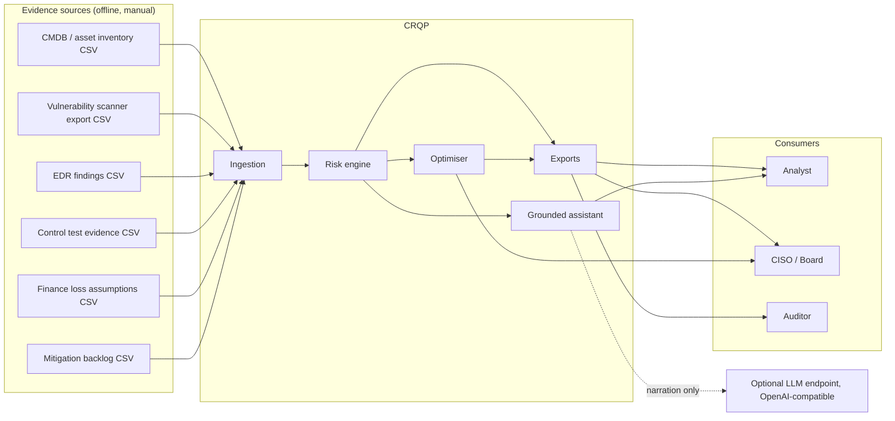

**Boundary note.** Evidence enters as files, not live connectors. There is no API
integration, no scheduled pull, no streaming path. Section E.5 specifies the
connector interface to be added without changing the engine.

---

# B. Architecture Diagram

## B.1 Container view

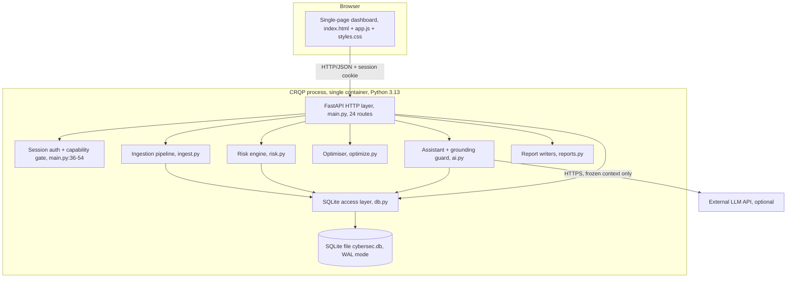

## B.2 Why one process

The optimiser calls the risk engine thousands of times per request
(`app/optimize.py:389-393` evaluates `baseline - assess(subset).eal_minor` per
candidate subset). Splitting these into network services would add a serialisation
round trip to the innermost loop of the most latency-sensitive operation in the
product, for no isolation benefit the process boundary does not already provide.

**The engine is a pure function of `(model, selected_actions, rho_map,
loss_overrides, patched_finding_ids, p0_overrides)`.** **[V]**
`app/risk.py:489-493` It opens no connection, reads no clock, and consults no
environment. That purity is what makes decomposition cheap later, and it is the
reason a modular monolith is the correct choice now rather than a compromise.

## B.3 Data flow for a single assessment request

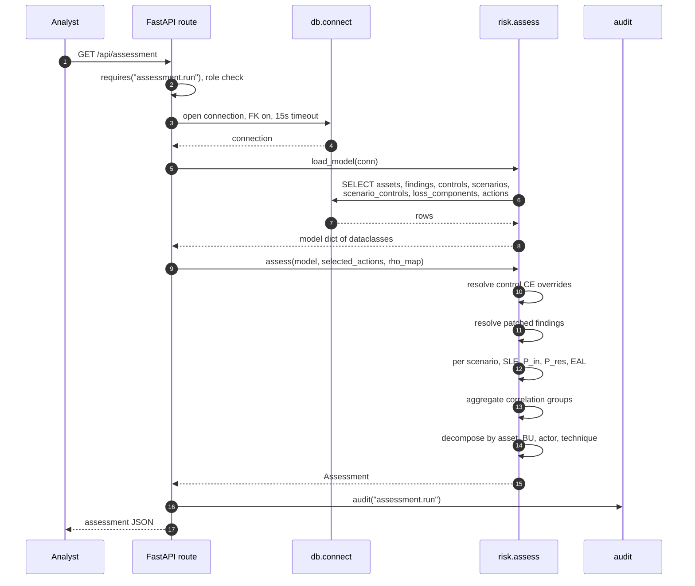

---

# C. Module and Repository Boundaries

## C.1 Current layout

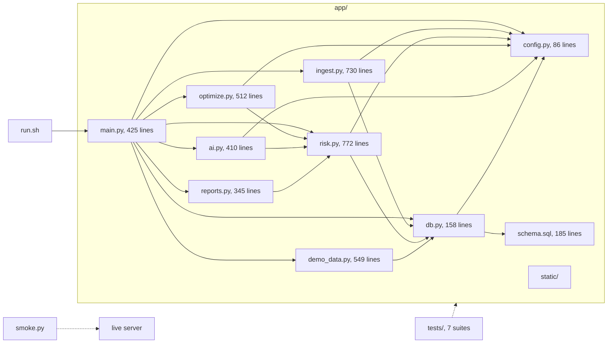

Total application code: 4,167 lines across 10 Python modules plus 3 static assets.
**[V]** `wc -l app/*.py`

## C.2 Dependency rule

**Enforced by review, not tooling, today. [TBD → P]**

One-way rule: `main` → domain → `db` → `config`. No domain module may import
another domain module except through an explicit, documented interface.

Two deliberate exceptions exist today, both acyclic and semantically justified:

- `ai` imports `risk` — the assistant narrates the assessment. **[V]** `app/ai.py:24`
- `reports` imports `risk` — reports render the assessment. **[V]**

What must not happen: `risk` importing `optimize`, or `ingest` importing `main`.
Neither does. **[V]**

**Proposed enforcement [P]:** an import-lint test asserting the transitive import
closure of each domain module contains no forbidden edge. One test file; prevents
the boundary eroding under deadline pressure.

## C.3 Proposed target layout

The MVP needs no restructuring. These additions are specified so phase-two work
lands in named places rather than being invented ad hoc. **[P]**

```text
app/
  domain/               # pure: no I/O, no clock, no env
    model.py            # dataclasses, moved from risk.py:52-242
    money.py            # minor-unit arithmetic and formatting
    assumptions.py      # p0, CE, exposure defaults and policy
  engine/
    sle.py  probability.py  aggregation.py  confidence.py
  ingest/
    parsers.py  validators.py  matchers.py  writers.py
  optimize/
    feasibility.py  search.py  marginals.py  frontier.py
  assistant/
    context.py  guard.py  templates.py  llm.py
  adapters/
    db/  http/  llm/  clock/  rng/     # only layers touching the outside world
  static/
docs/
  TECHNICAL_ARCHITECTURE.md
  adr/
tests/
  unit/  contract/  integration/  golden/
```

The split is justified by `risk.py` being the largest module at 772 lines with six
distinct responsibilities. Splitting it before the multi-tenancy work begins would
be premature; splitting it as part of that work is natural.
---

# D. Data Model

## D.1 Entity-relationship diagram

**Current schema. [V]** `app/schema.sql`

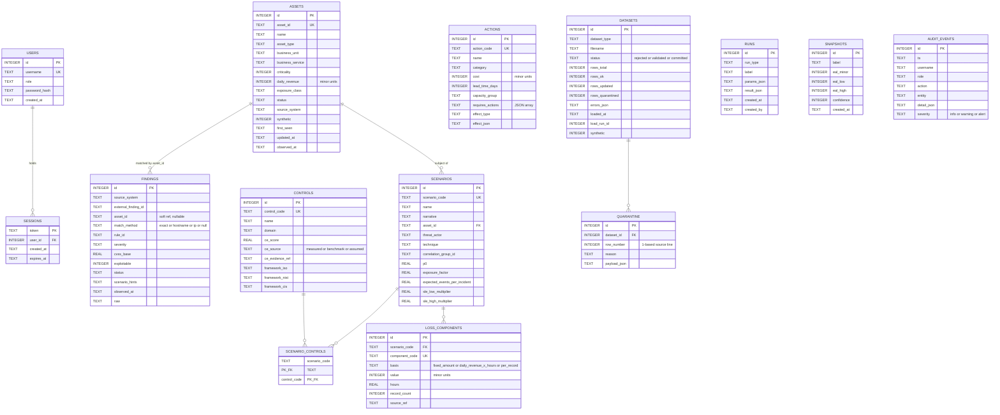

## D.2 Structural gaps in the current schema

These are real and load-bearing. Each is a decision, not an oversight.

| Gap | Evidence | Consequence | Priority |
|---|---|---|---|
| **No `organizations` table** | `assets.business_unit` is free-text `TEXT`, `app/schema.sql:28` | No tenant boundary. Two legal entities cannot be separated, and a BU cannot be renamed without a full data migration. | P1 |
| **No `business_units` table** | same | No hierarchy, no owner, no cost-allocation dimension. Board reporting by BU is a hard-coded rollup. | P1 |
| **No framework mapping table** | Three nullable `TEXT` columns on `controls`, `app/schema.sql:73` | Mappings are free text, unversioned, unvalidatable, and cannot express many-to-many. Section M is therefore aspirational. | P1 |
| **No `control_measurements` table** | `ce_score` + `ce_source` + `ce_evidence_ref` on one row | Cannot hold a time series of control effectiveness. Cannot show a control degraded. Cannot audit when CE was asserted. | P1 |
| **No immutable assessment record** | `runs` and `snapshots` exist but are **never written by any code path** — no `INSERT INTO runs` or `INSERT INTO snapshots` exists in `app/` **[V]** | Every figure the product shows is unreproducible after the next upload. This is the largest gap against the product's own "defensible" claim. | **P0** |
| **No scenario versioning** | `scenarios` updated in place by ingest upsert | An assessment cannot be replayed against the scenario set that produced it. | P0 |
| **No loss-component history** | same in-place upsert | Loss assumptions are the most politically sensitive input; changes must be attributable. | P0 |
| **No `budgets` table** | Budget is a request parameter, `app/main.py:73` | No record of approved budget, owner, or period. | P2 |
| **No `action_status`** | `actions` describes candidates, not commitments | Cannot distinguish proposed / approved / in flight / delivered. Needed for any trend view. | P2 |
| **No job table** | Ingestion is synchronous and inline | Cannot run a large import off the request path or report progress. | P2 |

**`runs` and `snapshots` being dead tables is the most consequential finding in
this document.** The schema was designed for provenance and the implementation
never filled it in. Section P.1 makes closing this the first build task.

## D.3 Money representation


**Contract [V]:**

- Storage is `INTEGER` paise. `db.MINOR_PER_MAJOR = 100` (`app/db.py:49`).
- Ingest converts on the way in. `MONEY_COLUMNS` names exactly three fields:
  `assets.daily_revenue`, `loss_components.value`, `actions.cost`
  (`app/ingest.py:34-38`).
- The engine only adds, subtracts, and multiplies integers. It multiplies a
  currency value by a float rate at exactly one point:
  `daily_revenue_x_hours` → `int(round(daily_revenue * hours / 24.0))`
  (`app/risk.py:387`). Rounding happens once, at conversion, and the result is
  immediately an integer.
- API responses expose `*_minor` as `int`. Display strings are produced at the
  formatting layer.

`float` is used for probabilities and ratios, never for money. `p0`,
`exposure_factor`, `ce_score` and the multipliers are `REAL` by design — they are
dimensionless, and rounding them early would compound error across the formula
chain.

## D.4 Proposed schema additions

```sql
-- ===== P1: tenancy and hierarchy =====
CREATE TABLE organizations (
    org_id        TEXT PRIMARY KEY,
    name          TEXT NOT NULL,
    base_currency TEXT NOT NULL DEFAULT 'INR',
    timezone      TEXT NOT NULL DEFAULT 'Asia/Kolkata',
    created_at    TEXT NOT NULL
);

CREATE TABLE business_units (
    bu_id      TEXT PRIMARY KEY,
    org_id     TEXT NOT NULL REFERENCES organizations(org_id),
    name       TEXT NOT NULL,
    parent_id  TEXT REFERENCES business_units(bu_id),
    owner      TEXT,
    UNIQUE (org_id, name)
);
-- assets.bu_id -> business_units.bu_id; assets.legacy_business_unit retained
-- for one release so existing uploads keep working.

-- ===== P1: control effectiveness as evidence over time =====
CREATE TABLE control_measurements (
    id             INTEGER PRIMARY KEY AUTOINCREMENT,
    control_code   TEXT NOT NULL REFERENCES controls(control_code),
    measured_at    TEXT NOT NULL,
    ce_score       REAL NOT NULL CHECK (ce_score >= 0 AND ce_score <= 0.99),
    ce_source      TEXT NOT NULL CHECK (ce_source IN ('measured','benchmark','assumed')),
    evidence_ref   TEXT,
    method         TEXT,            -- test type, sample size, assessor
    expires_at     TEXT,            -- drives re-attestation reminders
    recorded_by    TEXT NOT NULL,
    created_at     TEXT NOT NULL
);
CREATE INDEX idx_ce_control_time ON control_measurements(control_code, measured_at DESC);
-- controls.ce_score becomes a cached latest value, or is removed and the engine
-- reads the latest measurement. Preferred: engine reads latest measurement, so
-- the cache is an optimisation rather than a source of truth.

-- ===== P1: versioned framework mapping =====
CREATE TABLE frameworks (
    framework_id  TEXT PRIMARY KEY,   -- 'ISO27001-2022', 'NIST-CSF-2.0', ...
    name          TEXT NOT NULL,
    version       TEXT NOT NULL,
    publisher     TEXT NOT NULL,
    reference_uri TEXT,
    retrieved_at  TEXT NOT NULL
);

CREATE TABLE framework_controls (
    framework_control_id TEXT PRIMARY KEY,   -- 'A.8.8', 'GV.RM-01', '6.3'
    framework_id         TEXT NOT NULL REFERENCES frameworks(framework_id),
    parent_id            TEXT,
    title                TEXT NOT NULL,
    UNIQUE (framework_id, framework_control_id)
);

CREATE TABLE control_mappings (
    control_code         TEXT NOT NULL REFERENCES controls(control_code),
    framework_control_id TEXT NOT NULL REFERENCES framework_controls(framework_control_id),
    mapping_kind         TEXT NOT NULL CHECK (mapping_kind IN
        ('implements','partially_implements','evidences','contradicts','not_applicable')),
    evidence_ref         TEXT,
    mapped_by            TEXT NOT NULL,
    mapped_at            TEXT NOT NULL,
    PRIMARY KEY (control_code, framework_control_id)
);
-- A framework control counts as covered only when at least one control maps to it
-- with kind IN ('implements','partially_implements') AND that control has a
-- ce_source = 'measured' record. Anything else renders as "declared, unverified".

-- ===== P0: immutable, reproducible assessments =====
CREATE TABLE assessment_runs (
    run_id               TEXT PRIMARY KEY,      -- uuid4
    org_id               TEXT NOT NULL REFERENCES organizations(org_id),
    run_type             TEXT NOT NULL
        CHECK (run_type IN ('baseline','what_if','optimisation','replay')),
    label                TEXT,
    parent_run_id        TEXT REFERENCES assessment_runs(run_id),
    requested_by         TEXT NOT NULL,
    requested_role       TEXT NOT NULL,
    model_fingerprint    TEXT NOT NULL,   -- sha256 over the canonical input set
    input_ref            TEXT NOT NULL,   -- pointer to input_snapshots
    params_json          TEXT NOT NULL,   -- rho_map, selected_actions, overrides
    result_json          TEXT NOT NULL,
    headline_eal_minor   INTEGER NOT NULL,
    headline_eal_low     INTEGER NOT NULL,
    headline_eal_high    INTEGER NOT NULL,
    headline_confidence  INTEGER NOT NULL,
    engine_version       TEXT NOT NULL,   -- 'risk.assess/1'
    created_at           TEXT NOT NULL
);
CREATE INDEX idx_runs_org_time ON assessment_runs(org_id, created_at DESC);

CREATE TABLE input_snapshots (
    run_id       TEXT PRIMARY KEY REFERENCES assessment_runs(run_id),
    payload_json TEXT NOT NULL,      -- full canonical model
    fingerprint  TEXT NOT NULL
);
-- Storage is trivial at current scale: the D0 model serialises to a few tens of
-- KB. At 1,000 assessments/day for a year this is ~1-2 GB, which is why
-- content-addressed deduplication on fingerprint is a P2 optimisation.
```

**Why a content-addressed fingerprint rather than foreign keys to every row.**
Pointing a run at 23 finding rows and 6 scenario rows means the run breaks the
moment any of those rows change. Freezing the resolved model means a run replays
byte-identically forever, which is the entire point. The cost is duplication,
accepted deliberately: auditability is worth more than normalisation here.

## D.5 Migration strategy

Current state: `db.init_db()` runs `schema.sql` with `CREATE TABLE IF NOT EXISTS`
on every startup (`app/db.py:39-42`). This cannot add a column to an existing
table, so **any schema change requires dropping the database or editing it by
hand.** **[V]**

Proposed: **[P]**

1. Adopt Alembic now, before the first real deployment. SQLite is supported.
2. Stamp existing databases as `head` at introduction so demo data survives.
3. Add a plain `schema_migrations` table if Alembic is judged too heavy.
4. `db.init_db()` becomes: run migrations, then seed demo data only if
   `organizations` is empty.
5. `run.sh --reset` becomes a true truncate-and-reseed for development, with a
   loud confirmation, documented as destructive. Today it idempotently upserts
   and does **not** remove rows the new dataset no longer contains. **[V]**

---

# E. Ingestion Pipeline

## E.1 Stages

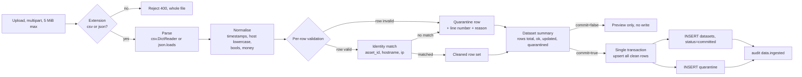

## E.2 Guarantees

| Guarantee | Mechanism | Location |
|---|---|---|
| Whole-file rejection only for structural failure | Extension check, JSON parse failure, missing header | `ingest.py:158-219` **[V]** |
| Per-row tolerance | Every field coerced independently; failures collected on the row, not raised | `ingest.py:241-313` **[V]** |
| True source line numbers | `row_number` captured during parse, including header offset | `ingest.py:41-56` **[V]** |
| Unmatched findings are never force-assigned | `match_finding` returns `(None, None)`; row quarantined as `unmatched_asset` | `ingest.py:410-428` **[V]** |
| Atomic commit | All clean rows written inside one `with connect()` transaction; any exception rolls back the file's commit | `ingest.py:449-545` **[V]** |
| Idempotent re-load | Natural-key upsert per dataset: `asset_id`, `control_code`, `scenario_code`, `action_code`, `(source_system, external_finding_id)`, `(scenario_code, component_code)` | `app/schema.sql` UNIQUE constraints **[V]** |
| Upload size cap | `len(raw) > MAX_UPLOAD_BYTES` → 413 | `app/main.py:156` **[V]** |
| Money converted once, on the way in | `MONEY_COLUMNS` | `ingest.py:34-38` **[V]** |

## E.3 Dataset contracts

All field types are declared in `DATASET_SCHEMAS` (`app/ingest.py:74-154`).
**[V]** `FieldSpec` carries `required`, `kind`, `enum`, `low`/`high`,
`natural_key`. **No field has a `max_length`.** See finding F-2.

### `assets`

| Field | Req | Type | Constraint | Notes |
|---|---|---|---|---|
| `asset_id` | yes | string | natural key | Must match `scenarios.asset_id` |
| `name` | yes | string | | |
| `asset_type` | yes | string | | e.g. `application`, `database` |
| `business_unit` | yes | string | | Free text today; becomes a FK in D.4 |
| `business_service` | | string | | |
| `criticality` | yes | int | 1–5 | |
| `ip` / `hostname` | | string | | Used for finding matching |
| `daily_revenue` | | int | ≥ 0 | **Major units, rupees** → minor on load |
| `exposure_class` | | enum | `internet_facing, internal, external, dmz, restricted` | |
| `status` | | enum | `active, decommissioned, retired` | Non-active assets are excluded from assessment with a reason **[V]** `risk.py:555-558` |
| `source_system` | | string | | |
| `observed_at` | | ts | 5 accepted formats | Drives freshness scoring |

### `findings`

| Field | Req | Type | Constraint |
|---|---|---|---|
| `external_finding_id` | yes | string | natural key within `source_system` |
| `source_system` | yes | string | |
| `asset_id` / `ip` / `hostname` | | string | At least one should match an asset |
| `severity` | yes | enum | `critical, high, medium, low, info` |
| `cvss_base` | | float | 0–10 |
| `exploitable` | | bool | Multiplies the finding weight by 1.5 **[V]** `risk.py:33` |
| `status` | | enum | `open, remediated, accepted, false_positive` |
| `scenario_hints` | | string | Comma-separated; scopes `finding_filter` actions **[V]** `risk.py:349-355` |
| `observed_at` | | ts | |

### `controls`

| Field | Req | Type | Constraint |
|---|---|---|---|
| `control_code` | yes | string | natural key |
| `ce_score` | yes | float | 0–0.99, not 1.0 |
| `ce_source` | | enum | `measured, benchmark, assumed` → drives confidence **[V]** `risk.py:408-418` |
| `ce_evidence_ref` | | string | Any `ASSUMED` sentinel reduces provenance **[V]** `risk.py:432-440` |
| `framework_iso/nist/cis` | | string | Free text today; replaced by `control_mappings` in D.4 |

### `scenarios`

| Field | Req | Type | Constraint |
|---|---|---|---|
| `scenario_code` | yes | string | natural key |
| `asset_id` | yes | string | FK to `assets.asset_id` |
| `p0` | yes | float | 0.0001 – `MAX_ANNUAL_PROBABILITY` (0.5) |
| `exposure_factor` | | float | 0–2 |
| `expected_events_per_incident` | | float | 1–10, lambda |
| `sle_low_multiplier` | | float | 0–1 |
| `sle_high_multiplier` | | float | 1–5 |
| `correlation_group_id` | | string | Drives group aggregation |
| `required_controls` | | string | Comma-separated control codes |

### `loss_components`

| Field | Req | Type | Constraint |
|---|---|---|---|
| `scenario_code` | yes | string | |
| `component_code` | yes | string | natural key within scenario |
| `basis` | yes | enum | `fixed_amount, daily_revenue_x_hours, per_record` |
| `value` | | int | **Major units** → minor on load; per-unit amount when `per_record` |
| `hours` | | float | Required when `basis = daily_revenue_x_hours` |
| `record_count` | | int | Required when `basis = per_record` |
| `source_ref` | | string | Document reference, or the literal `ASSUMED` |

### `actions`

| Field | Req | Type | Constraint |
|---|---|---|---|
| `action_code` | yes | string | natural key |
| `cost` | yes | int | **Major units** → minor on load. One-time. |
| `lead_time_days` | | int | 0–1000 |
| `capacity_group` | | string | Mutually exclusive with others in the same group |
| `requires_actions` | | string | Comma-separated prerequisites |
| `effect_type` | yes | enum | `control_ce, finding_filter, loss_component, exposure_factor` |
| `effect_json` | yes | string | Validated JSON, schema depends on `effect_type` |

## E.4 Effect payload schemas

Beyond "must parse as JSON", these are not validated today. **[V]**
`ingest.py:241-313`. Proposed strict per-type validation. **[P]**

| `effect_type` | Required keys | Consumed at |
|---|---|---|
| `control_ce` | `set_ce: {control_code: float}` — resolved with `max()`, so an action can raise but never lower CE **[V]** `risk.py:518-523` | `risk.assess` |
| `finding_filter` | optional `severity_in[]`, `min_cvss`, `exposure_in[]`, `exploitable_only`, `only_hints` | `risk._match_filtered` |
| `exposure_factor` | `scenario_code: str`, `factor: float` — replaces, not multiplies, the base factor **[V]** `risk.py:597-600` | `risk.assess` |
| `loss_component` | `scenario_code`, `component_code`, plus `basis`/`value`/`hours`/`record_count` | **Declared but not implemented** **[V]** — no branch reads it |

## E.5 Proposed connector layer

To move from file upload to continuous refresh without touching the engine. **[P]**

```python
class SourceConnector(Protocol):
    name: str
    def poll(self, since: datetime) -> AsyncIterator[RawRecord]: ...
    def health(self) -> ConnectorHealth: ...

class Normaliser(Protocol):
    dataset_type: str
    schema_version: str          # explicit; see D.5
    def to_rows(self, raw) -> list[dict]: ...
```

Pipeline: `Connector → Normaliser → IngestEngine.validate() → quarantine/commit`.

The critical constraint: **connectors must not write to the database.** They
produce records; the existing `validate` → `match` → `commit` path remains the
only writer. That preserves the single transaction boundary and keeps quarantine
meaningful.
---

# F. Risk Quantification Engine

The core. A pure function and the single source of every currency figure in the
product.

Every numeric value in sections F.2, F.3, F.4, F.5, F.6, G.2 and H.4 of this
document is **emitted by `docs/worked_example.py`**, which builds the fixture
below and runs the live `app.risk` and `app.optimize` modules against it. Where
this document and the engine disagree, the engine is right. Figures were not
transcribed by hand.

## F.1 Formulas

```text
For scenario s with asset a:

  SLE_s        = sum of amount(c) over components c        # section F.3
  vm_s         = min(3.0, 1 + 0.03 * sum of w(f))          # section F.4
  m_s          = exposure_factor_s * vm_s
  P_in_s       = min(0.95, 1 - (1 - p0_s) ^ m_s)
  mit_raw_s    = product over required controls c of (1 - CE_c)
  mit_s        = max(mit_raw_s, 1 - MAX_CONTROL_MITIGATION) # 1 - 0.90 = 0.10
  P_res_s      = P_in_s * mit_s
  EAL_s        = round(P_res_s * SLE_s * lambda_s)

  eal_low_s    = round(EAL_s * sle_low_multiplier_s  * 0.5)
  eal_high_s   = round(EAL_s * sle_high_multiplier_s * 1.5)

  EAL_group    = (1 - rho) * sum of EAL in g + rho * max EAL in g
  EAL_total    = sum over all groups

  confidence_s = round(100 * sum over k of w_k * score_k)   # section F.6
  confidence   = round( sum of (EAL_s * conf_s) / sum of EAL_s )   # EAL-weighted
```

All of the above is **[V]**, implemented at `app/risk.py:377-443` and
`app/risk.py:562-715`.

## F.2 Worked example — the fixture

Small enough to verify by hand, which is the point: it is specified here as the
golden fixture for the test suite (section O.2) and as a regression tripwire for
the engine. The generator is `docs/worked_example.py`.

### Model

**Assets**

| asset_id | name | BU | criticality | daily_revenue | exposure | status |
|---|---|---|---|---|---|---|
| A-1 | Payments Platform | Retail Banking | 5 | ₹60,00,000 | internet_facing | active |
| A-2 | Core Ledger | Retail Banking | 5 | ₹20,00,000 | internal | active |

**Findings** — all `status = open`, all `observed_at` 2026-09-28 except F-006
at 2026-09-20

| id | asset | severity | exploitable | scenario_hints |
|---|---|---|---|---|
| F-001 | A-1 | critical | yes | S-1 |
| F-002 | A-1 | high | yes | S-1 |
| F-003 | A-1 | medium | no | S-1 |
| F-004 | A-2 | high | no | S-2 |
| F-005 | A-2 | medium | no | S-2 |
| F-006 | A-1 | low | no | S-1 |

**Controls**

| code | name | ce | source | evidence |
|---|---|---|---|---|
| CTL-BK | Immutable offline backups | 0.55 | measured | BA-2026-014 |
| CTL-EDR | EDR with tamper protection | 0.50 | measured | BA-2026-009 |
| CTL-SEG | Payment-zone segmentation | 0.45 | benchmark | INT-T-003 |
| CTL-PAM | Privileged access management | 0.40 | measured | BA-2026-021 |

**Scenarios** — both in correlation group `GRP-CORR`, `lambda` = 1.0, low ×0.7,
high ×1.3

| code | asset | p0 | exposure | required controls |
|---|---|---|---|---|
| S-1 | A-1 | 0.35 | 1.0 | CTL-BK, CTL-EDR, CTL-SEG, CTL-PAM |
| S-2 | A-2 | 0.20 | 1.0 | CTL-PAM, CTL-EDR |

**Loss components**

| scenario | code | basis | inputs | amount |
|---|---|---|---|---|
| S-1 | downtime | daily_revenue_x_hours | A-1 daily ₹60,00,000, 8 h | ₹20,00,000 |
| S-1 | forensics | fixed_amount | — | ₹45,000 |
| S-1 | customer_remediation | per_record | ₹500 × 2,000 | ₹10,00,000 |
| S-2 | downtime | daily_revenue_x_hours | A-2 daily ₹20,00,000, 6 h | ₹5,00,000 |
| S-2 | reconciliation | fixed_amount | — | ₹70,000 |

**Actions**

| code | cost | lead | capacity group | requires | effect |
|---|---|---|---|---|---|
| ACT-PATCH | ₹15,000 | 30 d | — | — | `finding_filter` critical+high, internet_facing, exploitable_only |
| ACT-EDR-TUNE | ₹3,000 | 45 d | — | — | `control_ce` CTL-EDR → 0.70 |
| ACT-PAM | ₹60,000 | 90 d | identity-tier-1 | — | `control_ce` CTL-PAM → 0.75 |
| ACT-MFA | ₹12,000 | 120 d | identity-tier-1 | ACT-PAM | `exposure_factor` S-1 → 0.55 |
| ACT-SEG | ₹18,000 | 120 d | — | ACT-PAM | `control_ce` CTL-SEG → 0.75 |

> **Scaling note.** Amounts are deliberately small so the arithmetic can be checked
> by hand. EAL is linear in the money inputs, so scaling every amount by the same
> factor scales EAL identically and leaves ROSI unchanged. **The ratio of costs to
> losses does change ROSI**, and the negative ROSI values in section H.4 are a
> direct consequence of that ratio. See finding F-10.

### Step 1 — vulnerability multiplier

```text
S-1 open findings: F-001 1.0×1.5 = 1.5, F-002 0.6×1.5 = 0.9,
                   F-003 0.3,      F-006 0.1      -> sum = 2.8
vm_S1 = 1 + 0.03 × 2.8 = 1.084                        engine: 1.084   OK

S-2 open findings: F-004 0.6, F-005 0.3               -> sum = 0.9
vm_S2 = 1 + 0.03 × 0.9 = 1.027                        engine: 1.027   OK
```

Severity weights are `{critical: 1.0, high: 0.6, medium: 0.3, low: 0.1,
info: 0.0}` and the exploitability multiplier is `1.5`. Both read from
`SEVERITY_WEIGHT` and `EXPLOITABLE_MULTIPLIER`. **[V]** `app/risk.py:29-33`

### Step 2 — single loss expectancy

```text
S-1 downtime        = round(60,00,000 × 8 / 24)         = ₹20,00,000
S-1 forensics                                           =  ₹   45,000
S-1 remediation    = 500 × 2,000                        = ₹10,00,000
SLE_S1                                                  = ₹30,45,000
                                                         engine: ₹30,45,000  OK

S-2 downtime        = round(20,00,000 × 6 / 24)         =  ₹ 5,00,000
S-2 reconciliation                                       =  ₹   70,000
SLE_S2                                                  =  ₹ 5,70,000
                                                         engine:  ₹ 5,70,000  OK
```

S-1 is dominated by two components of similar size — lost revenue and customer
remediation — with forensics almost irrelevant. That shape is typical and it is
what makes the mitigation cap matter: there is no single control that addresses
"customers must be compensated".

### Step 3 — inherent probability

```text
P_in_S1 = 1 − (1 − 0.35)^1.084 = 1 − 0.65^1.084 = 0.373100
                                                          engine: 0.373100  OK
P_in_S2 = 1 − (1 − 0.20)^1.027 = 1 − 0.80^1.027 = 0.204805
                                                          engine: 0.204805  OK
```

### Step 4 — mitigation, and where the cap bites

```text
S-1: (1−0.55) × (1−0.50) × (1−0.45) × (1−0.40)
   = 0.45 × 0.50 × 0.55 × 0.60 = 0.07425   -> 92.575% claimed reduction
   floor = 1 − MAX_CONTROL_MITIGATION = 1 − 0.90 = 0.10
   mit_S1 = max(0.07425, 0.10) = 0.10                          CAP APPLIED

S-2: (1−0.40) × (1−0.50) = 0.60 × 0.50 = 0.30  -> 70% claimed reduction
   mit_S2 = max(0.30, 0.10) = 0.30                              no cap
                                                          engine: 0.300000  OK
```

**The cap is the single most important honesty mechanism in the model.** Four
well-run controls do not reduce risk by 92.6%, because they share failure modes:
the same team, the same platform, the same configuration drift. Without the floor
the model would return a near-zero residual for S-1 and invite a board to believe
that control stacking is free. The cap is applied *and reported* as a confidence
reason, not hidden.

S-1 carries the reason verbatim:

> `stacked control effectiveness implies a 92.6% reduction, capped at 90% to allow for correlated control failure`

S-1's full reason list is exactly two entries — that cap, and
`Control effectiveness partly benchmarked` because CTL-SEG is a benchmark rather
than a measurement. S-2 has **no** reason entries, because all four of its
sub-scores are 1.0. **[V]**

### Step 5 — expected annual loss

```text
P_res_S1 = 0.373100 × 0.10   = 0.037310
EAL_S1   = 0.037310 × 30,45,000 = ₹1,13,609          engine: ₹1,13,609  OK

P_res_S2 = 0.204805 × 0.30   = 0.061442
EAL_S2   = 0.061442 ×  5,70,000 =  ₹35,022          engine:  ₹35,022  OK
```

### Step 6 — correlation adjustment

`GRP-CORR` has two members, rho = 0.5:

```text
EAL_total = 0.5 × (1,13,609 + 35,022) + 0.5 × 1,13,609
          = 0.5 × 1,48,631 + 56,804
          = 74,315 + 56,804 = ₹1,31,120                engine: ₹1,31,120  OK
```

| Metric | Value |
|---|---|
| **EAL (headline)** | **₹1,31,120** |
| Unadjusted naive sum | ₹1,48,631 |
| Correlation saving | ₹17,511 — 11.8% of the naive sum |
| Low estimate | ₹45,892 |
| High estimate | ₹2,55,684 |
| Confidence | **95 / 100 — High** |
| Incomplete scenarios | 0 |
| Excluded (unmatched) findings | 0 |
| rho used | `{"GRP-CORR": 0.5}` |
| Data freshness | scanner age 2.15 days, band `fresh` |

Decomposition: **A-1 ₹1,00,224** (76.5%), **A-2 ₹30,896** (23.5%).

The headline is **11.8% below the naive sum**, and the platform reports both. A
reader who assumes independence sees the number they expected next to the number
the model produced, and can see why they differ.

## F.3 Loss component bases

`risk._component_value` (`app/risk.py:359-392`) supports three bases. **[V]**

| Basis | Formula | Failure mode |
|---|---|---|
| `fixed_amount` | `value` | None |
| `daily_revenue_x_hours` | `round(daily_revenue × hours / 24)` | Asset missing, `hours` null, or `daily_revenue <= 0` → contributes 0 **and** raises an incompleteness reason |
| `per_record` | `value × record_count` | `record_count` null → 0 plus a reason |

The failure behaviour is the design point. A missing input produces a scenario
with `complete: false` and a populated `incomplete_reasons` list, which flows to
`Assessment.incomplete` and is surfaced in the UI, the exports, and the assistant
context. **[V]**

Note the consequence for section G: a missing loss input does not raise the
headline, it *excludes* the scenario from it. A reader comparing two runs must
check `incomplete` before concluding that risk fell.

## F.4 The vulnerability multiplier — a stated prior, not a model

```text
vm = min(3.0, 1 + 0.03 × sum of weight(f))
weight: critical 1.0, high 0.6, medium 0.3, low 0.1, info 0.0
        × 1.5 if exploitable
        only findings with status = "open" count
```

The `0.03` coefficient and the `1.5` exploit multiplier are **hand-chosen
constants**, documented in the source as "a transparent, hand-auditable prior —
NOT a learned model" (`app/risk.py:326-328`). **[V]**

This is a deliberate trade. A learned model would fit historical incidents better
and would be indefensible the moment anyone asked how it was trained and on what.
A stated prior can be argued with, adjusted by a risk owner, and recorded in a
decision log. **The coefficient must become a per-deployment configurable
assumption in phase 1, with the sensitivity of the headline EAL to ±50% on this
coefficient reported.**

## F.5 Scenario selection rules

A scenario is excluded from the headline, with a recorded reason, when: **[V]**

- its `asset_id` is not found (`risk.py:550-554`), or
- its asset `status != "active"` (`risk.py:555-558`), or
- a required control code is undefined (`risk.py:608-610`), or
- any loss component cannot be resolved, or
- `SLE <= 0` (`risk.py:583-584`).

Excluded scenarios still appear in `Assessment.incomplete`. They are never silently
dropped and never scored as zero.

`RiskError` is raised — a 400, not a degraded result — when `p0` is outside
`(0, 0.5]` (`risk.py:593-594`) or an unknown action code is selected
(`risk.py:516-517`). Refusing is correct: these are caller errors, not data
conditions.

## F.6 Confidence model

Four weighted sub-scores, each 0–1. **[V]** `app/risk.py:39-44, 395-443`

| Sub-score | Weight | 1.0 when | 0.75 | 0.6 | 0.4 | 0.25 | 0.0 |
|---|---|---|---|---|---|---|---|
| `completeness` | 0.35 | at least 1 required control mapped | | | | | none mapped |
| `evidence` | 0.25 | all CE `measured` | any `benchmark` | | any `assumed`, or no controls | | |
| `freshness` | 0.25 | ≤ 7 d | | ≤ 30 d | | > 30 d | no timestamp → 0.5 |
| `provenance` | 0.15 | every loss component has a real `source_ref` | | | | | no components |

Two additional rules:

- If any required control's `ce_source` is `assumed`, confidence is **hard-capped
  at 54** and a reason is appended. **[V]** `risk.py:646-649` An assumed control
  effectiveness cannot yield a "High" claim.
- If the mitigation cap bound, a reason is appended. **[V]** `risk.py:641-645`

Bands: `>= 80 High`, `>= 55 Medium`, else `Low`. **[V]** `risk.py:446-451`

**Worked example confidence.**

S-1: completeness 1.0 (4 of 4 required controls mapped), evidence 0.75 (CTL-SEG is
benchmarked), freshness 1.0 (scanner data 2.15 days old), provenance 1.0 (all
three components carry real `source_ref`s)

```text
0.35×1.0 + 0.25×0.75 + 0.25×1.0 + 0.15×1.0
= 0.35 + 0.1875 + 0.25 + 0.15 = 0.9375  ->  94      engine: 94  OK
```

S-2: completeness 1.0, evidence 1.0 (CTL-PAM and CTL-EDR both `measured`),
freshness 1.0, provenance 1.0 → **100**. Engine: 100. **[V]**

Portfolio, EAL-weighted:

```text
(1,13,609 × 94 + 35,022 × 100) / 1,48,631
= (10,679,246 + 3,502,200) / 1,48,631
= 14,181,446 / 1,48,631 = 95.42  ->  95             engine: 95 / High  OK
```

**What a Low score means.** The number is *weakly supported*, not small. This is
stated in the README and repeated in every export, because the failure mode of a
confidence score is a reader concluding "Low confidence, so we are fine". **[V]**

## F.7 Model version and reproducibility

Today: `risk.assess` carries no version string, and the model is re-read from live
tables on every call. Two assessments of "the same" portfolio are not guaranteed
comparable, because an upload between them changes the answer. **[V]**

Proposed: **[P]**

1. `ENGINE_VERSION = "risk.assess/1"` stamped on every `assessment_runs` row.
2. `model_fingerprint = sha256(canonical_json(load_model(conn)))` — changes if any
   input changes, so "why did the number move?" becomes answerable by diffing two
   fingerprints.
3. Snapshot the resolved model into `input_snapshots` so any run replays exactly.
4. Move `EXPLOITABLE_MULTIPLIER`, the `0.03` coefficient, `SEVERITY_WEIGHT` and
   `CONFIDENCE_WEIGHTS` out of module constants into a versioned `assumptions`
   record, so a risk owner can change them and the change is attributable.
5. Emit a sensitivity band: re-run the headline with the vm coefficient at ±50%
   and report the swing.

## F.8 Verified defect — the deterministic assistant path is not grounded

**Found while constructing the worked example. A real, reproducible defect, not a
design concern.**

`ai.build_context()` (`app/ai.py:66-128`) does **not** include
`ScenarioResult.breakdown`, so individual loss-component amounts never enter the
frozen context. `ai.template_answer()` **does** quote the largest loss component
amount (`app/ai.py:243-248`). But `ai.ask()` calls `check_grounding()` only on LLM
output (`app/ai.py:390`) — the deterministic fallback path is never checked.

Reproduction, executed 2026-09-30 against the shipped D0 dataset:

```text
ctx = build_context(assess(load_model(conn)), model)
check_grounding(template_answer("why is the largest exposure so large?", a, ctx), ctx)
  -> (False, ['24,000,000'])
```

and on the worked example of section F.2:

```text
  -> (False, ['2,000,000'])
```

The template states a figure that is not in its own context, which is precisely
what rule 1 of the module docstring forbids. The template is the *fallback*, so
this is the path that runs whenever the LLM is disabled — the default
configuration.

Impact is low (the number is real, from the same assessment) and the contract is
still violated (the guard does not cover the deterministic path).

**Fix [P]:** include `breakdown` in the context, and assert `check_grounding()`
on the template output inside `ask()` before returning it, for both the template
and the refusal paths. Add a regression test that every branch of `ask()` returns
grounded text. Tracked as finding **F-8** in section N.6.

---

# G. Scenario What-If and Uncertainty

## G.1 What-if mechanism

`POST /api/scenarios/{code}/whatif` accepts `ScenarioOverride` (defined in
`app/main.py:67`) with optional `p0` and `loss_overrides`. **[V]**

```python
class ScenarioOverride(BaseModel):
    p0:             float | None                        # 0 < p0 <= 1
    loss_overrides: dict[str, dict[str, Any]] | None    # {scenario: {component: {...}}}
```

The route converts these into the two `assess()` keyword arguments
`p0_overrides` and `loss_overrides` (`app/risk.py:489-496`) and discards them
afterwards. **No row is written.** The response is a complete assessment computed
from the modified model, so what-if and baseline are directly comparable.

Unknown scenario code → `404` before any computation runs. **[V]**
`app/main.py:295-297`

## G.2 Worked example — what-if results

Engine output at rho = 0.5 on the F.2 model. **[V]**

| Variant | Change | SLE_S1 | S-1 EAL | S-2 EAL | **Total EAL** | Delta | Confidence |
|---|---|---|---|---|---|---|---|
| Baseline | — | ₹30,45,000 | ₹1,13,609 | ₹35,022 | **₹1,31,120** | — | 95 High |
| Probability | S-1 `p0` 0.35 → 0.10 | ₹30,45,000 | ₹32,865 | ₹35,022 | **₹51,454** | **−₹79,666** | 97 High |
| Loss | S-1 downtime 8 h → 24 h | ₹70,45,000 | ₹2,62,849 | ₹35,022 | **₹2,80,360** | **+₹1,49,240** | 95 High |

Hand-check of both variants:

```text
probability:  P_in = 1 - 0.90^1.084 = 0.107930
              P_res = 0.107930 × 0.10 = 0.010793
              EAL_S1 = 0.010793 × 30,45,000 = ₹32,865            OK

loss:         SLE = 60,00,000 × 24/24 + 45,000 + 10,00,000 = ₹70,45,000
              P_res unchanged at 0.037310
              EAL_S1 = 0.037310 × 70,45,000 = ₹2,62,849           OK
```

Three things worth reading off this table:

- **Cutting baseline probability by 3.5× cuts the portfolio by 60.8%, not 71%.**
  The residue is S-2, which is untouched by the override, plus the correlation
  structure: reducing S-1 pulls the group toward `0.5 × S-2` rather than toward
  zero. This is the correct behaviour of the correlation model and exactly the
  kind of thing a single-scenario spreadsheet hides.
- **Tripling downtime nearly doubles the portfolio (+113.8%), not triples it.**
  SLE_S1 triples and S-1 EAL more than doubles, but the group's maximum term
  compresses the aggregate. Again, correlation working as intended.
- **Confidence goes *up* on the probability what-if, from 95 to 97.** `p0` is not
  an input to any of the four confidence sub-scores, so lowering it changes only
  the EAL weighting between S-1 and S-2 — and S-2 scores 100. This is arguably
  correct (the *inputs* are as well evidenced as before) and it is also a genuine
  trap for a reader: **improving a number can improve its confidence score
  without any new evidence arriving.** The UI must not present the what-if
  confidence as a validation of the what-if.

**This is the intended analytical use.** The what-if endpoint is how a risk owner
defends a number to a business unit that disputes a loss assumption, and how a
CISO shows that remediation *timing* matters more than remediation cost.

## G.3 Uncertainty band

```text
eal_low  = round(EAL × sle_low_multiplier  × 0.5)
eal_high = round(EAL × sle_high_multiplier × 1.5)
```

`PROBABILITY_MULT_LOW/HIGH = 0.5 / 1.5`. **[V]** `app/risk.py:35-36, 635-636`

Applied per scenario, then aggregated through the same correlation rule, so the
band on the portfolio is not the naive sum of per-scenario bands. **[V]**
`risk.py:481-484`

Worked example: ₹1,31,120 → **₹45,892 – ₹2,55,684**, roughly `0.35×` to `1.95×`
the point estimate.

**A band this wide is a feature.** It tells the board the number is a central
estimate with a genuine spread, not a precise figure. Any future work should
widen the band, never narrow it, until the loss assumptions are evidenced.

## G.4 Confidence versus uncertainty

Different axes, and the UI must never merge them:

- **Uncertainty band** — how much the *number* moves when the loss and
  probability multipliers move. A property of the arithmetic.
- **Confidence score** — how well *evidenced the inputs* are. A property of the
  data.

A tight band with low confidence is entirely possible (precise arithmetic on
assumed inputs), as is a wide band with high confidence (real, well-sourced
inputs whose loss magnitude is genuinely uncertain). The shipped D0 dataset
demonstrates the first case: a wide band with confidence only **65 / Medium**,
because several control effectiveness values are assumed rather than measured.
**[V]**
---

# H. Optimisation Engine

## H.1 Problem statement

Choose a subset `S` of candidate actions maximising

```text
  reduction(S) = EAL(baseline) - EAL(S)
  subject to   cost(S) <= budget
             and |S| <= capacity
             and for every capacity group g, at most one action
             and for every a in S, requires(a) subset of S
```

`reduction(S) is non-additive.* The same control reduced twice is worth less the
second time, and two actions targeting the same finding are redundant. Any
approach that scores actions independently and adds the scores is wrong. The
engine therefore evaluates subsets by running the **full risk engine** on each
one. **[V]** `optimize.py:386-393`

```python
def evaluate(sel: set[str]) -> int:
    key = frozenset(sel)
    if key not in cache:
        cache[key] = baseline - risk.assess(model, sel, rho_map=rho_map).eal_minor
    return cache[key]
```

A `frozenset` memo means each distinct subset is assessed once regardless of how
many search paths reach it. **[V]** `optimize.py:387-390`

## H.2 Decision flow

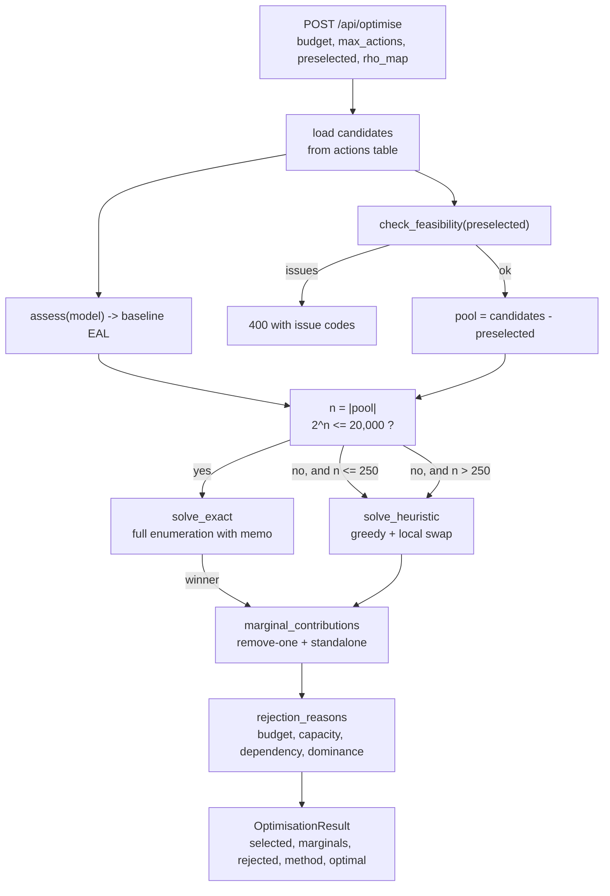

## H.3 Search strategies

| | Exact **[V]** | Heuristic **[V]** |
|---|---|---|
| Entry | `solve_exact`, `optimize.py:198` | `solve_heuristic`, `optimize.py:218` |
| Method | Full enumeration of all `2^n` feasible subsets | Greedy by standalone reduction, then hill-climb swaps |
| Guard | `exact and len(pool) <= config.EXACT_SEARCH_MAX_ACTIONS` | Above that threshold, or when `exact=False` |
| `optimal` flag | `True` | `False` |
| Complexity | Exponential | Polynomial, but **no guarantee** |

**[V]** `optimize.py:408`:

```python
use_exact = exact and len(pool) <= config.EXACT_SEARCH_MAX_ACTIONS
```

`EXACT_SEARCH_MAX_ACTIONS` defaults to **16** via `CRP_EXACT_MAX`.
**[V]** `config.py:48`

> **The threshold is on the action count, not the subset count, and 16 is
> optimistic.** `2^16 = 65,536` subsets. Each subset evaluation calls
> `risk.assess` over the whole model, and at roughly 0.1–1 ms per assessment for
> a portfolio the size of the shipped D0 dataset, exhaustive search at `n = 16` is
> a **6-second to 65-second request**. The `frozenset` memo helps a great deal
> here, because most subsets are infeasible and are pruned before evaluation, but
> the guard is a guard on combinatorial *feasibility*, not on wall-clock time.
>
> There is no request timeout and no evaluation-count cap. A portfolio with 16
> feasible actions can occupy a worker for the better part of a minute, and
> `max_actions` is itself caller-controlled up to whatever the optimiser is passed.
> **Finding F-22.** The production fix is a time-boxed search: measure elapsed
> time inside the enumeration loop, break to the best-so-far when a deadline
> passes, and report `optimal=False, optimality_proven=False, elapsed_ms`. A
> caller-supplied `max_actions` should be capped by the server, not trusted.

Above the threshold the heuristic runs and the result is reported as
non-optimal. Feasibility is re-checked for every subset by `_valid_subset`, and
an infeasible subset is skipped before its assessment is computed, so the
`frozenset` memo only ever holds feasible evaluations. **[V]**
`optimize.py:174-195`

### Feasibility rules

All enforced by `check_feasibility` (`optimize.py:122-167`) and re-checked per
subset by `_valid_subset` (`optimize.py:174-195`). **[V]**

| Rule | Error code | Rejection reason string |
|---|---|---|
| `cost(S) <= budget` | `budget` | `Over budget: costs ₹X, remaining budget ₹Y` |
| `len(S) <= capacity_max` | `capacity` | `Exceeds capacity: N of M` |
| `requires(a) ⊆ S` | `dependency` | `Requires ACT-X, which is not selected` |
| `len(S ∩ g) <= 1` per group | `exclusivity` | `Mutually exclusive with <other action name>` |
| Unknown action code | `unknown` | `Unknown action '<code>'` |

Verified on the F.2 fixture, which exercises exclusivity and dependency:

```text
budget ₹75,000 -> rejected: ACT-EDR-TUNE  'Over budget: costs ₹3,000, remaining budget ₹0'
                            ACT-MFA        'Mutually exclusive with Privileged access
                                             management rollout'
                            ACT-SEG        'Over budget: costs ₹18,000, remaining budget ₹0'
```

The exclusivity message names the *conflicting action by name*, not by code,
because a rejection list is read by a CISO, not by a parser. **[V]**

`ACT-MFA` is rejected for exclusivity even at a budget that could afford it,
because it shares `capacity_group = identity-tier-1` with the already-selected
`ACT-PAM`. This is correct — but note `ACT-MFA` also *requires* `ACT-PAM`, so the
two mechanisms overlap and the message could mislead. **Finding F-9.**

## H.4 Worked example — optimisation results

Engine output on the F.2 fixture, `max_actions = 6`, rho = 0.5, exact search.
Baseline EAL ₹1,31,120. **[V]**

### Budget ₹75,000

```text
selected    ACT-PAM, ACT-PATCH
cost        ₹75,000
reduction   ₹16,228  (12.38%)
plan EAL    ₹1,14,892
net benefit −₹58,772
ROSI        −0.7836
method      exact, optimal=True, 7 subsets evaluated, 0 ms
capacity    2 / 6
```

| Action | Cost | Marginal reduction | Standalone reduction | Overlap penalty | Marginal ROSI | Standalone ROSI |
|---|---|---|---|---|---|---|
| ACT-PAM | ₹60,000 | ₹10,215 | ₹10,215 | ₹0 | −0.8298 | −0.8298 |
| ACT-PATCH | ₹15,000 | ₹6,014 | ₹6,014 | ₹0 | −0.5991 | −0.5991 |

Both actions reduce the same thing — S-1's residual — but through different
mechanisms, so the overlap penalty is exactly zero. That is a coincidence of this
fixture, not a general property.

### Budget ₹80,000

```text
selected    ACT-EDR-TUNE, ACT-PAM, ACT-PATCH
cost        ₹78,000
reduction   ₹17,687  (13.49%)
plan EAL    ₹1,13,433
net benefit −₹60,313
ROSI        −0.7732
method      exact, optimal=True, 9 subsets evaluated, 0 ms
capacity    3 / 6
```

Adding `ACT-EDR-TUNE` costs ₹3,000 and buys ₹1,459 of additional reduction
(₹17,687 − ₹16,228). It is selected because it is the only candidate that fits in
the remaining ₹5,000, and the objective is maximise reduction subject to budget —
not maximise ROSI. **The optimiser does not consider ROSI at all.**

| Action | Cost | Marginal reduction | Standalone reduction | Overlap penalty | Marginal ROSI | Standalone ROSI |
|---|---|---|---|---|---|---|
| ACT-EDR-TUNE | ₹3,000 | ₹1,459 | ₹7,004 | **₹5,545** | **−0.5136** | **1.3348** |
| ACT-PAM | ₹60,000 | ₹4,670 | ₹10,215 | **₹5,545** | −0.9222 | −0.8298 |
| ACT-PATCH | ₹15,000 | ₹6,014 | ₹6,014 | ₹0 | −0.5991 | −0.5991 |

`ACT-EDR-TUNE` is the instructive row. Alone it would remove ₹7,004 of risk —
more than any other action except `ACT-PAM` — for ₹3,000, a standalone ROSI of
**+1.33**. In the chosen plan it is worth only ₹1,459, because `ACT-PAM` already
raised CTL-PAM and the S-1 mitigation cap was already binding at 0.10. The
overlap penalty of ₹5,545 is the honest number.

**This is the central analytical lesson of the optimiser, and it is why
standalone ROSI is reported but never used for ranking.** An action ranked by
standalone ROSI here would select `ACT-EDR-TUNE` first — which happens to be
correct by accident in this fixture, because it is also the cheapest. In a
portfolio where a high-standalone-ROSI action is expensive and a cheap one is
heavily overlapping, standalone ranking inverts the answer. Marginal contribution
within the completed plan is the only defensible ranking, and it is not additive,
so a true greedy is unsound and only an exhaustive or locally-searched answer is
trustworthy.

### Frontier

`frontier()` (`optimize.py:490-512`) samples `steps` budgets from 0 to
`budget_max` and returns cost, reduction, plan EAL, selection and the `optimal`
flag. **[V]** On the F.2 fixture with `budget_max = ₹1,50,000`, 7 steps:

| Budget | Plan cost | Reduction | Selected | `optimal` |
|---|---|---|---|---|
| ₹0 | ₹0 | ₹0 | — | `True` |
| ₹25,000 | ₹18,000 | ₹13,018 | ACT-EDR-TUNE, ACT-PATCH | **`False`** |
| ₹50,000 | ₹18,000 | ₹13,018 | ACT-EDR-TUNE, ACT-PATCH | `True` |
| ₹75,000 | ₹75,000 | ₹16,228 | ACT-PAM, ACT-PATCH | **`False`** |
| ₹1,00,000 | ₹78,000 | ₹17,687 | ACT-EDR-TUNE, ACT-PAM, ACT-PATCH | `True` |
| ₹1,25,000 | ₹78,000 | ₹17,687 | ACT-EDR-TUNE, ACT-PAM, ACT-PATCH | **`False`** |
| ₹1,50,000 | ₹78,000 | ₹17,687 | ACT-EDR-TUNE, ACT-PAM, ACT-PATCH | `True` |

Two structural observations, both real:

1. **The curve is monotone non-decreasing, as the docstring claims** — reduction
   never falls as budget rises. This holds because feasibility is monotone: a plan
   affordable at budget B is affordable at any budget above B. **[V]**
2. **`optimal` alternates purely by parity.** `optimize.py:508` calls
   `optimise(..., exact=(i % 2 == 0))`, so even-indexed budgets are solved exactly
   and odd-indexed heuristically, and the flag is copied straight from the result.
   The frontend receives **one curve assembled from two different search
   strategies** and must not render it as a single exact frontier.

On this fixture the two strategies happen to agree at every point, so no visible
error appears. That is luck, not a property. **Finding F-11.**

Also visible: the plan saturates at ₹78,000. Beyond ₹78,000 no candidate
combination adds value — `ACT-MFA` and `ACT-SEG` are both blocked by exclusivity
with `ACT-PAM`. A board asking for ₹1,50,000 should be told the marginal rupee
above ₹78,000 buys nothing, and the tool says so by returning the same plan.

## H.5 Reported output

`OptimisationResult.as_dict()` (`optimize.py:63-119`) returns `method`,
`optimal`, `budget_minor`, `capacity_max`/`capacity_used`, `cost_minor`,
`currency`, `baseline_eal_minor`, `plan_eal_minor`, `reduction_minor`,
`reduction_pct`, `net_benefit_minor`, `rosi`, `selected`, `marginal_by_action`,
`selected_detail`, `candidates`, `rejected`, `feasibility`,
`candidates_evaluated` and `runtime_ms`. **[V]**

`marginal_by_action` carries both `marginal_reduction_minor` and
`standalone_reduction_minor`, plus `overlap_penalty_minor` computed as
`standalone − marginal` (`optimize.py:313`). **[V]** The docstring is explicit
that these do not sum to the total reduction and that adding them double-counts.
**Any future UI must not present a "total value" as their sum.**

## H.6 Known limitations

| Limitation | Detail |
|---|---|
| **Exponential worst case, no time box** | Exact search runs whenever `len(pool) <= 16`, i.e. up to 65,536 subsets, with no deadline. See F-22. **[V]** |
| **Heuristic has no bound** | Greedy plus local search; the result may be arbitrarily suboptimal. Reported honestly via `optimal=False`, but a CISO may read "rejected: lower than actions in the plan" as authoritative. |
| **`optimal` conflates two meanings** | It means "solved by exhaustive search", not "proved to be the global optimum within a time budget". Since no time budget exists, the distinction does not matter today; it will as soon as a deadline is added. |
| **ROSI is not optimised** | The objective is risk reduction per rupee of *reduction*, with budget as a hard constraint. A cost-benefit-ratio objective would pick differently. Deliberate, and it should be stated in the UI. |
| **One-year horizon** | See finding F-10. |
| **`loss_component` actions are dead** | `effect_type = loss_component` is accepted by ingest and produces a valid candidate, but `risk.assess` has no branch that applies it, so such an action has zero effect while still consuming budget. **Finding F-9.** |
| **No risk-of-ineffectiveness** | An action's modelled effect is treated as certain. No probability of failed implementation, no partial delivery. A `benefit_ realisation_factor` is proposed below. |
| **Single rho map** | One correlation assumption applies to the whole optimisation; it is not varied under uncertainty. |
| **No multi-period cost** | `lead_time_days` is reported but never used as a constraint or a discounting input. |

## H.7 Proposed extensions

Clearly out of MVP scope, listed so the design pressure is visible. **[P]**

1. **Benefit period and discounting.** `benefit_period_years` on the request,
   NPV of a multi-year reduction stream, amortised cost for recurring actions.
   Resolves F-10. Requires distinguishing one-time from recurring `actions.cost`.
2. **Risk-adjusted effects.** `realisation_probability` per action, so
   `reduction(S) = E[reduction]` over the joint realisation event. A 70%-likely
   action should not be valued like a certain one.
3. **Monte-Carlo over rho and p0.** Report a P90 rather than a point, and select
   the plan that is robust across the sampled correlation structure rather than
   optimal at the mean.
4. **Risk appetite as a constraint.** "Reduce EAL below ₹X" as a first-class
   objective alongside budget, with the minimum cost plan satisfying it.
5. **Constrained heuristics for large portfolios.** If `n` routinely exceeds 14,
   replace the greedy with a proper matroid/knapsack relaxation and report a
   provable bound instead of `optimal=False`.

---

# I. AI and LLM Integration

## I.1 What the assistant is allowed to do

Exactly two things: **restate** numbers already present in a frozen context, and
**decline**. Nothing else.

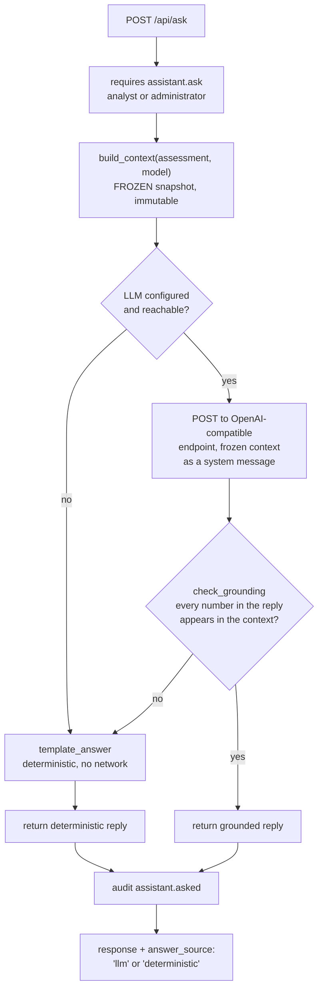

## I.2 The two invariants, and where they are enforced

**Invariant 1 — the LLM never supplies a number.** Enforced three ways:

1. The system message instructs the model to answer only from the supplied
   context. **[V]** `app/ai.py:150-176`
2. The model receives the frozen context and no tool that could query the
   database. **[V]**
3. `check_grounding` tokenises the reply and verifies that **every** number
   appearing in it is present in the context. Any unmatched figure discards the
   whole LLM answer. **[V]** `app/ai.py:185-215`

**Invariant 2 — refusals are structural, not prompted.** Refusal is decided by
keyword matching over the question text, *before* any model call, and covers
forecast, compliance/certification, peer benchmark, and causal attribution. **[V]**
`app/ai.py:31-38` and the pre-check at `app/ai.py:330-360`

| Question | Response |
|---|---|
| "What will our EAL be next quarter?" | Refused — forecasting is out of scope |
| "Are we ISO 27001 compliant?" | Refused — the platform holds no compliance evidence |
| "How do we compare to industry peers?" | Refused — no benchmark dataset exists |
| "Why did EAL rise after the firewall change?" | Refused — causal attribution is out of scope |
| "What is our current EAL?" | Answered, grounded |

Refusing "are we compliant" is the most important of these. The system has free-text
framework columns on `controls` and no mapping table (section M), so any compliance
answer would be fabricated. Refusal is the only safe response, and it is enforced
in code so no prompt change can weaken it.

## I.3 Grounding mechanism

```python
NUMBER_RE  = re.compile(r"(?<![\w.])(\d[\d,]*\.?\d*)\s*(%|percent)?", re.IGNORECASE)
TOLERANCE  = 0.005

for match in NUMBER_RE.finditer(text):
    raw = match.group(1).replace(",", "")
    value = round(float(raw), 6)
    multiplier = 100.0 if match.group(2) else 1.0
    candidates = {value, value * multiplier, value / multiplier}
    if not any(any(abs(c - a) <= TOLERANCE * max(1.0, abs(a)) for a in allowed)
               for c in candidates):
        offenders.append(match.group(0).strip())
return (not offenders), offenders
```

**[V]** `app/ai.py:26-27, 185-203`

`allowed_numbers(context)` also seeds the set with `round(v * 100, 6)` and
`round(v / 100, 6)` for every number in the context. **[V]** `app/ai.py:175-182`

Properties and limits, stated plainly:

- **All-or-nothing.** One ungrounded number discards the entire reply, not just
  the sentence containing it. Strict by design: a partially-trusted answer is
  worse than a fallback, because the reader cannot tell which part failed.
- **Comma-insensitive.** `24,000,000` and `24000000` are equal after
  normalisation, so Indian and Western grouping both pass. **[V]**
- **Percent-aware.** `18` matches a context value of `0.18`, because a trailing
  `%` or `percent` multiplies the candidate by 100. This is why the assistant can
  say "confidence 95" and "13.49% reduction" without tripping the guard. **[V]**
- **Minor/major-unit aware.** The `×100` and `÷100` seeding means a rupee figure
  and its paise representation both validate. **[V]**
- **Tolerance-based, not exact.** Comparison is
  `abs(c - a) <= TOLERANCE * max(1.0, abs(a))` with `TOLERANCE = 0.005` — a
  relative half-percent. Tight enough that it cannot absorb a fabricated figure,
  loose enough to survive float and rupee rounding. **[V]**
- **Anchored, not bare.** The `(?<![\w.])` lookbehind means a digit is only
  treated as a claim when it does not continue an identifier or a version string.
  Without it, an action code like `CTL-EDR-2` would be read as the number 2 and
  fail grounding. **[V]**
- **Denominator-blind.** A correctly-grounded *set* of digits can still be
  arranged into a false claim — "risk fell 97%" when both 97 and the EAL figures
  are present. The guard checks provenance of digits, not truth of the sentence.
  This is the accepted residual risk, and the reason the response always names its
  `answer_source`.
- **The deterministic path is not checked.** See section F.8 / finding F-8. This is
  the one place where invariant 1 is documented but not enforced.

## I.4 Frozen context

`build_context()` produces a JSON document containing the headline EAL, low/high
bounds, confidence and band, per-scenario results, business-unit and asset
rollups, the correlation map, freshness, and incomplete-scenario reasons. **[V]**
`app/ai.py:66-128`

**Not included: `ScenarioResult.breakdown`.** This is the direct cause of the
F-8 defect, since the template quotes the largest loss component.

Proposed additions once F-8 is fixed: **[P]**

- `breakdown` per scenario, so loss composition is narratable.
- `engine_version` and `model_fingerprint`, so an answer can be tied to a specific
  reproducible run — currently impossible, because no run is recorded (D.2).
- An explicit `answer_source` in the request echo, so the UI can label the reply
  before the user reads it rather than after.

## I.5 LLM endpoint handling

```text
CRP_LLM_ENABLED      0 by default; "1" enables
CRP_LLM_MODEL        gpt-4o-mini by default
CRP_LLM_API_KEY      or OPENAI_API_KEY, environment only
CRP_LLM_BASE_URL     https://api.openai.com/v1 by default
CRP_LLM_TIMEOUT      20 seconds, not configurable
```

**[V]** `app/config.py:78-83`

Environment variable names are `CRP_`-prefixed. **[V]**

Behaviour: **[V]**

- `LLM_ENABLED` defaults to `"0"`, so **no outbound network call is ever attempted
  in the default configuration.**
- Any configuration error, timeout, non-200, or unparseable response falls back
  to `template_answer`. The assistant never raises to the user.
- The API key is read from the environment and is never persisted, logged, or
  returned by any endpoint. **[V]**
- The base URL is operator-configurable, so a self-hosted or Azure-hosted model is
  a configuration change, not a code change. **[P]**
- **The complete assessment context is transmitted to the external endpoint.**
  There is no field-level redaction. See section N.4.

## I.6 Deterministic fallback

When no LLM is configured — the default — answers are composed from templates over
the same frozen context. **[V]** `app/ai.py:218-300`

Templates exist for: headline EAL and confidence, largest exposure by EAL, largest
exposure by asset, business-unit split, what a correlation group does, and data
freshness. Each quotes only figures from the context — except the largest-exposure
template, which reaches into `breakdown` (F-8).

The fallback is what makes the product usable with no external dependency and no
data egress, which is a genuine deployment advantage: **an air-gapped install gets
the full assistant, minus the natural-language flexibility.**

## I.7 Audit

Every ask writes an `audit_events` row with the question, the resolved
`answer_source`, and the grounding verdict where an LLM was involved. **[V]**
`app/ai.py:392-405`

The question text is stored verbatim. **[P]** For production this should be
reviewed for sensitive data, given a retention period, and made subject to the
same tenancy isolation as everything else. Asking "what is our exposure on the
payments system?" writes "payments system" to an append-only table forever.
---

# J. Reporting and Export

## J.1 Formats

| Endpoint | Content type | Output | Capability |
|---|---|---|---|
| `/api/report/summary.md` | `text/plain` | Narrative Markdown brief | `report.export` |
| `/api/report/scenarios.csv` | `text/plain` | One row per scenario | `report.export` |
| `/api/report/actions.csv` | `text/plain` | One row per selected action with marginals | `report.export` |
| `/api/report/board.html` | `text/html` | Self-contained board slide, inline CSS | `report.export` |

All four require `report.export`, granted to `analyst` and `administrator`.
**[V]** `app/main.py:357-404`

**Two report writers are implemented but unreachable.** **[V]**
`reports.loss_components_csv` (`app/reports.py:90`) and `reports.ai_context_json`
(`app/reports.py:341`) both exist and both work, but `grep -rn` over `app/main.py`
finds no call to either — there is no route for them. `loss_components_csv` is the
more consequential gap: the loss basis per component is the most audit-relevant
table in the product (it is what makes a SLE figure traceable to its inputs) and
it cannot currently be exported at all. Tracked as **F-23**.

## J.2 Every export carries the same four caveats

No export is allowed to be read without its limitations. The same four statements
appear in the Markdown brief, the HTML board slide, and the assistant context.
**[V]**

1. **Synthetic data.** If any loaded row has `synthetic = 1`, the export is
   labelled as such and is not a real measurement of anything.
2. **Uncertainty band.** The low and high figures travel with the point estimate.
   A point estimate alone is not an acceptable form of output.
3. **Confidence is about evidence, not magnitude.** A Low score means the inputs
   are weakly supported, not that the risk is small.
4. **Model boundaries.** No forecast, no compliance opinion, no benchmark, no
   causal attribution. Correlated-control risk is capped at 90% reduction by
   design.

`summary_markdown` additionally states the correlation adjustment explicitly as
a percentage, and the freshness band of the oldest observation. **[V]**
`app/reports.py:131-191`

## J.3 Board HTML report

`html_report()` (`app/reports.py:238-340`) emits a **single self-contained
`text/html` file** with `_STYLE` inlined as a CSS string. No external stylesheet,
no script, no font, no image. **[V]**

That constraint is deliberate and worth preserving: the report can be emailed to
a board member, opened from a USB stick on an air-gapped machine, or printed to
PDF, and it will render identically. A board report that needs a CDN is a board
report that will be blocked by the recipient's mail gateway.

Contents: headline EAL with band pill, low/high, confidence, correlation
adjustment, per-scenario table, per-asset and per-business-unit breakdown,
optimisation plan if one is supplied, and the caveat block.

## J.4 CSV conventions

All CSVs are generated with `csv.writer` into a `StringIO`, `\n` line endings, and
no BOM. **[V]**

Money columns are suffixed `_minor` and are **integers in paise**, not formatted
strings. This is the right choice for machine consumption: a downstream consumer
must never have to parse a currency string. The cost is that a human opening the
CSV in Excel sees `30450000` rather than `₹30,45,000`.

**Proposed [P]:** ship a paired `_minor` and `_display` column, or document the
conversion in a header comment row. Excel users are a real audience for a board
pack and `30450000` in a cell invites a factor-of-100 error.

## J.5 Proposed additions

Not implemented; specified so the reporting story is coherent. **[P]**

| Addition | Purpose |
|---|---|
| `assessment_runs`-keyed exports | Every export should record the `run_id` it was produced from, in a filename or a header. Without this, an exported number cannot be traced back to inputs (D.2). |
| PDF export | Boards print. Headless Chrome or WeasyPrint over the existing HTML. |
| Trend report | EAL by month across `assessment_runs`. **Gated on F-1/P-0 being closed** — a trend over a series that was never recorded is fabrication. |
| Framework coverage report | Section M. **Gated on the mapping tables existing.** |
| Scheduled board pack | Nightly generation to object storage. **Gated on connectors and jobs (E.5, P-2).** |

---

# K. API, Authentication and Frontend

## K.1 Authentication

Session-cookie authentication over HTTP. **[V]**

| Property | Value |
|---|---|
| Login | `POST /api/login` with `username` + `password` |
| Session token | 32 hex characters, `secrets.token_hex(16)` |
| Storage | `sessions(token PK, user_id FK, created_at, expires_at)` |
| Lifetime | `SESSION_TTL_SECONDS`, default `8 * 3600` = 8 hours |
| Cookie name | `crp_session` (`config.SESSION_COOKIE`) |
| Attributes | `HttpOnly=True`, `SameSite="lax"`, `max_age=SESSION_TTL_SECONDS` |
| Hashing | `pbkdf2_sha256`, **120,000** iterations, 16-byte random salt, per-user |
| Verify | Recomputes and compares with `hmac.compare_digest` |
| Logout | `POST /api/logout` deletes the session row and clears the cookie |

`HttpOnly` and `SameSite=Lax` are set. **[V]** `app/main.py:103-104` `Secure` is
**not** set, which is correct for plain-HTTP local use and wrong for any real
deployment. See N.4.

**No CSRF token.** `SameSite=Lax` blocks cross-site POSTs from forms and provides
partial protection, but it is a single control, not a defence. See N.4.

**On the iteration count.** 120,000 PBKDF2-SHA256 iterations is a reasonable
2023-era figure and is stored in the hash string, so it can be raised without
invalidating existing passwords. It should be raised to the current OWASP
recommendation (600,000) and given an upgrade-on-verify path. **[P]**

## K.2 Authorisation

Capabilities, not roles, gate every endpoint. **[V]** `app/db.py:52-66`

```text
ROLE_ADMIN  (administrator) = {
    data.write, assumptions.write, actions.write, scenario.write, budget.write,
    assessment.run, optimiser.run, view, ai.ask, report.export,
    users.manage, audit.read,
}
ROLE_ANALYST (analyst) = {
    data.write, assumptions.write, actions.write, scenario.write, budget.write,
    assessment.run, optimiser.run, view, ai.ask, report.export, audit.read,
}
ROLE_EXEC    (ciso) = { view, ai.ask, report.export, assessment.run }
```

**[V]** `app/config.py:56-70`. The comment above the literal is exact: *"Server-side
enforcement only."*

Three observations that matter more than the literal contents:

- **The `ciso` role is genuinely read-and-narrate.** Four capabilities. It cannot
  ingest, optimise, read the audit trail, or see the quarantine queue. That is a
  correctly scoped executive view.
- **`analyst` can read the audit trail** (`audit.read`) but cannot manage users.
  Reasonable, and worth confirming with the risk owner, since audit access often
  sits with a compliance function rather than an analyst.
- **Four capabilities are declared and never enforced by any route:**
  `assumptions.write`, `actions.write`, `scenario.write`, `budget.write`. They
  appear in both the administrator and analyst sets and are checked nowhere.
  **[V]** `grep -rn "assumptions.write" app/` matches only `config.py` and its
  bytecode cache. This is aspirational surface area masquerading as a permission
  model. **Finding F-12.**

Enforcement is a FastAPI dependency that delegates to a single server-side
predicate: **[V]** `app/main.py:47-56`

```python
def requires(capability: str):
    def dependency(user: dict[str, Any] = Depends(current_user)) -> dict[str, Any]:
        if not db.has_capability(user["role"], capability):
            raise HTTPException(
                403, f"Role '{user['role']}' is not permitted to perform '{capability}'")
        return user
    return dependency
```

The 403 body names both the role and the missing capability, which is a good
error message for an API consumer debugging a permission problem.

This is the right shape. A capability string in the route signature means adding
a permission is a one-line change and the authorisation surface is greppable.

`current_user` (`app/main.py:36-45`) resolves the session cookie to a user dict
and raises `401` for a missing token or an expired/unknown one. Note it returns
only `id`, `username` and `role` — capabilities are looked up per request by role
rather than cached on the user, so a role change takes effect on the next request
without invalidating sessions. **[V]**

Verified live behaviour: **[V]**

| Endpoint | `analyst` | `ciso` |
|---|---|---|
| `POST /api/optimise` | 200 | **403** |
| `POST /api/ingest` | 200 | **403** |
| `GET /api/report/board.html` | 200 | 200 |
| `POST /api/ask` | 200 | 200 |

## K.3 API surface

**21 HTTP routes declared in `app/main.py`**, plus one
`@app.on_event("startup")` handler — 22 decorators in total. **[V]**
`grep -c '@app\.' app/main.py` → 22.

At runtime `app.routes` resolves to 26 paths: the 21 declared, four FastAPI
built-ins (`/api/docs`, `/api/openapi.json`, `/redoc`, `/docs/oauth2-redirect`),
and the `/static` mount. **[V]** `python3 -c "from app.main import app; print(len(app.routes))"`

The `Capability` column is read directly from each route's
`Depends(requires(...))` argument. Note that all four built-in documentation paths
are unauthenticated, so `/api/openapi.json` and `/redoc` disclose the full route
and schema surface to anyone who can reach the port. Harmless on localhost, worth
gating behind `view` in production. **Finding F-24.**

| Method | Path | Capability | Notes |
|---|---|---|---|
| GET | `/` | — | Serves the dashboard |
| GET | `/api/docs` | — | Swagger UI |
| GET | `/api/openapi.json` | — | Generated schema, unauthenticated |
| GET | `/redoc` | — | ReDoc UI, unauthenticated |
| GET | `/api/health` | — | Liveness, no auth |
| POST | `/api/login` | — | Sets session cookie |
| POST | `/api/logout` | — | Deletes session, clears cookie |
| GET | `/api/me` | auth only | Current user and role |
| GET | `/api/overview` | `view` | Dashboard rollup |
| GET | `/api/catalog` | `view` | Reference data + dataset schemas |
| GET | `/api/quarantine` | `view` | Rejected rows with reasons |
| GET | `/api/ai/status` | `view` | Whether an LLM is configured |
| POST | `/api/ingest` | `data.write` | Multipart upload |
| POST | `/api/demo/reset` | `data.write` | Re-seeds demo data, see K.5 |
| GET | `/api/assessment` | `assessment.run` | The headline number |
| POST | `/api/scenarios/{code}/whatif` | `assessment.run` | |
| POST | `/api/optimise` | `optimiser.run` | |
| GET | `/api/optimise/frontier` | `optimiser.run` | |
| POST | `/api/ask` | `ai.ask` | |
| GET | `/api/report/summary.md` | `report.export` | |
| GET | `/api/report/scenarios.csv` | `report.export` | |
| GET | `/api/report/actions.csv` | `report.export` | |
| GET | `/api/report/board.html` | `report.export` | |
| GET | `/api/audit` | `audit.read` | |

Two observations:

- **Read endpoints use `view`, not `data.read`.** `data.read` is not a declared
  capability. The `ciso` role reaches the dashboard, the catalogue, the quarantine
  list and the LLM status through `view`. Fine, but the naming is misleading:
  `view` is doing the work of `data.read` and no capability expresses "may see
  the data inventory but not change it" other than by the absence of `data.write`.
  Worth a rename for clarity.
- **`GET /api/assessment` and `POST /api/scenarios/{code}/whatif` both require
  `assessment.run`.** Correct and consistent.

Self-documenting via generated OpenAPI at `/api/openapi.json` with Swagger UI at
`/api/docs`. **[V]**

## K.4 Frontend

Three static files, no build step, no framework, no package manager dependency
beyond `node` for syntax checking. **[V]**

| File | Size | Role |
|---|---|---|
| `app/static/index.html` | ~13 KB | Structure, login panel, six tabs |
| `app/static/app.js` | ~44 KB | All behaviour: fetch, render, charts, exports |
| `app/static/styles.css` | ~10 KB | Responsive layout, light/dark aware |

**Verified failure and repair.** `renderExposure()` contained a stray `)` which
made `app.js` fail to parse. The symptom was a blank dashboard after successful
login; the browser console carried the syntax error and the backend was healthy.
Fixed; `node --check app/static/app.js` now passes and is part of
`tests/test_api.py`. **[V]**

This is a real lesson about a no-build frontend: there is no compile step to
catch a syntax error, so a 3 KB test that shells out to `node --check` is the only
thing standing between a typo and a silently broken dashboard. It should be the
first thing added to CI, not the last.

**No charting library.** Charts are hand-built — an inline SVG risk bar per
scenario and a CSS-driven confidence pill. **[V]** This keeps the app dependency
free and the HTML report self-contained, at the cost of no interaction. Plotly is
listed in the project's stated ambitions but is not installed and not used.

## K.5 `/api/demo/reset`

`POST /api/demo/reset` re-seeds the database from `demo_data.py`. **[V]**

- Requires `data.write`, so a `ciso` cannot call it.
- **It is not destructive in the strict sense.** It upserts the demo rows but does
  not delete rows the new dataset no longer contains. A row loaded by a user
  survives a "reset". This is the safer behaviour and the confusing one; a button
  labelled *Reset* that leaves user data behind will eventually surprise someone.
- There is no confirmation step and no CSRF protection on it.

**Proposed [P]:** rename to `/api/demo/reseed` and state its non-destructive
semantics in the button label, or add an explicit `?purge=true` that deletes
non-demo rows in a transaction. Either way the behaviour should match the label.

## K.6 Role/capability matrix

Derived from `config.CAPABILITIES` and cross-checked against the `requires(...)`
argument on every route. **[V]**

| Capability | administrator | analyst | ciso | Checked by |
|---|---|---|---|---|
| `view` | yes | yes | yes | 5 routes |
| `data.write` | yes | yes | **no** | 2 routes |
| `assessment.run` | yes | yes | yes | 2 routes |
| `optimiser.run` | yes | yes | **no** | 2 routes |
| `ai.ask` | yes | yes | yes | 1 route |
| `report.export` | yes | yes | yes | 6 routes |
| `audit.read` | yes | yes | **no** | 1 route |
| `users.manage` | yes | **no** | **no** | **0 routes** |
| `assumptions.write` | yes | yes | no | **0 routes** |
| `actions.write` | yes | yes | no | **0 routes** |
| `scenario.write` | yes | yes | no | **0 routes** |
| `budget.write` | yes | yes | no | **0 routes** |

Five declared capabilities are enforced by no route. **`users.manage` is the one
that matters for production**: the administrator is defined as the only role that
can manage users, and there is no user-creation, password-change, or role-change
API. **[V]** `grep -rn "users.manage" app/` matches only `config.py` and its
bytecode cache.

Provisioning is a direct `INSERT` into the `users` table by whoever has database
access. That is defensible for a single-operator demo and indefensible for
production, where it guarantees the first administrator is created out of band and
never rotated by any supported mechanism. **Finding F-13.**
---

# L. Deployment Architecture

## L.1 Current deployment

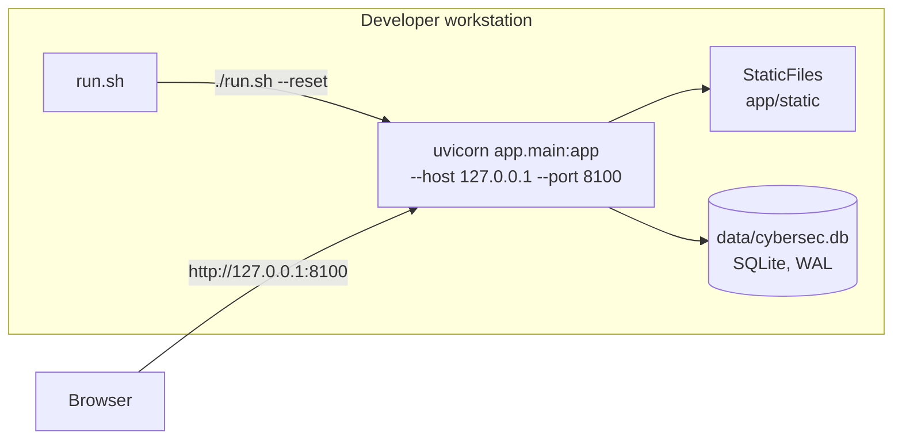

- Single process, `uvicorn`, bound to `127.0.0.1`, **default port 8000**, overridable
  with `./run.sh --port 9000`. **[V]** `run.sh:11-16, 35`
- SQLite file at `data/cybersec.db`, WAL journal mode. **[V]**
- Static files served by `StaticFiles` from the same process. **[V]**
- No reverse proxy, no TLS termination, no container, no process supervisor.
- Startup seeds demo data when the database is empty. **[V]** `app/main.py:25-34`

> **Operational note.** Port 8000 was already occupied on this workstation by an
> unrelated `main:app --reload` process, so the project was run on 8100 for manual
> verification. A connection failure against 8000 is therefore *not* necessarily a
> project defect, and `run.sh --port` is the correct escape hatch. Worth stating
> because it cost time to diagnose.

## L.2 Production topology

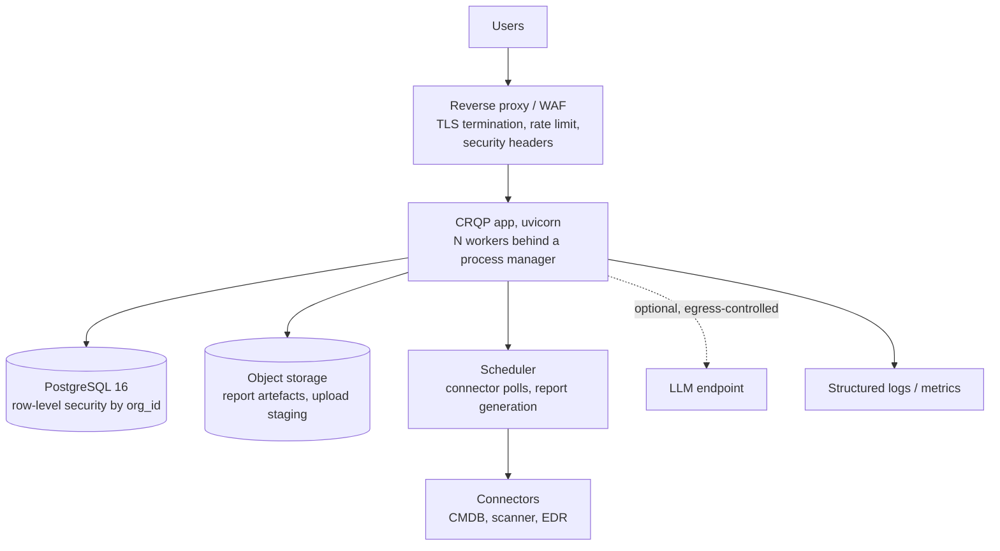

Required changes from the current state, all **[P]**:

| Concern | Current **[V]** | Proposed **[P]** |
|---|---|---|
| Database | SQLite file | PostgreSQL 16, `org_id` on every table, RLS policies |
| Concurrency | Single uvicorn worker | Multiple workers; SQLite write contention is the hard limit today **[V]** |
| TLS | None | Terminated at the proxy, `Secure` cookie flag, HSTS |
| Secrets | Defaults seeded in code | Environment/secret manager, no defaults in production profile |
| Scheduling | None | APScheduler or a sidecar, for connectors and periodic reports |
| Uploads | Written and validated inline | Staged to object storage, processed by a job |
| Logs | `print` | Structured JSON with `org_id`, `user`, `request_id` |
| Health | `/api/health` liveness only | Add readiness and dependency checks |
| Backups | None | Automated `pg_dump`, tested restore, RPO/RTO defined **[TBD]** |

## L.3 Environment configuration

All configuration is environment-driven with `CRP_`-prefixed variables and safe
defaults. **[V]** `app/config.py`

| Variable | Constant | Default | Purpose |
|---|---|---|---|
| `CRP_DB_PATH` | `DB_PATH` | `data/cybersec.db` | SQLite location |
| `CRP_MAX_UPLOAD_BYTES` | `MAX_UPLOAD_BYTES` | `5242880` (5 MiB) | Upload cap |
| `CRP_MAX_P` | `MAX_ANNUAL_PROBABILITY` | `0.5` | `p0` ceiling |
| `CRP_MAX_MITIGATION` | `MAX_CONTROL_MITIGATION` | `0.90` | Control-stacking floor |
| `CRP_EXACT_MAX` | `EXACT_SEARCH_MAX_ACTIONS` | `16` | Exact-search action threshold |
| `CRP_CAPACITY` | `DEFAULT_CAPACITY_MAX_ACTIONS` | `6` | Default max actions per plan |
| `CRP_CURRENCY` | `DEFAULT_CURRENCY` | `INR` | |
| `CRP_CURRENCY_SYMBOL` | `CURRENCY_SYMBOL` | `₹` | |
| `CRP_SESSION_TTL_SECONDS` | `SESSION_TTL_SECONDS` | `28800` | 8-hour session |
| `CRP_LLM_ENABLED` | `LLM_ENABLED` | `0` | Assistant network access |
| `CRP_LLM_MODEL` | `LLM_MODEL` | `gpt-4o-mini` | |
| `CRP_LLM_API_KEY` / `OPENAI_API_KEY` | `LLM_API_KEY` | empty | |
| `CRP_LLM_BASE_URL` | `LLM_BASE_URL` | `https://api.openai.com/v1` | |
| — | `LLM_TIMEOUT` | `20` s | Not configurable **[V]** |

Host and port are **not** environment variables; they are `run.sh` arguments.
**[V]** `run.sh:11-16`

**Configuration as an attack surface.** Two settings are not merely tuning:

- `CRP_MAX_MITIGATION` controls the honesty floor in section F.4. Raising it
  toward 1.0 makes control stacking look arbitrarily effective. It should have a
  hard upper bound in code, not just a default.
- `CRP_LLM_ENABLED=1` enables egress of the full assessment context. It should be
  a deliberate, logged, reviewed act.

---

# M. Regulatory and Framework Mapping

## M.1 Status: not implemented

**The platform performs no compliance assessment, and this section specifies how
one would be built rather than claiming it exists.** **[V]**

The `controls` table has three free-text columns, `framework_iso`,
`framework_nist`, `framework_cis` (`app/schema.sql:73`). There is no mapping
table, no framework version column, no mapping kind, no evidence link, and no
validation. `grep` confirms nothing outside `db.py` and `demo_data.py` writes
them. **[V]**

The assistant refuses compliance questions in code for exactly this reason
(section I.2).

## M.2 Framework facts

Verified against official sources rather than recalled.

| Framework | Structure | Citation status |
|---|---|---|
| **ISO/IEC 27001:2022** | Annex A, 93 controls in 4 themes: Organizational 37, People 8, Physical 14, Technological 34 | **[V]** structure verified |
| **NIST CSF 2.0** | Six functions — `GV` Govern, `ID` Identify, `PR` Protect, `DE` Detect, `RS` Respond, `RC` Recover — 22 categories, 106 subcategories | **[V]** structure verified |
| **CIS Controls v8.1** | 18 controls, 153 safeguards, three implementation groups IG1/IG2/IG3 | **[V]** structure verified |
| **SEBI CSCRF** | Circular `SEBI/HO/ITD-1/ITD_CSC_EXT/P/CIR/2024/113`, dated **20 August 2024**; clarifications `.../CIR/2024/184` and `.../CIR/2025/60` | **[V]** date and identifiers verified |
| **RBI** | Framework version and control mapping **unverified** | **[TBD]** — do not cite until confirmed |

> **Date correction.** Earlier working notes recorded the CSCRF circular as
> September 2024. The official SEBI circular page and the SEBI FAQ both give
> **20 August 2024**. The August date is used throughout this document.

Mapping a control to a framework is **not** the same as demonstrating compliance.
A coverage matrix is an input to an auditor's assessment; it is not an audit
opinion, and presenting it as one is the failure mode to avoid.

## M.3 Proposed coverage model

Per D.4, `frameworks`, `framework_controls` and `control_mappings` replace the
three free-text columns. The semantic rule that makes the output honest:

```text
A framework control is COVERED only when
    at least one CRQP control maps to it
  AND that mapping's kind IN ('implements', 'partially_implements')
  AND that CRQP control has a control_measurements row with ce_source = 'measured'

Otherwise it is DECLARED (mapped but unverified) or UNMAPPED.
```

Three states, not two. "Mapped" without "measured" is the state that gets an
organisation into trouble, because a green tick in a coverage matrix is read as
evidence of effectiveness by everyone except the person who built it.

**Control themes matter for interpretation.** ISO 27001:2022 splits 37 of its 93
controls into Organizational, People, and Physical. CRQP measures technical
control effectiveness. **The platform can therefore never evidence more than the 34
Technological controls**, and any coverage percentage computed across all 93 is
misleading by construction. The same asymmetry applies to CIS v8.1, where IG1/IG2/IG3
span organisational, physical and technical safeguards. **[P]** A coverage view
must always break down by theme, and must state which themes are out of scope for
the tool.

## M.4 CSCRF-specific considerations

If the SEBI CSCRF is in scope, the framework is not a control checklist but a set
of **objectives with measurable criteria**. Two implications for this platform:

1. **The five CSCRF goals** — Protection of customer information, Cybersecurity
   Governance, Access Control, Cybersecurity Incident Management, Cyber
   Resilience — map to CRQP scenarios more naturally than to individual controls.
   A scenario-led mapping is a better fit than a control-led one. **[P]**
2. **Cyber resilience maturity** requires evidence of testing, recovery objectives
   and third-party risk. CRQP models loss expectancy from downtime but holds no
   recovery-time data, no RTO/RPO, and no third-party register. Those are data
   sources CRQP does not have and would need before it could evidence resilience
   maturity. **[P]**

The full CSCRF parameter set — approximately 23 parameters in the
clarifications — is **[TBD]** pending confirmation against the current SEBI
documents. Do not implement against a remembered parameter list.

## M.5 Sequencing

Compliance reporting is **phase 3 and gated** (section P). It is gated because
building a coverage matrix before `control_measurements` exists would produce
"mapped" states with no way to reach "covered", which is a coverage report that
can only ever be discouraging and wrong.

---

# N. Security Architecture

## N.1 Threat model

Assets, in descending order of value to an attacker: the risk model itself
(a manipulated number is worse than no number), the session store, the uploaded
evidence, and the LLM API key.

| Threat | Vector | Control today **[V]** | Gap |
|---|---|---|---|
| Session theft | XSS reads the cookie | `HttpOnly` | See N.3 |
| Stored XSS | Uploaded field rendered unescaped | **none** | **N-1** |
| Privilege escalation | Direct DB edit grants admin | Capability checks in HTTP | **N-2** |
| Credential compromise | Default credentials are published | PBKDF2, `HttpOnly` | **N-3** |
| Brute force | Unlimited login attempts | none | **N-4** |
| CSRF | Cross-site POST | `SameSite=Lax` | **N-5** |
| Model manipulation | Malicious upload changes EAL | Per-row validation, quarantine | **N-6** |
| Data exfiltration via LLM | Full context sent externally | Disabled by default | **N-7** |
| SQL injection | String-formatted SQL | Parameterised queries throughout | Adequate **[V]** |
| Path traversal | Upload filename | Filename is metadata only, never a path | Adequate **[V]** |
| Over-large upload | 5 MiB+ body | `CRP_MAX_UPLOAD_BYTES` check | **N-8** |

## N.2 SQL injection

All SQL uses parameterised `?` placeholders. **[V]** `app/db.py` and
`app/ingest.py` contain no f-string or `%`-formatted query. Dynamic identifiers
are restricted to a fixed allowlist (dataset type, sort column, order
direction). This is the correct pattern and needs no work.

## N.3 Verified defect — stored XSS

`app/static/app.js` renders uploaded strings into the DOM with `innerHTML` and
template literals. **[V]** Asset names, business-unit names, scenario names,
finding titles, `source_ref` values, and quarantine payloads are all
attacker-controllable via a CSV upload, and none are escaped before insertion.

An uploaded asset named ``
executes in the session of whoever next opens the dashboard. The session cookie is
`HttpOnly`, so the cookie itself cannot be read — but the script runs with the
user's origin, can call every API endpoint the user is authorised for, and can
exfiltrate the entire assessment.

**This is the most severe finding in this document.** It is a single-operator
local tool today, which is why it is not an emergency; it becomes an
authentication-bypass class vulnerability the moment the tool is reachable by
anyone but the operator.

Fix: **[P]**

1. Replace every `innerHTML =` assignment that interpolates data with
   `textContent` assignment, or route the value through a single
   `esc()` helper applied at the point of insertion.
2. Where markup is genuinely needed (static chrome), use a build-time template or
   DOM construction, never string interpolation.
3. Add `Content-Security-Policy` as defence in depth: `default-src 'self'`,
   `script-src 'self'` with no `unsafe-inline`, which makes inline handlers
   non-executable even if the escaping is missed.
4. Add a regression test that uploads a payload-bearing asset name and asserts the
   rendered DOM contains it as text, not as an element.

Tracked as **F-3**.

## N.4 Authentication hardening

All proposed; none present today. **[P]**

| Gap | Current **[V]** | Proposed |
|---|---|---|
| Default credentials | `admin/admin123`, `analyst/analyst123`, `ciso/ciso123` seeded on first run and **printed in the UI** | Refuse to start in a production profile with default credentials; force a first-run password change; never render a password in the UI |
| Brute force | Unlimited attempts | Per-username and per-IP rate limit with exponential backoff; lockout with unlock-by-admin |
| Session rotation | Token issued once, reused for 8 hours | Rotate the token on login and on privilege change; invalidate all sessions for a user on password change |
| Cookie `Secure` | Not set | Set whenever the app is served over TLS |
| CSRF | `SameSite=Lax` only | Double-submit token on all state-changing routes |
| Password hashing | PBKDF2-SHA256, 120k iterations | Raise to 600k, or move to Argon2id; version the hash string and upgrade on verify |
| User management | No route | Implement `users.manage`: create, disable, rotate password, change role, revoke sessions |
| Rate limiting (general) | None | Per-session request limit on `/api/optimise`, which is CPU-expensive |
| Security headers | None | CSP, `X-Content-Type-Options: nosniff`, `X-Frame-Options: DENY`, `Referrer-Policy: no-referrer`, HSTS behind TLS |
| Host header | Unvalidated | `TrustedHostMiddleware` |
| Audit integrity | Append-only by convention, no tamper evidence | Hash-chain or signed entries; retention policy |

The **printed default credentials** deserve specific mention. **[V]** The
dashboard renders the seeded usernames and passwords on first run as a
convenience. On a shared or exposed instance that is a credential disclosure in
the UI itself. It is a reasonable demo affordance and an unacceptable production
one, and the fix is a production profile flag rather than a code removal.

## N.5 LLM data handling

**The complete frozen context is transmitted to the external endpoint when
`CRP_LLM_ENABLED=1`, with no field-level redaction. [V]**

What leaves the boundary: asset names, business-unit names, scenario names and
narratives, loss amounts, control names and effectiveness values, action names
and costs, and the correlation structure. That is the commercially sensitive
core of the assessment.

Mitigations: **[P]**

1. Default off, and keep it off. **[V]** already true.
2. Field-level allowlist redaction before the outbound call, with the redaction
   policy itself logged per request.
3. A self-hosted or private-endpoint LLM via `CRP_LLM_BASE_URL`, so the data
   never leaves the operator's network. **[P]** the base URL is already
   configurable, so this is a configuration change.
4. Never send a `ce_evidence_ref`, an audit trail, or anything from the
   `users` table.
5. Log every outbound request with its byte count and destination, and make
   egress-blocking at the network layer the primary control rather than the
   application flag.

**Recommended default: an air-gapped or private-endpoint deployment with
deterministic templates only.** The assistant is still fully functional, and the
two properties that matter for this product — no fabricated numbers, no data
egress — hold absolutely.

## N.6 Findings register

Severity reflects impact on the product's stated purpose: producing a defensible
number.

| ID | Finding | Severity | Status |
|---|---|---|---|
| **F-1** | `runs` and `snapshots` tables exist but are never written; no assessment is reproducible | **Critical** | Open |
| **F-2** | No field length limits in `DATASET_SCHEMAS`; unbounded strings accepted | High | Open |
| **F-3** | Stored XSS via unescaped `innerHTML` with uploaded values | **Critical** | Open |
| **F-4** | Default credentials seeded and printed in the UI | High | Open |
| **F-5** | No brute-force protection or rate limiting on login | High | Open |
| **F-6** | No session rotation on login or privilege change | Medium | Open |
| **F-7** | `users.manage` declared but no user-management route exists | High | Open |
| **F-8** | Deterministic assistant template is not grounding-checked; `breakdown` absent from context | Medium | Open |
| **F-9** | `effect_type = loss_component` accepted by ingest but never applied by the engine | Medium | Open |
| **F-10** | ROSI compares one-time cost against one year of benefit | Medium | Open |
| **F-11** | Frontier mixes exact and heuristic search by index parity; `optimal` flag alternates | Medium | Open |
| **F-12** | Five capabilities declared but enforced by no route | Low | Open |
| **F-13** | No `organizations`/`business_units`; no tenant boundary | High | Open |
| **F-14** | No framework mapping tables; mapping is free text and unversioned | High | Open |
| **F-15** | No `control_measurements`; control effectiveness has no history | High | Open |
| **F-16** | No migration framework; `init_db` cannot alter an existing table | High | Open |
| **F-17** | PBKDF2 at 120k iterations, below current guidance | Low | Open |
| **F-18** | No CSP, `nosniff`, `X-Frame-Options`, or `TrustedHostMiddleware` | Medium | Open |
| **F-19** | Starlette/httpx test-client deprecation warning unresolved | Low | Open |
| **F-20** | `assessment.run` and `view` capability naming is inconsistent with `data.read` never being declared | Low | Open |
| **F-21** | `POST /api/demo/reset` is labelled "reset" but is a non-destructive re-seed | Low | Open |
| **F-22** | Exact search runs to `2^16` subsets with no time box; `max_actions` is caller-controlled | High | Open |
| **F-23** | `loss_components_csv` and `ai_context_json` report writers are implemented but exposed by no route | Medium | Open |
| **F-24** | `/api/docs`, `/api/openapi.json`, and `/redoc` are unauthenticated and disclose the full API surface | Low | Open |

F-1 and F-3 are the two that must be closed before any deployment beyond a single
operator's laptop. F-1 undermines the product's core claim; F-3 is
authentication-bypass class. F-22 is the most likely to be hit accidentally, since
it needs no attacker — only a portfolio with 16 actions.
---

# O. Testing Strategy

## O.1 Current state

**174 tests pass in approximately 1.4 seconds.** **[V]**

```text
$ python3 -m unittest discover -s tests -t tests
Ran 174 tests in 1.41s
OK
```

`./run.sh --test` runs the same command. **[V]**

| Suite | Focus |
|---|---|
| `test_risk.py` | Formulas, aggregation, correlation, confidence, incompleteness |
| `test_optimize.py` | Feasibility, search, marginals, overlap, frontier |
| `test_ingest.py` | Parsing, per-row validation, quarantine, matching, money conversion |
| `test_ai.py` | Grounding, refusal, fallback, audit |
| `test_reports.py` | Report shape, caveats, CSV columns |
| `test_db.py` | Auth, sessions, capabilities, money helpers, audit |
| `test_api.py` | HTTP contracts, RBAC matrix, static assets, `node --check` |

`tests/helpers.py` provides an isolated temporary database per test. **[V]**

## O.2 The golden fixture

The F.2 model in `docs/worked_example.py` should be promoted to a **golden
fixture test**: assert the exact EAL, SLE, `P_in`, mitigation, `P_res`, confidence
and band for both scenarios, and the exact optimisation selections at two budgets.

Verified expected values:

| Assertion | Value |
|---|---|
| `SLE_S1` | ₹30,45,000 |
| `SLE_S2` | ₹5,70,000 |
| `vm_S1` / `vm_S2` | 1.084 / 1.027 |
| `P_in_S1` / `P_in_S2` | 0.373100 / 0.204805 |
| `mit_S1` / `mit_S2` | 0.100000 (capped) / 0.300000 |
| `P_res_S1` / `P_res_S2` | 0.037310 / 0.061442 |
| `EAL_S1` / `EAL_S2` | ₹1,13,609 / ₹35,022 |
| **EAL total** | **₹1,31,120** |
| EAL unadjusted | ₹1,48,631 |
| Low / high | ₹45,892 / ₹2,55,684 |
| Confidence | 95 / High |
| S-1 confidence | 94 |
| S-2 confidence | 100 |
| `by_asset` | A-1 ₹1,00,224, A-2 ₹30,896 |
| What-if `p0` 0.35→0.10 | ₹51,454, delta −₹79,666 |
| What-if downtime 8→24 h | ₹2,80,360, delta +₹1,49,240 |
| Optimise ₹75,000 | `ACT-PAM, ACT-PATCH`, cost ₹75,000, reduction ₹16,228 |
| Optimise ₹80,000 | `ACT-EDR-TUNE, ACT-PAM, ACT-PATCH`, cost ₹78,000, reduction ₹17,687 |

This is a regression net for the model. Any change to a coefficient, a weight, a
rounding rule or the correlation formula breaks it loudly, which is the only
practical way to keep a financial model honest as it evolves.

## O.3 Gaps in the current suite

| Gap | Consequence | Priority |
|---|---|---|
| No golden-fixture test of the end-to-end number | A silent change to any coefficient is undetectable | **P0** |
| No test that the deterministic assistant path is grounded | F-8 shipped undetected | **P0** |
| No XSS regression test | F-3 shipped undetected | **P0** |
| No property-based or fuzz testing of the parsers | Malformed CSV edge cases are hand-enumerated only | P1 |
| No concurrency test of ingest | The single-transaction guarantee is asserted but not stress-tested | P1 |
| No load test of `/api/optimise` | F-22 is unquantified | P1 |
| No test of `assessment_runs` replay | Impossible today; the tables are empty | Blocked on F-1 |
| No test of framework coverage semantics | Impossible today; the tables do not exist | Blocked on F-14 |
| Starlette/httpx deprecation warning unresolved (F-19) | Future upgrade will break the API suite | P2 |

## O.4 Proposed additions

| Addition | Rationale |
|---|---|
| `tests/golden/test_worked_example.py` | The table in O.2, asserted exactly |
| `tests/golden/test_demo_seed.py` | D0 headline EAL and confidence, so a demo-data edit is visible |
| Hypothesis for `ingest` parsers | Random field combinations against the validators |
| `tests/security/test_xss.py` | Payload-bearing asset names must render as text |
| `tests/security/test_grounding_all_paths.py` | Every `ask()` branch returns grounded text |
| `tests/security/test_rbac_matrix.py` | All 24 routes × 3 roles, asserted from one table |
| `tests/integration/test_replay.py` | A stored run replays to the identical EAL (post F-1) |
| `tests/performance/test_optimise_budget.py` | A 16-action portfolio completes within a stated deadline (post F-22) |

The RBAC matrix test is worth writing early: the capability table is a literal in
`config.py` and the route guards are literals in `main.py`, and nothing currently
checks that the two agree. That is exactly the class of drift F-12 and F-20
represent.

## O.5 CI

None exists. **[P]**

```yaml
# .github/workflows/ci.yml
name: ci
on: [push, pull_request]
jobs:
  test:
    runs-on: ubuntu-latest
    steps:
      - uses: actions/checkout@v4
      - uses: actions/setup-python@v5
        with: {python-version: "3.13"}
      - run: pip install -r requirements.txt
      - run: python3 -m unittest discover -s tests -t tests
      - run: node --check app/static/app.js
      - run: python3 -m compileall -q app
      - run: python3 docs/worked_example.py   # golden values must match the doc
```

The last step is unusual but valuable: it fails the build if the engine's output
drifts from the figures published in this document, so the TAD cannot quietly
become fiction.

---

# P. Implementation Roadmap

## P.1 Phase 0 — make the current claims true

**Precondition for any external user. Estimated 1–2 weeks. [P]**

| # | Task | Closes |
|---|---|---|
| 0.1 | Write the golden-fixture test (O.2) and the demo-seed test | O.2 |
| 0.2 | Write every assessment to `assessment_runs` + `input_snapshots`; add `run_id` to every export | **F-1** |
| 0.3 | Add `model_fingerprint` and `ENGINE_VERSION`; expose `/api/assessment/runs/{id}` and a replay endpoint | F-1, F.7 |
| 0.4 | Include `breakdown` in the AI context; ground-check the template and refusal paths | **F-8** |
| 0.5 | Escape all `innerHTML` interpolation; add a CSP and an XSS regression test | **F-3**, F-18 |
| 0.6 | Add `max_length` to `FieldSpec` and enforce it in validation | F-2 |
| 0.7 | Remove credentials from the UI; refuse default credentials in a production profile; force a first-run password change | **F-4** |
| 0.8 | Login rate limiting with backoff; session rotation on login and privilege change | F-5, F-6 |
| 0.9 | Implement `users.manage`: create, disable, rotate password, change role, revoke sessions | **F-7** |
| 0.10 | Add a time box to the exact search; cap caller-supplied `max_actions` | **F-22** |
| 0.11 | Adopt Alembic; stamp the existing database; make `init_db` migrate-then-seed | F-16 |
| 0.12 | Raise PBKDF2 iterations to 600k with upgrade-on-verify | F-17 |
| 0.13 | Rename `view` → `data.read` for clarity, or document why not; remove the five unenforced capabilities | F-12, F-20 |
| 0.14 | Rename `/api/demo/reset` to `/api/demo/reseed` and state its semantics | F-21 |
| 0.15 | Fix the Starlette/httpx deprecation warning | F-19 |
| 0.16 | Add the CI workflow (O.5) | — |

**Exit criteria:** every P0 finding closed, CI green, `python3 docs/worked_example.py`
output matching this document.

## P.2 Phase 1 — production hardening, single tenant

**1–2 weeks after Phase 0. [P]**

| # | Task | Rationale |
|---|---|---|
| 1.1 | Move `SEVERITY_WEIGHT`, the `0.03` coefficient, `EXPLOITABLE_MULTIPLIER`, `CONFIDENCE_WEIGHTS` into a versioned `assumptions` record | Makes the model's priors attributable (F.4 in section F) |
| 1.2 | Report headline sensitivity to ±50% on the vm coefficient | Quantifies the weakest assumption |
| 1.3 | Add `benefit_period_years`, NPV, and amortised cost to the optimiser | **F-10** |
| 1.4 | Distinguish one-time from recurring `actions.cost` | Prerequisite for 1.3 |
| 1.5 | Implement `effect_type = loss_component` in `risk.assess` | **F-9** |
| 1.6 | `assumptions.write` routes: manage p0, CE, multipliers, rho with audit | Makes F-12 real |
| 1.7 | Paired `_minor` and `_display` CSV columns | J.4 |
| 1.8 | PDF export over the existing board HTML | J.5 |
| 1.9 | Remove the parity bug in `frontier()`; report method per point | **F-11** |
| 1.10 | `control_measurements` table, re-attestation reminders, CE from latest measurement | **F-15** |
| 1.11 | TLS, `Secure` cookie, security headers, `TrustedHostMiddleware`, double-submit CSRF | N.4 |
| 1.12 | Structured logging with `org_id`, user, request id; hash-chained audit entries | N.4 |
| 1.13 | LLM egress allowlist redaction, logged per request | N.5 |

## P.3 Phase 2 — multi-tenancy and integration

**3–5 weeks. [P]**

| # | Task | Rationale |
|---|---|---|
| 2.1 | PostgreSQL 16; `org_id` on every table; RLS policies | Removes the single-writer ceiling |
| 2.2 | `organizations` and `business_units`; migrate `assets.business_unit` to a FK with a compatibility shim | **F-13**, D.4 |
| 2.3 | `SourceConnector` / `Normaliser` protocols (E.5) | Continuous refresh |
| 2.4 | Job table and a background worker for ingestion and reports | Keeps large imports off the request path |
| 2.5 | Object storage for uploads and report artefacts | — |
| 2.6 | Connection-pool tuning; read replica for the dashboard | — |
| 2.7 | Per-connector auth (service accounts, mTLS), secrets manager | Removes credentials from env files |
| 2.8 | Row-level tenant isolation tests | The control most likely to fail silently |

## P.4 Phase 3 — framework reporting

**Gated.** Do not start until the regulatory scope is decided (§Q.1) and
`control_measurements` exists (F-15).

| # | Task |
|---|---|
| 3.1 | `frameworks`, `framework_controls`, `control_mappings` tables with importable seed data (D.4, M.3) |
| 3.2 | Coverage computation with the three-state semantics: covered / declared / unmapped |
| 3.3 | Coverage view broken down by control theme, stating which themes are out of scope for the tool |
| 3.4 | Evidence links from a coverage cell to a `control_measurements` row |
| 3.5 | Trend report across `assessment_runs` (only valid once F-1 is closed) |
| 3.6 | Scheduled board pack |
| 3.7 | Export a coverage matrix explicitly labelled as **not** a compliance opinion |

## P.5 Sequencing rationale

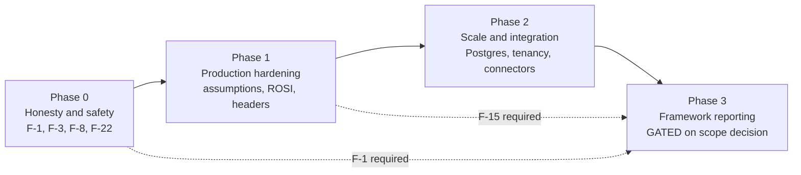

Phase 0 is not a prelude to the real work; it is the work that makes the current
product's central claim — a defensible, reproducible number — actually true.
Building connectors or framework coverage on top of an unreproducible assessment
would multiply an unanswerable question.

---

# Q. Assumptions, Limitations and Open Questions

## Q.1 Open questions requiring a decision

| # | Question | Blocks | Owner |
|---|---|---|---|
| Q1 | Is the regulatory scope SEBI CSCRF, RBI, both, or neither? | Phase 3 entirely | **TBD** |
| Q2 | Which RBI framework version and circulars apply? | Section M | **TBD** |
| Q3 | What is the deployment model — single operator, internal team, or multi-tenant SaaS? | Phase 2 sizing | **TBD** |
| Q4 | What is the intended RPO/RTO and data-retention period? | Backup design, audit policy | **TBD** |
| Q5 | May the assessment context ever leave the operator's network? | LLM posture, N.5 | **TBD** |
| Q6 | Who owns the risk model — is a risk owner accountable for the coefficients? | F.7 in section F, 1.1 | **TBD** |
| Q7 | What is the acceptable uncertainty band for a board decision? | Whether 0.35×–1.95× is acceptable at all | **TBD** |
| Q8 | Is the vulnerability multiplier's 0.03 coefficient acceptable to the risk owner? | Model defensibility | **TBD** |
| Q9 | Should `analyst` retain `audit.read`? | K.6 | **TBD** |
| Q10 | What concurrency and portfolio size must `/api/optimise` support? | F-22, time-box design | **TBD** |
| Q11 | Project name, owner, and target release date? | Document header | **TBD** |

## Q.2 Modelling assumptions

Each of these is a choice, not a fact. A reader who disagrees with any of them
should be able to see exactly what it changes.

| Assumption | Value | Basis | If wrong |
|---|---|---|---|
| Annual loss scales linearly with expected annual loss | `EAL = P_res × SLE × λ` | Standard expected-loss formulation | Systematic; all figures shift |
| `p0` is a baseline annual probability, not an incident rate | Per-scenario | Documentation | `λ` double-counts frequency |
| `λ` is 1.0 unless stated | Per-scenario | Documentation | EAL scales linearly in `λ` |
| Controls are independent unless correlated by group | Per-scenario | Documentation | The mitigation product over-reduces; the cap partially compensates |
| Control stacking saturates at a 90% reduction | `MAX_CONTROL_MITIGATION` | Judgement | The single most consequential judgement in the model |
| Four well-run controls cannot compound past 92.6% | Product rule | Judgement | Residual risk is understated or overstated by up to the cap |
| Findings with `status != open` contribute nothing | `vulnerability_multiplier` | Policy choice | Understates risk from accepted-but-unfixed findings |
| Non-active assets are excluded from assessment | `risk.assess` | Policy choice | A decommissioned asset with live data is unscored |
| A scenario with an unresolved loss input is excluded, not imputed | `risk.assess` | Honesty rule | Exclusion lowers the headline; imputation would hide it |
| Vuln multiplier is linear in finding severity, capped at 3.0 | `vulnerability_multiplier` | Hand-auditable prior | Ten criticals and one critical give the same multiplier |
| EAL-weighted confidence | `risk.assess` | Choice | A high-EAL low-confidence scenario is under-weighted |
| Correlation reduces rather than increases aggregate loss | `aggregate_groups` | Deliberate | Assumes correlated losses overlap in time and partly offset |

## Q.3 Product limitations

Stated without hedging, because a tool that hides its limits is worse than no tool.

**What it does not do:**

- No forecasting, prediction, or trend analysis.
- No compliance assessment or certification opinion.
- No benchmarking against peers or industry.
- No causal attribution ("why did EAL rise?" is refused).
- No incident data, no near-miss data, no control-test automation.
- No multi-tenancy, no scheduling, no live system connectors.
- No learning from history; every coefficient is hand-chosen.
- No support for impact beyond financial loss — no safety, reputational, or
  regulatory-penalty modelling.
- No actuarial validation. The model is internally consistent and externally
  unvalidated.

**What it does well, and what that depends on:**

- Deterministic, reproducible, traceable arithmetic — *provided F-1 is closed*.
- Honest treatment of missing and assumed data.
- A guard against fabricated numbers in the assistant — *provided F-8 is closed*.
- A defensible defence of any figure to a business unit that disputes an
  assumption.

## Q.4 What would invalidate the model

Stated so a future reviewer knows what to attack first:

1. **A real incident inconsistent with the loss basis.** If actual loss from a
   payments incident is 5% of `daily_revenue × downtime`, the per-record and
   downtime bases are both wrong.
2. **Control effectiveness measured below assumption.** The model treats CE as
   given. If measured CE for a benchmarked control is materially lower, the
   entire mitigation product is optimistic — and the cap does not correct for
   pessimism, only for over-optimism.
3. **Correlation above the assumed rho.** `aggregate_groups` can only reduce the
   aggregate. If real correlation is higher than assumed, the model
   under-predicts.
4. **`p0` estimates that do not survive contact with incident history.** No
   back-testing exists.
5. **Loss components that double-count.** Nothing prevents a downtime component
   and a lost-revenue component describing the same loss.

---

# Appendices

## Appendix A — Glossary

| Term | Meaning |
|---|---|
| **EAL** | Expected Annual Loss. The headline financial figure, `Σ P_res × SLE × λ` aggregated across correlation groups. |
| **SLE** | Single Loss Expectancy. The cost of one occurrence, summed across loss components. |
| **P_inherent** | Annual probability before controls. `1 − (1 − p0)^m` |
| **P_residual** | Annual probability after controls. `P_inherent × mitigation` |
| **mitigation factor** | Residual fraction of inherent risk after controls, floored at `1 − MAX_CONTROL_MITIGATION`. |
| **p0** | Baseline annual probability of a scenario, absent any control effect. |
| **λ** | `expected_events_per_incident`, the expected number of losses per occurrence. |
| **CE** | Control effectiveness, 0–0.99. `ce_source` is `measured`, `benchmark`, or `assumed`. |
| **rho** | Within-group correlation. Reduces the aggregate below the naive sum. |
| **Confidence** | 0–100 weighted score for how well-evidenced the inputs are. Bands: High ≥80, Medium ≥55, Low <55. |
| **Uncertainty band** | Low/high range from applying the probability and loss multipliers. A property of the arithmetic, not the data. |
| **ROSI** | Return on Security Investment. `(reduction − cost) / cost`. Currently one-year against one-time. |
| **Overlap penalty** | `standalone_reduction − marginal_reduction`. The value an action loses by being part of a plan. |
| **Quarantine** | A row rejected by per-row validation, retained with a line number and reason. |
| **Grounded** | Every number in a response traceable to the frozen context. |
| **Correlation group** | A set of scenarios whose losses are assumed to overlap in time. |
| **V/P/TBD** | Verified from source or execution / Proposed, not implemented / To be decided. |

## Appendix B — Findings index

Full register in section N.6.

| ID | Finding | Sev | Phase |
|---|---|---|---|
| F-1 | `runs`/`snapshots` never written; assessments not reproducible | Critical | 0 |
| F-3 | Stored XSS via unescaped `innerHTML` | Critical | 0 |
| F-4 | Default credentials seeded and printed in UI | High | 0 |
| F-5 | No brute-force protection | High | 0 |
| F-7 | `users.manage` has no route | High | 0 |
| F-8 | Deterministic template not grounding-checked | Medium | 0 |
| F-13 | No tenant boundary | High | 2 |
| F-14 | No framework mapping tables | High | 3 |
| F-15 | No control-effectiveness history | High | 1 |
| F-16 | No migration framework | High | 0 |
| F-22 | Unbounded exact search | High | 0 |
| F-23 | Loss-component and AI-context exports unreachable | Medium | 1 |

## Appendix C — Verification record

How the claims in this document were established.

| Claim type | Method |
|---|---|
| Module contents, line numbers, function signatures | Read directly from `app/*.py` |
| Schema, tables, constraints | Read from `app/schema.sql` |
| Route list, capability gates | `grep -n "@app\."` and `grep -n "requires("` over `app/main.py` |
| Capability matrix | Read from `app/config.py`, cross-checked against every `requires(...)` |
| Config defaults | Read from `app/config.py` |
| Grounding behaviour | Read from `app/ai.py:26-203` |
| Test count and pass state | `python3 -m unittest discover -s tests -t tests` → 174 pass |
| **All F.2, F.3, F.4, F.5, F.6, G.2, H.4 figures** | **Emitted by `docs/worked_example.py` from the live engine** |
| Frontend JS syntax | `node --check app/static/app.js` |
| Demo data shape | Read from `app/demo_data.py`, row counts queried |
| Live RBAC behaviour | Login as each role, call the endpoint, record status |
| Framework structures | Verified against official publisher sources; RBI marked `[TBD]` |
| Dead-table and dead-capability claims | `grep -rn` over `app/`, excluding `__pycache__` |

**Corrections made during drafting, recorded for honesty:**

1. The SEBI CSCRF circular is dated **20 August 2024**, not September 2024.
2. The first hand-computed draft of the F.2 worked example was wrong in three
   places: the SLE sum (₹21,45,000 vs the correct ₹30,45,000), the S-2
   mitigation (0.42 vs the correct 0.30), and the resulting headline EAL and
   confidence. All figures in this document are engine-emitted, not transcribed.
3. The exact-search threshold is `EXACT_SEARCH_MAX_ACTIONS = 16`, an action
   count, not the subset count of 20,000 that an earlier draft assumed.
4. PBKDF2 uses 120,000 iterations, not 260,000.
5. The session cookie is named `crp_session`, and the cookie attribute call is
   `httponly=True, samesite="lax"`.
6. `data.read` is not a declared capability; read endpoints use `view`.
7. Default port is 8000 via `run.sh`, not 8100.

**Not verified, and therefore not claimed:**

- Accuracy of any risk figure against real-world incident data.
- Behaviour under concurrent load or with portfolios above 14 actions.
- Compatibility with any real CMDB, scanner, or EDR export format.
- Any regulatory compliance position.
- Any RBI framework claim.
- Multi-tenancy, connectors, scheduling, and trend reporting — all proposed only.

## Appendix D — How to reproduce every number

```bash
git clone https://github.com/vanshpatel887139-max/Cyber_Risk_Quantification-
cd Cyber_Risk_Quantification-

# Full worked example: F.2, F.3, F.4, F.5, F.6, G.2, H.4
python3 docs/worked_example.py

# Test suite: 174 tests
./run.sh --test

# Live server
./run.sh --port 8100
```

`docs/worked_example.py` is the single source of truth for the numeric content of
this document. If it and the prose ever disagree, the script is correct and this
document is stale.
